# StreamLib

A real-time processing framework for building applications where audio, video, and data flow together continuously.

**What does "streaming" mean here?** Not broadcasting to Twitch. Not just playing video files. StreamLib treats streaming as *continuous real-time data flow*—like electricity through a circuit. Audio, video, sensor data, AI model outputs, or any combination flowing through your application simultaneously.

**Zero external dependencies on GStreamer, FFmpeg, or similar frameworks.** Unlike traditional media libraries that focus on encoding and decoding files, StreamLib is a processing framework. Connect inputs to processors to outputs. Data flows through in real-time. Build anything from video conferencing to robot vision to multi-modal AI agents.

## Vision

StreamLib is building a truly headless processing framework that requires no display server or window system. Run the same code on headless servers, embedded devices, edge compute, or full GUI applications.

This is an alternative to solutions like NVIDIA DeepStream that require CUDA and lock you into specific hardware. StreamLib uses platform-native APIs (Metal, Vulkan, DirectX) to deliver GPU acceleration without vendor lock-in.

**Inspired by game engine architecture.** Like Unreal Engine enables cross-platform game development, StreamLib applies the same principles to real-time processing. A unified framework that abstracts platform differences, letting you write once and deploy anywhere.

**Target environments:**
- Headless cloud servers (no X11/Wayland required)
- Embedded devices and edge compute
- Desktop applications with full GUI
- Mobile devices (iOS, Android planned)

**Language support (roadmap):**
- Rust (native, available now)
- Python (planned, separate repository)
- TypeScript (planned)

All platforms supported out of the box—Linux, macOS, Windows—without convoluted setup. Every processor is designed to be cross-platform from the start.

## Features

- **Multi-modal by design** - Audio, video, and arbitrary data flow through the same graph. Build applications that see, hear, and process data simultaneously
- **Graph-based processing** - Connect processors into pipelines. Data flows from inputs through processors to outputs, like nodes in a visual programming environment
- **Zero legacy dependencies** - No GStreamer, FFmpeg, or libav. Pure Rust with platform-native APIs
- **GPU-accelerated** - Hardware-accelerated video encoding/decoding via Metal and wgpu
- **Real-time audio** - Low-latency audio processing with CLAP plugin support
- **Built for AI agents** - Designed for applications where AI models need to perceive and act on live data
- **Cross-platform** - See platform support table below

## Platform Support

| Platform | Status | Notes |
|----------|--------|-------|
| macOS | ✅ Supported | Primary development platform |
| iOS | 🚧 Partial | Core functionality works |
| Linux | 📋 Planned | Up next |
| Windows | 📋 Planned | Up next |

## Quick Start

See [examples/camera-display](examples/camera-display) for a minimal working example that captures video from a camera and displays it in a window.

## Documentation

- [Architecture Overview](docs/) - How StreamLib works
- [API Documentation](https://docs.rs/streamlib) - Rust API reference
- [Examples](examples/) - Working example applications

## Examples

| Example | Description |
|---------|-------------|
| [camera-display](examples/camera-display) | Camera capture and display |
| [microphone-reverb-speaker](examples/microphone-reverb-speaker) | Audio processing with CLAP plugins |
| [camera-audio-recorder](examples/camera-audio-recorder) | Record camera + audio to MP4 |
| [webrtc-cloudflare-stream](examples/webrtc-cloudflare-stream) | WebRTC streaming to Cloudflare |
| [whep-player](examples/whep-player) | WHEP (WebRTC egress) player |

Run an example:
```bash
cargo run -p camera-display
```

## License & Business Model

StreamLib uses an **open-core model** inspired by game engines like Unity and Unreal.

### The Simple Version

| What you want to do | Cost |
|---------------------|------|
| Build Processors | **Free** |
| Sell Processors | **Free** (you keep 100%) |
| Keep source private | **Free** (no obligation to share) |
| Run the Runtime in production | Commercial license required* |

*Unless you fall under permitted uses (see below)

### Build Anything, Own Everything

**We don't own your Processors.** Just like Epic doesn't own games built with Unreal Engine, we don't own what you build with StreamLib.

```mermaid
flowchart TB
    YOURS["<b>Your Processors</b><br/>Custom • Community • Commercial<br/><i>Yours 100% — sell, keep private, open source</i>"]
    API["<b>Processor API</b><br/>ReactiveProcessor • LinkInput/Output • VideoFrame • AudioFrame"]
    RUNTIME["<b>StreamLib Runtime</b><br/>Graph Compiler • Scheduler • GPU Context<br/><i>BUSL-1.1 — Restricted uses require license</i>"]

    YOURS --> API --> RUNTIME

    style YOURS fill:#d4edda,stroke:#28a745
    style RUNTIME fill:#fff3cd,stroke:#ffc107
```



### What You Can Do (No License Required)

| Activity | Allowed? | Notes |
|----------|:--------:|-------|
| Build custom Processors | ✅ | For yourself, clients, or to sell |
| Sell Processors commercially | ✅ | Keep 100% of revenue |
| Keep Processor source private | ✅ | No obligation to open source |
| Build Processors for clients | ✅ | Contractors/consultants welcome |
| Personal/hobby projects | ✅ | No restrictions |
| Educational/research use | ✅ | Universities, students, researchers |
| Open source projects | ✅ | OSI-approved licenses |
| Commercial apps (StreamLib as component) | ✅ | Video conferencing, security cameras, robotics, etc. |

### What Requires a Commercial License (Restricted Uses)

| Activity | License Required |
|----------|:----------------:|
| Selling/licensing the Runtime as a product | ✅ Commercial |
| Offering the Runtime as a managed service or SaaS | ✅ Commercial |
| White-labeling or rebranding the Runtime for resale | ✅ Commercial |
| Creating a competing runtime derived from StreamLib | ✅ Commercial |
| Embedding the Runtime and sublicensing it to end users | ✅ Commercial |

**"Runtime"** = graph compiler, scheduler, processor execution, GPU context, link/port infrastructure.
**Not the Runtime** = Processors you build using the Processor API.

### Why This Model?

**For the community:** We want a thriving ecosystem of Processors. Whether you're building an AI video analyzer, a custom encoder, or a specialized filter—build it, sell it, keep it private. Your choice.

**For sustainability:** The runtime engine requires significant investment to build and maintain. Commercial licenses from companies building competing platforms fund continued development.

**For trust:** On **January 1, 2029**, StreamLib automatically converts to [Apache License 2.0](LICENSES/Apache-2.0.txt). The code will be fully open source with no restrictions, guaranteed.

### The Game Engine Analogy

| Game Engine | StreamLib |
|-------------|-----------|
| Engine (Unity/Unreal) | Runtime Engine |
| Games you build | Processors you build |
| Asset Store | Processor marketplace (coming soon) |
| You own your games | You own your Processors |
| Engine is licensed | Runtime is BUSL-1.1 |

### Commercial Licensing

Need a commercial license? Two options:

**[Commercial License](docs/license/COMMERCIAL-LICENSING.md)** — For companies building streaming platforms or competing products.

**[Partner License](docs/license/PARTNER-LICENSING.md)** — For consultants, agencies, and integrators. Includes co-marketing, roadmap input, and early access.

**Contact:** fontanezj1@gmail.com

### Full License

StreamLib is licensed under the [Business Source License 1.1](LICENSE). See the LICENSE file for complete terms including the Additional Use Grant that explicitly permits Processor development.

## Contributing

Contributions are welcome! By submitting a pull request, you agree to license your
contribution under the same BUSL-1.1 terms.

See [CLA.md](docs/license/CLA.md) for the Contributor License Agreement.

## Project Structure

```
streamlib/
├── libs/
│   ├── streamlib/           # Core library
│   └── streamlib-macros/    # Procedural macros
├── examples/                # Example applications
└── docs/                    # Documentation
```

## Requirements

- Rust 1.75+
- macOS 13+ (for Apple framework features)
- Metal-capable GPU (for video processing)

## Building

```bash
# Build the library
cargo build -p streamlib

# Run tests
cargo test -p streamlib

# Build all examples
cargo build --workspace
```

## Status

StreamLib is under active development. APIs may change between versions.

## Contact

- **Author:** Jonathan Fontanez
- **Email:** fontanezj1@gmail.com
- **Repository:** https://github.com/tato123/streamlib
