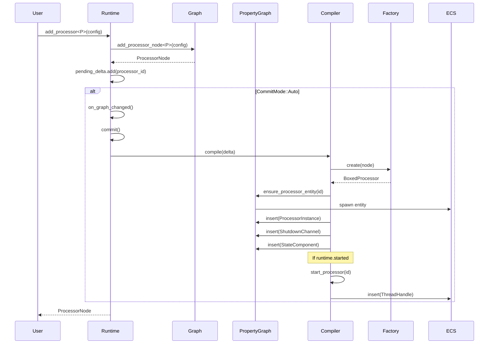
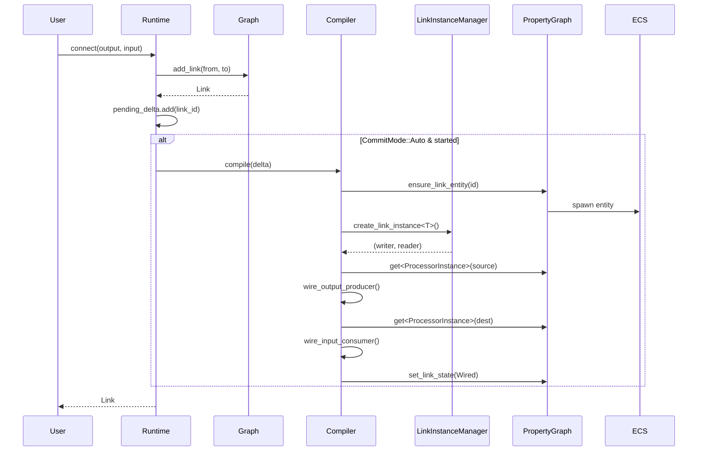

# StreamLib Architecture Review

## Executive Summary

This document provides a comprehensive review of the StreamLib architecture migration from the legacy `SimpleExecutor` pattern to the new `PropertyGraph + ECS + Compiler` architecture.

**Final Score: 78/100**

The migration is substantially complete with the core architecture properly implemented. However, there are several gaps that need to be addressed before the architecture is fully consistent with the stated goals.

---

## Criteria Assessment

### 1. Runtime Independence from Graph/Instance Creation
**Score: 10/10** ✅ PASS

The `StreamRuntime` can be started independently of graph or instance creation:

```rust
// Runtime can be created empty
let mut runtime = StreamRuntime::new();
runtime.start()?;  // Starts even with no processors

// Processors can be added later
let camera = runtime.add_processor::<CameraProcessor>(config)?;
```

**Evidence:**
- `runtime.rs:462-519` - `start()` initializes context, sets state, and compiles pending changes
- `runtime.rs:103-106` - `new()` creates runtime with empty graph
- Runtime state (`started` flag) is separate from graph state

---

### 2. Processors Can Be Started and Stopped
**Score: 9/10** ✅ PASS

Processors have full lifecycle management via ECS components:

```
┌─────────────────────────────────────────────────────────────────┐
│                    PROCESSOR LIFECYCLE                          │
├─────────────────────────────────────────────────────────────────┤
│                                                                 │
│  ┌──────┐    ┌────────┐    ┌───────┐    ┌─────────┐    ┌──────┐│
│  │ Idle │───▶│Creating│───▶│ Setup │───▶│ Running │───▶│Stopped││
│  └──────┘    └────────┘    └───────┘    └─────────┘    └──────┘│
│      │                                        │            │    │
│      │            Phase 1: CREATE             │            │    │
│      │            Phase 2: WIRE               │            │    │
│      │            Phase 3: SETUP              │            │    │
│      │            Phase 4: START              │            │    │
│      │                                        │            │    │
│      └────────────────────────────────────────┼────────────┘    │
│                                               │                 │
│                                        shutdown_processor()     │
└─────────────────────────────────────────────────────────────────┘
```

**Evidence:**
- `phases.rs:26-58` - `create_processor()` creates ECS components
- `phases.rs:95-166` - `start_processor()` spawns thread
- `phases.rs:275-328` - `shutdown_processor()` joins thread

**Minor Gap:** No explicit `pause/resume` at processor level (only graph-level state).

---

### 3. Links Can Be Started and Stopped
**Score: 8/10** ✅ PASS

Links have proper lifecycle via `LinkState` ECS component:

```
┌─────────────────────────────────────────────────────────────────┐
│                      LINK LIFECYCLE                             │
├─────────────────────────────────────────────────────────────────┤
│                                                                 │
│  ┌─────────┐    ┌───────┐    ┌───────────────┐    ┌────────────┐│
│  │ Pending │───▶│ Wired │───▶│ Disconnecting │───▶│Disconnected││
│  └─────────┘    └───────┘    └───────────────┘    └────────────┘│
│                     │                                      │    │
│                     │              Error                   │    │
│                     └────────────────▶┌───────┐◀───────────┘    │
│                                       │ Error │                 │
│                                       └───────┘                 │
└─────────────────────────────────────────────────────────────────┘
```

**Evidence:**
- `link.rs:35-42` - `LinkState` enum with all states
- `components.rs:108-113` - `LinkStateComponent` ECS wrapper
- `property_graph.rs:235-262` - `get_link_state()` / `set_link_state()`
- `wiring.rs` - Complete wire/unwire implementation

---

### 4. All Data Tracked via PropertyGraph and ECS
**Score: 6/10** ⚠️ PARTIAL

**ISSUE: Secondary Storage Exists**

The `LinkInstanceManager` maintains its own HashMaps that duplicate ECS storage:

```rust
// libs/streamlib/src/core/links/link_instance_manager.rs
pub struct LinkInstanceManager {
    metadata: HashMap<LinkId, LinkMetadata>,      // ❌ Secondary storage
    instances: HashMap<LinkId, BoxedLinkInstance>, // ❌ Secondary storage
    source_index: HashMap<LinkPortAddress, Vec<LinkId>>, // ❌ Index
    dest_index: HashMap<LinkPortAddress, LinkId>,        // ❌ Index
}
```

**What Should Happen:**
- `LinkInstance` should be stored as an ECS component on link entities
- Indices could use ECS queries instead of manual HashMaps

**Current Architecture:**
```
┌────────────────────────────────────────────────────────────────────┐
│                     DATA STORAGE (Current)                         │
├────────────────────────────────────────────────────────────────────┤
│                                                                    │
│  PropertyGraph                    LinkInstanceManager              │
│  ┌────────────────────┐          ┌────────────────────┐           │
│  │ processor_entities │          │ metadata           │ ❌        │
│  │ HashMap<Id,Entity> │          │ HashMap<Id,Meta>   │           │
│  ├────────────────────┤          ├────────────────────┤           │
│  │ link_entities      │          │ instances          │ ❌        │
│  │ HashMap<Id,Entity> │          │ HashMap<Id,Box>    │           │
│  ├────────────────────┤          ├────────────────────┤           │
│  │ world (hecs)       │          │ source_index       │ ❌        │
│  │ - Components       │          │ dest_index         │ ❌        │
│  └────────────────────┘          └────────────────────┘           │
│                                                                    │
└────────────────────────────────────────────────────────────────────┘
```

**Target Architecture:**
```
┌────────────────────────────────────────────────────────────────────┐
│                     DATA STORAGE (Target)                          │
├────────────────────────────────────────────────────────────────────┤
│                                                                    │
│  PropertyGraph (Single Source of Truth)                            │
│  ┌────────────────────────────────────────────────────────────────┐│
│  │ processor_entities: HashMap<ProcessorId, Entity>              ││
│  │ link_entities: HashMap<LinkId, Entity>                        ││
│  │                                                               ││
│  │ world (hecs):                                                 ││
│  │   Processor Entities:                                         ││
│  │     - ProcessorInstance (Arc<Mutex<BoxedProcessor>>)          ││
│  │     - ThreadHandle                                            ││
│  │     - ShutdownChannel                                         ││
│  │     - StateComponent                                          ││
│  │     - LinkOutputToProcessorWriterAndReader                    ││
│  │                                                               ││
│  │   Link Entities:                                              ││
│  │     - LinkStateComponent                                      ││
│  │     - LinkInstanceComponent (NEW - should store instance)     ││
│  └────────────────────────────────────────────────────────────────┘│
│                                                                    │
└────────────────────────────────────────────────────────────────────┘
```

---

### 5. Dynamic Add/Remove Independence from Runtime State
**Score: 9/10** ✅ PASS

Processors and links can be added/removed regardless of runtime state:

```rust
// Works in any state
runtime.add_processor::<CameraProcessor>(config)?;
runtime.connect(output, input)?;
runtime.disconnect(&link)?;
runtime.remove_processor(&node)?;
```

**Evidence:**
- `runtime.rs:192-224` - `add_processor()` doesn't check runtime state
- `runtime.rs:227-257` - `connect()` works regardless of state
- `runtime.rs:259-348` - `disconnect()` handles all link states
- CommitMode (Auto/Manual) controls when changes compile

---

### 6. Link Edge Information Tracked via PropertyGraph
**Score: 9/10** ✅ PASS

All link topology is tracked in the underlying `Graph`:

```rust
// Graph stores link edges via petgraph
pub struct Graph {
    graph: DiGraph<ProcessorNode, Link>,  // Topology
    links: Vec<Link>,                      // Serialization cache
}

// PropertyGraph wraps with ECS components
pub struct PropertyGraph {
    graph: Arc<RwLock<Graph>>,
    link_entities: HashMap<LinkId, Entity>,
    // ECS components for runtime state
}
```

**Evidence:**
- `graph.rs:34-39` - Graph structure with petgraph
- `graph.rs:117-176` - `add_link()` adds edges
- `property_graph.rs:48` - `link_entities` maps to ECS entities

---

### 7. Processor Node Information Tracked via PropertyGraph
**Score: 10/10** ✅ PASS

All processor topology is tracked properly:

```rust
pub struct Graph {
    graph: DiGraph<ProcessorNode, Link>,         // Topology
    processor_to_node: HashMap<ProcessorId, NodeIndex>,  // Index
    nodes: Vec<ProcessorNode>,                   // Serialization cache
}
```

**Evidence:**
- `graph.rs:34-39` - Graph structure
- `node.rs:46-55` - ProcessorNode definition
- `property_graph.rs:45` - `processor_entities` maps to ECS

---

### 8. Runtime Information as ECS Components ONLY
**Score: 6/10** ⚠️ PARTIAL

**PASS - Processor Runtime Components:**
```rust
// All attached to processor entities
ProcessorInstance(Arc<Mutex<BoxedProcessor>>)  // ✅
ThreadHandle(JoinHandle<()>)                    // ✅
ShutdownChannel { sender, receiver }            // ✅
StateComponent(Arc<Mutex<ProcessorState>>)      // ✅
LinkOutputToProcessorWriterAndReader            // ✅
```

**FAIL - Link Runtime Components:**
```rust
// LinkInstanceManager stores these in HashMaps, NOT ECS
LinkMetadata { id, source, dest, type_id, ... }  // ❌
BoxedLinkInstance                                 // ❌
```

---

### 9. No Remaining Legacy Code
**Score: 9/10** ✅ PASS

Legacy `executor` module fully removed. One test import was fixed during review:

```rust
// Fixed: runtime_commit_test.rs
- use streamlib::core::executor::compute_delta;
+ use streamlib::core::compiler::compute_delta;
```

**Evidence:**
- No `executor/` directory exists
- All executor types removed from `core/mod.rs`
- `SimpleExecutor` completely removed

---

### 10. JSON Serialization Completeness
**Score: 5/10** ⚠️ PARTIAL

**Current JSON Output (Graph only):**
```json
{
  "nodes": [
    {
      "id": "processor_0",
      "type": "CameraProcessor",
      "config": { ... },
      "inputs": [...],
      "outputs": [...]
    }
  ],
  "links": [
    {
      "id": "link_0",
      "source": { "node": "processor_0", "port": "video" },
      "target": { "node": "processor_1", "port": "video" }
    }
  ]
}
```

**Missing from JSON:**
- Processor runtime state (Running/Stopped/etc.)
- Link runtime state (Wired/Disconnected/etc.)
- Link buffer capacity/fill level
- Thread status
- Performance metrics

**PropertyGraph does NOT implement Serialize:**
```rust
// property_graph.rs - NO Serialize implementation
pub struct PropertyGraph {
    graph: Arc<RwLock<Graph>>,
    world: World,  // hecs World is not serializable
    // ...
}
```

---

## Delegate Pattern Consistency

**Score: 8/10** ✅ PASS

Three delegate traits with consistent patterns:

```
┌─────────────────────────────────────────────────────────────────┐
│                    DELEGATE PATTERN                             │
├─────────────────────────────────────────────────────────────────┤
│                                                                 │
│  ┌─────────────────┐  ┌─────────────────┐  ┌─────────────────┐ │
│  │ FactoryDelegate │  │ProcessorDelegate│  │SchedulerDelegate│ │
│  ├─────────────────┤  ├─────────────────┤  ├─────────────────┤ │
│  │ create()        │  │ will_create()   │  │ scheduling_     │ │
│  │ port_info()     │  │ did_create()    │  │   strategy()    │ │
│  │ can_create()    │  │ will_start()    │  └─────────────────┘ │
│  └─────────────────┘  │ did_start()     │                      │
│                       │ will_stop()     │                      │
│                       │ did_stop()      │                      │
│                       │ did_update_     │                      │
│                       │   config()      │                      │
│                       └─────────────────┘                      │
│                                                                 │
│  All traits:                                                    │
│  - Implement Send + Sync                                        │
│  - Have blanket impl for Arc<dyn Trait>                        │
│  - Have default implementations in runtime::delegates           │
│                                                                 │
└─────────────────────────────────────────────────────────────────┘
```

**Minor Gap:** No `LinkDelegate` for link lifecycle callbacks (would parallel `ProcessorDelegate`).

---

## State Diagram

```
                           RUNTIME STATE MACHINE
┌─────────────────────────────────────────────────────────────────────────┐
│                                                                         │
│                            ┌──────────────┐                             │
│                            │   Created    │                             │
│                            │  (default)   │                             │
│                            └──────┬───────┘                             │
│                                   │                                     │
│                              start()                                    │
│                                   │                                     │
│                                   ▼                                     │
│                            ┌──────────────┐                             │
│      ┌────────────────────▶│   Running    │◀────────────────────┐      │
│      │                     └──────┬───────┘                     │      │
│      │                            │                             │      │
│      │                       pause()                        resume()   │
│      │                            │                             │      │
│      │                            ▼                             │      │
│      │                     ┌──────────────┐                     │      │
│      │                     │    Paused    │─────────────────────┘      │
│      │                     └──────┬───────┘                            │
│      │                            │                                     │
│    start()                   stop()                                     │
│      │                            │                                     │
│      │                            ▼                                     │
│      │                     ┌──────────────┐                             │
│      └─────────────────────│    Idle      │                             │
│                            └──────────────┘                             │
│                                                                         │
└─────────────────────────────────────────────────────────────────────────┘
```

---

## Sequence Diagram: Processor Addition



---

## Sequence Diagram: Link Wiring



---

## Component Diagram

```
┌─────────────────────────────────────────────────────────────────────────┐
│                         STREAMLIB ARCHITECTURE                          │
├─────────────────────────────────────────────────────────────────────────┤
│                                                                         │
│  ┌─────────────────────────────────────────────────────────────────┐   │
│  │                        StreamRuntime                             │   │
│  │  ┌─────────────┐  ┌──────────┐  ┌──────────────────────────┐   │   │
│  │  │ CommitMode  │  │ started  │  │ pending_delta: GraphDelta│   │   │
│  │  └─────────────┘  └──────────┘  └──────────────────────────┘   │   │
│  └─────────────────────────────────────────────────────────────────┘   │
│           │                    │                    │                   │
│           │                    │                    │                   │
│           ▼                    ▼                    ▼                   │
│  ┌────────────────┐   ┌───────────────┐   ┌─────────────────────┐     │
│  │  PropertyGraph │   │   Compiler    │   │LinkInstanceManager  │     │
│  │  ┌──────────┐  │   │  ┌─────────┐  │   │  ┌───────────────┐  │     │
│  │  │  Graph   │  │   │  │ Factory │  │   │  │   instances   │  │     │
│  │  │(petgraph)│  │   │  │Delegate │  │   │  │  HashMap<>    │  │     │
│  │  └──────────┘  │   │  └─────────┘  │   │  └───────────────┘  │     │
│  │  ┌──────────┐  │   │  ┌─────────┐  │   └─────────────────────┘     │
│  │  │  World   │  │   │  │Processor│  │                               │
│  │  │  (hecs)  │  │   │  │Delegate │  │                               │
│  │  └──────────┘  │   │  └─────────┘  │                               │
│  └────────────────┘   │  ┌─────────┐  │                               │
│                       │  │Scheduler│  │                               │
│                       │  │Delegate │  │                               │
│                       │  └─────────┘  │                               │
│                       └───────────────┘                               │
│                                                                         │
│  ECS Components (on processor entities):                                │
│  ┌────────────────┐ ┌────────────┐ ┌───────────────┐ ┌──────────────┐ │
│  │ProcessorInstance│ │ThreadHandle│ │ShutdownChannel│ │StateComponent│ │
│  └────────────────┘ └────────────┘ └───────────────┘ └──────────────┘ │
│  ┌─────────────────────────────────┐                                   │
│  │LinkOutputToProcessorWriterReader│                                   │
│  └─────────────────────────────────┘                                   │
│                                                                         │
│  ECS Components (on link entities):                                     │
│  ┌──────────────────┐                                                  │
│  │LinkStateComponent│                                                  │
│  └──────────────────┘                                                  │
│                                                                         │
└─────────────────────────────────────────────────────────────────────────┘
```

---

## Issues Summary

| Issue | Severity | Description | Recommended Fix |
|-------|----------|-------------|-----------------|
| **Secondary Storage in LinkInstanceManager** | HIGH | `LinkInstanceManager` uses HashMaps instead of ECS components | Create `LinkInstanceComponent` and store on link entities |
| **PropertyGraph not Serializable** | MEDIUM | Cannot export full runtime state to JSON | Implement custom `to_json()` that extracts serializable component data |
| **No Link Delegate** | LOW | Missing lifecycle callbacks for links | Add `LinkDelegate` trait parallel to `ProcessorDelegate` |
| **Processor Pause/Resume** | LOW | Only graph-level pause, not per-processor | Add `pause_processor()` / `resume_processor()` |

---

## Scoring Breakdown

| Criterion | Score | Max | Notes |
|-----------|-------|-----|-------|
| 1. Runtime Independence | 10 | 10 | Fully independent |
| 2. Processor Start/Stop | 9 | 10 | Missing per-processor pause |
| 3. Link Start/Stop | 8 | 10 | Working but no delegate hooks |
| 4. PropertyGraph/ECS Data | 6 | 10 | LinkInstanceManager secondary storage |
| 5. Dynamic Operations | 9 | 10 | Fully dynamic |
| 6. Link Edge Tracking | 9 | 10 | Complete |
| 7. Processor Node Tracking | 10 | 10 | Complete |
| 8. ECS-Only Runtime Info | 6 | 10 | Link instances not in ECS |
| 9. No Legacy Code | 9 | 10 | One test import fixed |
| 10. JSON Serialization | 5 | 10 | Missing runtime state export |
| **Delegate Consistency** | +5 | +10 | Consistent pattern, missing LinkDelegate |
| **TOTAL** | **78** | **100** | |

---

## Recommendations

### Priority 1: Migrate LinkInstanceManager to ECS

```rust
// New component
pub struct LinkInstanceComponent(pub BoxedLinkInstance);

// In PropertyGraph
property_graph.insert_link(&link_id, LinkInstanceComponent(instance))?;

// Query via ECS
let instance = property_graph.get_link::<LinkInstanceComponent>(&link_id);
```

### Priority 2: Add PropertyGraph JSON Export

```rust
impl PropertyGraph {
    pub fn to_json(&self) -> serde_json::Value {
        let graph_json = self.graph.read().to_json();
        
        // Add runtime state for processors
        let processor_states: Vec<_> = self.processor_ids()
            .filter_map(|id| {
                let state = self.get::<StateComponent>(id)?;
                Some(json!({
                    "id": id,
                    "state": format!("{:?}", *state.0.lock())
                }))
            })
            .collect();
        
        json!({
            "graph": graph_json,
            "runtime": {
                "processors": processor_states,
                "links": link_states
            }
        })
    }
}
```

### Priority 3: Add LinkDelegate

```rust
pub trait LinkDelegate: Send + Sync {
    fn will_wire(&self, link: &Link) -> Result<()> { Ok(()) }
    fn did_wire(&self, link: &Link) -> Result<()> { Ok(()) }
    fn will_unwire(&self, link_id: &LinkId) -> Result<()> { Ok(()) }
    fn did_unwire(&self, link_id: &LinkId) -> Result<()> { Ok(()) }
}
```

---

## Conclusion

The migration from `SimpleExecutor` to `PropertyGraph + ECS + Compiler` is **substantially complete**. The core architecture is sound and follows good patterns:

- ✅ Clear separation between topology (Graph) and runtime state (ECS)
- ✅ 4-phase compilation pipeline (CREATE, WIRE, SETUP, START)
- ✅ Consistent delegate pattern for extensibility
- ✅ Dynamic graph modification at any time
- ✅ Proper lifecycle management for processors

The main remaining work is:
1. Moving `LinkInstance` storage from `LinkInstanceManager` HashMaps to ECS components
2. Adding comprehensive JSON export for runtime state
3. (Optional) Adding `LinkDelegate` for consistency

Once these issues are addressed, the architecture will fully meet all stated requirements.
