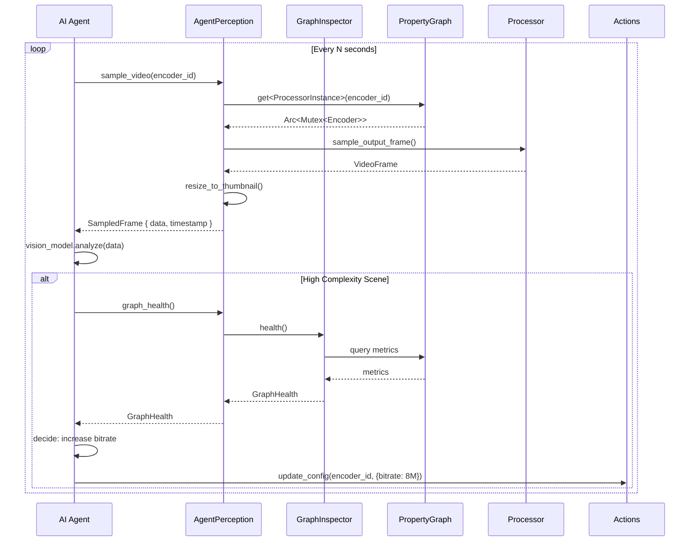

# StreamLib Architecture V2: Implementation Guide for Claude Code

<approval date="2025-12-01">
**EXPLICIT APPROVAL GRANTED**: The project owner has authorized Claude Code to work independently 
as a self-directed agent on this architecture refactoring. All four phases may be implemented 
without stopping for approval at each step. The work is being done on a dedicated feature branch 
that can be backed out if needed.

**Additional directive**: As part of Phase 4 completion, remove ALL backwards compatibility shims 
and deprecated type aliases introduced during this refactoring. The goal is one clean API with 
no legacy paths. This runtime is pre-production, so breaking changes are acceptable.

**Context**: The hard work of building the runtime is complete. This refactoring prepares the 
codebase for dynamic control, observability, and AI agent integration features.
</approval>

<role>
You are Claude Code implementing a major refactoring of StreamLib's runtime architecture. This document provides the complete specification, current codebase state, and step-by-step implementation tasks. Follow each phase exactly as written, using the verification steps to confirm correctness before proceeding.
</role>

<context>
StreamLib is a real-time audio/video processing framework using a graph-based processor pipeline. The current architecture has pain points that this refactoring addresses. You have access to rust-analyzer MCP for codebase analysis.
</context>

---

## Quick Reference

<status_summary>
| Feature | Status | Action Required |
|---------|--------|-----------------|
| Event naming (Will/Did) | ✅ DONE | None - already implemented |
| PropertyGraph (ECS) | 🔲 TODO | Phase 3 |
| Delegate pattern | 🔲 TODO | Phase 2 |
| Observability layer | 🔲 TODO | Phase 4 |
| Remove EXECUTOR_REF | 🔲 TODO | Phase 3 |
| Extract Compiler | 🔲 TODO | Phase 1 |
</status_summary>

---

## Phase Overview

<phases>
<phase id="1" name="Extract Compiler" risk="low" breaking="no">
Move compilation logic from SimpleExecutor to dedicated Compiler struct.
</phase>

<phase id="2" name="Introduce Delegates" risk="low" breaking="no">
Add delegate traits with default implementations. Backwards compatible.
</phase>

<phase id="3" name="PropertyGraph" risk="medium" breaking="internal">
Replace Graph + ExecutionGraph with unified PropertyGraph using ECS.
</phase>

<phase id="4" name="Observability" risk="low" breaking="no">
Add GraphInspector and dynamic tap points. New feature, no breaking changes.
</phase>
</phases>

---

# Current Codebase State

<current_architecture>
This section documents the **actual current implementation** verified via rust-analyzer. You must understand this baseline before implementing changes.

<structure name="StreamRuntime" file="libs/streamlib/src/core/runtime/runtime.rs">
```rust
pub struct StreamRuntime {
    graph: Arc<RwLock<Graph>>,
    executor: Arc<Mutex<SimpleExecutor>>,
    factory: Arc<RegistryBackedFactory>,
    commit_mode: CommitMode,
}
```

**Methods**: new, with_commit_mode, commit_mode, set_commit_mode, graph, commit, add_processor, connect, disconnect, disconnect_by_id, remove_processor, remove_processor_by_id, update_processor_config, start, stop, pause, resume, wait_for_signal, wait_for_signal_with, status
</structure>

<structure name="SimpleExecutor" file="libs/streamlib/src/core/executor/simple/mod.rs">
```rust
pub struct SimpleExecutor {
    state: ExecutorState,
    graph: Option<Arc<RwLock<Graph>>>,
    runtime_context: Option<Arc<RuntimeContext>>,
    execution_graph: Option<ExecutionGraph>,
    factory: Option<Arc<dyn ProcessorNodeFactory>>,
    link_channel: LinkChannel,
    next_processor_id: usize,
    next_link_id: usize,
    dirty: bool,
    is_macos_standalone: bool,
}

// PROBLEM: Global singleton
static EXECUTOR_REF: OnceLock<Weak<Mutex<SimpleExecutor>>> = OnceLock::new();
```

**Submodules**: compiler, lifecycle, processors, wiring
</structure>

<structure name="RunningProcessor" file="libs/streamlib/src/core/executor/running.rs">
```rust
pub struct RunningProcessor {
    pub node: ProcessorNode,           // Copy of node - CAN DRIFT from Graph
    pub thread: Option<JoinHandle<()>>,
    pub shutdown_tx: Sender<()>,
    pub shutdown_rx: Receiver<()>,
    pub process_function_invoke_send: Sender<ProcessFunctionEvent>,
    pub process_function_invoke_receive: Receiver<ProcessFunctionEvent>,
    pub state: Arc<Mutex<ProcessorState>>,
    pub processor: Option<Arc<Mutex<BoxedProcessor>>>,
}
```
</structure>

<structure name="WiredLink" file="libs/streamlib/src/core/executor/running.rs">
```rust
pub struct WiredLink {
    pub link: Link,
    pub port_type: LinkPortType,
    pub capacity: usize,
}
```
</structure>

<verified status="complete" feature="event_naming">
**Event System - ALREADY IMPLEMENTED**

Location: `libs/streamlib/src/core/pubsub/events.rs`

The Apple-style Will/Did pattern is fully implemented. No changes needed.

```rust
pub enum RuntimeEvent {
    // Graph mutation events (Will/Did pattern) ✅
    GraphWillAddProcessor { processor_id: String, processor_type: String },
    GraphDidAddProcessor { processor_id: String, processor_type: String },
    GraphWillRemoveProcessor { processor_id: String },
    GraphDidRemoveProcessor { processor_id: String },
    GraphWillCreateLink { from_processor: String, from_port: String, to_processor: String, to_port: String },
    GraphDidCreateLink { link_id: String, from_port: String, to_port: String },
    // ... full enum in codebase
}
```
</verified>
</current_architecture>

---

# Pain Points to Address

<pain_points>
<problem id="1" name="StreamRuntime Does Too Much">
<description>
StreamRuntime handles graph mutations, factory registration, event publishing, lifecycle delegation, and commit mode. Factory registration should be separate.
</description>
<solution>Extract factory concerns to FactoryDelegate</solution>
</problem>

<problem id="2" name="SimpleExecutor Has Overlapping Responsibilities">
<description>
SimpleExecutor handles: lifecycle state machine, graph compilation (4 phases), thread management, link wiring, ID generation, event listening.
</description>
<solution>Extract compilation to Compiler, scheduling to SchedulerDelegate</solution>
</problem>

<problem id="3" name="Dual Graph Synchronization">
<description>
Graph (desired state) and ExecutionGraph (actual state) must be manually synchronized. The node copy in RunningProcessor can drift from Graph.
</description>
<solution>Unify into PropertyGraph with ECS components</solution>
</problem>

<problem id="4" name="Global Executor Singleton">
<description>
EXECUTOR_REF is global mutable state that makes testing hard and prevents multiple runtime instances.
</description>
<solution>Remove global - all state lives in PropertyGraph</solution>
</problem>
</pain_points>

---

# Phase 1: Extract Compiler

<phase_1>
<objective>
Move compilation logic from SimpleExecutor to dedicated Compiler struct without changing external API.
</objective>

<pre_implementation_checklist>
Before starting, verify you understand the current state:

1. [ ] Read `libs/streamlib/src/core/executor/simple/compiler.rs`
2. [ ] Read `libs/streamlib/src/core/executor/simple/wiring.rs`
3. [ ] Identify all compilation phases in current code
4. [ ] List all types that need to move
</pre_implementation_checklist>

<task id="1.1" name="Create Compiler Module Structure">
<instruction>
Create the new module structure for the compiler.
</instruction>

<files_to_create>
- `libs/streamlib/src/core/compiler/mod.rs`
- `libs/streamlib/src/core/compiler/compiler.rs`
- `libs/streamlib/src/core/compiler/phases.rs`
- `libs/streamlib/src/core/compiler/delta.rs`
- `libs/streamlib/src/core/compiler/wiring.rs`
</files_to_create>

<example context="Creating mod.rs">
```rust
//! Graph compilation pipeline.
//!
//! Converts graph topology changes into running processor instances.

mod compiler;
mod delta;
mod phases;
mod wiring;

pub use compiler::Compiler;
pub use delta::GraphDelta;
```
</example>

<verification>
```bash
cargo check -p streamlib
# Should compile with empty module stubs
```
</verification>
</task>

<task id="1.2" name="Define GraphDelta">
<instruction>
Move or recreate the GraphDelta type that represents changes between desired and actual state.
</instruction>

<thinking>
GraphDelta captures what needs to change during compilation:
- processors_to_add: New processors to create and start
- processors_to_remove: Running processors to stop and destroy
- links_to_add: New connections to wire
- links_to_remove: Connections to unwire

This is a pure data structure with no behavior beyond computing the delta.
</thinking>

<example context="delta.rs implementation">
```rust
use crate::core::graph::{ProcessorId, LinkId};

/// Represents the difference between desired graph state and compiled state.
pub struct GraphDelta {
    pub processors_to_add: Vec<ProcessorId>,
    pub processors_to_remove: Vec<ProcessorId>,
    pub links_to_add: Vec<LinkId>,
    pub links_to_remove: Vec<LinkId>,
}

impl GraphDelta {
    /// Compute delta between desired graph and current compiled state.
    pub fn compute(
        desired: &Graph,
        compiled_processors: &HashSet<ProcessorId>,
        compiled_links: &HashSet<LinkId>,
    ) -> Self {
        // Implementation
    }
    
    /// Returns true if there are no changes.
    pub fn is_empty(&self) -> bool {
        self.processors_to_add.is_empty()
            && self.processors_to_remove.is_empty()
            && self.links_to_add.is_empty()
            && self.links_to_remove.is_empty()
    }
}
```
</example>

<verification>
```bash
cargo test -p streamlib delta
```
</verification>
</task>

<task id="1.3" name="Define Compiler Struct">
<instruction>
Create the Compiler struct that orchestrates the 4-phase compilation pipeline.
</instruction>

<thinking>
The Compiler needs access to:
1. Factory - to create processor instances
2. RuntimeContext - for GPU context, audio config
3. Graph - to read topology and node definitions

The compilation phases are:
1. CREATE: Instantiate processors via factory
2. WIRE: Create ring buffers and connect ports
3. SETUP: Call __generated_setup on each processor
4. START: Spawn threads based on scheduling strategy

For Phase 1, we keep the same behavior but in a cleaner structure.
Later phases will add delegates.
</thinking>

<example context="compiler.rs implementation">
```rust
use std::sync::Arc;
use parking_lot::Mutex;

use crate::core::{
    context::RuntimeContext,
    error::Result,
    graph::Graph,
    processors::BoxedProcessor,
};

use super::delta::GraphDelta;

/// Compiles graph changes into running processor state.
pub struct Compiler {
    factory: Arc<dyn ProcessorNodeFactory>,
}

impl Compiler {
    pub fn new(factory: Arc<dyn ProcessorNodeFactory>) -> Self {
        Self { factory }
    }
    
    /// Compile graph changes.
    ///
    /// Executes 4 phases: Create, Wire, Setup, Start
    pub fn compile(
        &self,
        graph: &Graph,
        execution_graph: &mut ExecutionGraph,
        runtime_context: &RuntimeContext,
        delta: &GraphDelta,
    ) -> Result<()> {
        // Phase 1: Create
        self.phase_create(graph, execution_graph, delta)?;
        
        // Phase 2: Wire
        self.phase_wire(graph, execution_graph, delta)?;
        
        // Phase 3: Setup
        self.phase_setup(execution_graph, runtime_context, delta)?;
        
        // Phase 4: Start
        self.phase_start(execution_graph, delta)?;
        
        Ok(())
    }
}
```
</example>
</task>

<task id="1.4" name="Move Phase Implementations">
<instruction>
Move the phase implementations from SimpleExecutor's compiler submodule to the new Compiler.
</instruction>

<files_to_modify>
- `libs/streamlib/src/core/compiler/phases.rs` (create)
- `libs/streamlib/src/core/executor/simple/mod.rs` (update to use Compiler)
</files_to_modify>

<example context="phases.rs - phase_create">
```rust
impl Compiler {
    /// Phase 1: Create processor instances.
    fn phase_create(
        &self,
        graph: &Graph,
        execution_graph: &mut ExecutionGraph,
        delta: &GraphDelta,
    ) -> Result<()> {
        for id in &delta.processors_to_add {
            let node = graph.get_processor(id)
                .ok_or_else(|| StreamError::ProcessorNotFound(id.clone()))?;
            
            let processor = self.factory.create(node)?;
            
            let running = RunningProcessor::new(node.clone(), processor);
            execution_graph.add_processor(id.clone(), running);
        }
        Ok(())
    }
    
    // ... other phases
}
```
</example>

<verification>
```bash
# All existing tests must pass
cargo test -p streamlib

# Specifically test compilation
cargo test -p streamlib compile
```
</verification>
</task>

<task id="1.5" name="Update SimpleExecutor to Use Compiler">
<instruction>
Modify SimpleExecutor to delegate compilation to the new Compiler struct.
</instruction>

<thinking>
SimpleExecutor should:
1. Own a Compiler instance
2. Call compiler.compile() when dirty flag is set
3. Remove the compile-related methods that moved to Compiler
4. Keep lifecycle methods (start, stop, pause, resume)

The public API of SimpleExecutor should not change.
</thinking>

<example context="Updated SimpleExecutor">
```rust
pub struct SimpleExecutor {
    state: ExecutorState,
    graph: Option<Arc<RwLock<Graph>>>,
    runtime_context: Option<Arc<RuntimeContext>>,
    execution_graph: Option<ExecutionGraph>,
    compiler: Compiler,  // NEW: owns compiler
    link_channel: LinkChannel,
    next_processor_id: usize,
    next_link_id: usize,
    dirty: bool,
    is_macos_standalone: bool,
}

impl SimpleExecutor {
    fn compile_if_dirty(&mut self) -> Result<()> {
        if !self.dirty {
            return Ok(());
        }
        
        let graph = self.graph.as_ref().unwrap().read();
        let execution_graph = self.execution_graph.as_mut().unwrap();
        let runtime_context = self.runtime_context.as_ref().unwrap();
        
        let delta = GraphDelta::compute(
            &graph,
            &execution_graph.processor_ids(),
            &execution_graph.link_ids(),
        );
        
        if !delta.is_empty() {
            self.compiler.compile(&graph, execution_graph, runtime_context, &delta)?;
        }
        
        self.dirty = false;
        Ok(())
    }
}
```
</example>

<verification>
```bash
# Full test suite must pass
cargo test -p streamlib

# Run an example to verify runtime behavior
cargo run -p camera-display
```
</verification>
</task>

<completion_checklist>
- [ ] All tests pass
- [ ] Examples run correctly
- [ ] No new warnings from clippy
- [ ] Code compiles without errors
</completion_checklist>
</phase_1>

---

# Phase 2: Introduce Delegates

<phase_2>
<objective>
Add delegate traits with default implementations. Current behavior becomes the default, enabling future customization.
</objective>

<depends_on>Phase 1 (Compiler extraction)</depends_on>

<task id="2.1" name="Create Delegates Module">
<files_to_create>
- `libs/streamlib/src/core/delegates/mod.rs`
- `libs/streamlib/src/core/delegates/factory.rs`
- `libs/streamlib/src/core/delegates/processor.rs`
- `libs/streamlib/src/core/delegates/scheduler.rs`
</files_to_create>
</task>

<task id="2.2" name="Define FactoryDelegate Trait">
<instruction>
Create the FactoryDelegate trait that abstracts processor creation.
</instruction>

<example context="factory.rs">
```rust
use crate::core::{
    error::Result,
    graph::ProcessorNode,
    processors::BoxedProcessor,
    schema::PortInfo,
};

/// Delegate for processor instantiation.
pub trait FactoryDelegate: Send + Sync {
    /// Create a processor instance from a node definition.
    fn create(&self, node: &ProcessorNode) -> Result<BoxedProcessor>;
    
    /// Get port information for a processor type.
    fn port_info(&self, processor_type: &str) -> Option<(Vec<PortInfo>, Vec<PortInfo>)>;
    
    /// Check if this factory can create a processor type.
    fn can_create(&self, processor_type: &str) -> bool;
}
```
</example>

<example context="RegistryBackedFactory as default implementation">
```rust
// The existing RegistryBackedFactory implements FactoryDelegate
impl FactoryDelegate for RegistryBackedFactory {
    fn create(&self, node: &ProcessorNode) -> Result<BoxedProcessor> {
        // Existing implementation
    }
    
    fn port_info(&self, processor_type: &str) -> Option<(Vec<PortInfo>, Vec<PortInfo>)> {
        // Existing implementation
    }
    
    fn can_create(&self, processor_type: &str) -> bool {
        // Existing implementation
    }
}
```
</example>
</task>

<task id="2.3" name="Define ProcessorDelegate Trait">
<instruction>
Create the ProcessorDelegate trait for lifecycle callbacks.
</instruction>

<example context="processor.rs">
```rust
use crate::core::{
    error::Result,
    graph::{ProcessorId, ProcessorNode},
    processors::BoxedProcessor,
};

/// Delegate for processor lifecycle events.
pub trait ProcessorDelegate: Send + Sync {
    /// Called before a processor is created.
    fn will_create(&self, node: &ProcessorNode) -> Result<()> { Ok(()) }
    
    /// Called after a processor is created.
    fn did_create(&self, node: &ProcessorNode, processor: &BoxedProcessor) -> Result<()> { Ok(()) }
    
    /// Called before a processor starts.
    fn will_start(&self, id: &ProcessorId) -> Result<()> { Ok(()) }
    
    /// Called after a processor starts.
    fn did_start(&self, id: &ProcessorId) -> Result<()> { Ok(()) }
    
    /// Called before a processor stops.
    fn will_stop(&self, id: &ProcessorId) -> Result<()> { Ok(()) }
    
    /// Called after a processor stops.
    fn did_stop(&self, id: &ProcessorId) -> Result<()> { Ok(()) }
    
    /// Called when a processor's config is updated.
    fn did_update_config(&self, id: &ProcessorId, config: &serde_json::Value) -> Result<()> { Ok(()) }
}

/// Default implementation that does nothing.
pub struct DefaultProcessorDelegate;

impl ProcessorDelegate for DefaultProcessorDelegate {}
```
</example>
</task>

<task id="2.4" name="Define SchedulerDelegate Trait">
<instruction>
Create the SchedulerDelegate trait that determines how processors are scheduled.
</instruction>

<thinking>
SchedulingStrategy determines runtime resource allocation:
- DedicatedThread: Own OS thread with configurable priority
- WorkStealingPool: Rayon pool for parallel processing (scales to 50k+ processors)
- MainThread: Required for Apple frameworks (AVFoundation, Metal)
- Lightweight: No dedicated resources, runs inline

This is ORTHOGONAL to ProcessExecution (Continuous/Reactive/Manual) which describes how a processor fundamentally works.
</thinking>

<example context="scheduler.rs">
```rust
use crate::core::graph::ProcessorNode;

/// How a processor should be scheduled at runtime.
pub enum SchedulingStrategy {
    /// Dedicated OS thread with priority.
    DedicatedThread {
        priority: ThreadPriority,
        name: Option<String>,
    },
    
    /// Run on Rayon work-stealing pool.
    WorkStealingPool,
    
    /// Run on main thread (required for Apple frameworks).
    MainThread,
    
    /// Lightweight - no dedicated resources.
    Lightweight,
}

pub enum ThreadPriority {
    RealTime,
    High,
    Normal,
    Background,
}

/// Delegate for processor scheduling decisions.
pub trait SchedulerDelegate: Send + Sync {
    /// Determine scheduling strategy for a processor.
    fn scheduling_strategy(&self, node: &ProcessorNode) -> SchedulingStrategy;
}

/// Default scheduler implementation.
pub struct DefaultScheduler;

impl SchedulerDelegate for DefaultScheduler {
    fn scheduling_strategy(&self, node: &ProcessorNode) -> SchedulingStrategy {
        match node.processor_type.as_str() {
            // Audio processors get real-time threads
            t if t.contains("Audio") => SchedulingStrategy::DedicatedThread {
                priority: ThreadPriority::RealTime,
                name: Some(format!("audio-{}", node.id)),
            },
            
            // Apple framework processors go to main thread
            "CameraProcessor" | "DisplayProcessor" => SchedulingStrategy::MainThread,
            
            // Default: normal dedicated thread
            _ => SchedulingStrategy::DedicatedThread {
                priority: ThreadPriority::Normal,
                name: None,
            },
        }
    }
}
```
</example>
</task>

<task id="2.5" name="Update Compiler to Use Delegates">
<instruction>
Modify Compiler to accept and use the delegate traits.
</instruction>

<example context="Updated Compiler">
```rust
pub struct Compiler {
    factory: Arc<dyn FactoryDelegate>,
    processor_delegate: Arc<dyn ProcessorDelegate>,
    scheduler: Arc<dyn SchedulerDelegate>,
}

impl Compiler {
    pub fn new(
        factory: Arc<dyn FactoryDelegate>,
        processor_delegate: Arc<dyn ProcessorDelegate>,
        scheduler: Arc<dyn SchedulerDelegate>,
    ) -> Self {
        Self { factory, processor_delegate, scheduler }
    }
    
    fn phase_create(&self, /* ... */) -> Result<()> {
        for id in &delta.processors_to_add {
            let node = graph.get_processor(id)?;
            
            // Delegate callback
            self.processor_delegate.will_create(node)?;
            
            let processor = self.factory.create(node)?;
            
            // Delegate callback
            self.processor_delegate.did_create(node, &processor)?;
            
            // ... rest of creation
        }
        Ok(())
    }
    
    fn phase_start(&self, /* ... */) -> Result<()> {
        for id in &delta.processors_to_add {
            let node = execution_graph.get_node(id)?;
            let strategy = self.scheduler.scheduling_strategy(node);
            
            self.processor_delegate.will_start(id)?;
            
            match strategy {
                SchedulingStrategy::DedicatedThread { priority, name } => {
                    self.spawn_thread(execution_graph, id, priority, name)?;
                }
                SchedulingStrategy::MainThread => {
                    self.schedule_on_main(execution_graph, id)?;
                }
                // ... other strategies
            }
            
            self.processor_delegate.did_start(id)?;
        }
        Ok(())
    }
}
```
</example>
</task>

<task id="2.6" name="Add RuntimeBuilder">
<instruction>
Add builder pattern for StreamRuntime to allow delegate customization.
</instruction>

<example context="Runtime builder">
```rust
impl StreamRuntime {
    /// Simple constructor with all defaults.
    pub fn new() -> Self {
        Self::default()
    }
    
    /// Builder for customization.
    pub fn builder() -> RuntimeBuilder {
        RuntimeBuilder::default()
    }
}

impl Default for StreamRuntime {
    fn default() -> Self {
        Self {
            graph: Arc::new(RwLock::new(Graph::new())),
            executor: Arc::new(Mutex::new(SimpleExecutor::new(/* defaults */))),
            factory: Arc::new(RegistryBackedFactory::new()),
            commit_mode: CommitMode::Auto,
        }
    }
}

pub struct RuntimeBuilder {
    factory: Option<Arc<dyn FactoryDelegate>>,
    processor_delegate: Option<Arc<dyn ProcessorDelegate>>,
    scheduler: Option<Arc<dyn SchedulerDelegate>>,
    commit_mode: CommitMode,
}

impl RuntimeBuilder {
    pub fn with_factory(mut self, f: impl FactoryDelegate + 'static) -> Self {
        self.factory = Some(Arc::new(f));
        self
    }
    
    pub fn with_processor_delegate(mut self, d: impl ProcessorDelegate + 'static) -> Self {
        self.processor_delegate = Some(Arc::new(d));
        self
    }
    
    pub fn with_scheduler(mut self, s: impl SchedulerDelegate + 'static) -> Self {
        self.scheduler = Some(Arc::new(s));
        self
    }
    
    pub fn with_commit_mode(mut self, mode: CommitMode) -> Self {
        self.commit_mode = mode;
        self
    }
    
    pub fn build(self) -> Result<StreamRuntime> {
        // Construct with provided or default delegates
    }
}
```
</example>

<verification>
```bash
# Existing code unchanged
cargo test -p streamlib

# New builder works
cargo test -p streamlib builder
```
</verification>
</task>
</phase_2>

---

# Phase 3: PropertyGraph (ECS)

<phase_3>
<objective>
Replace Graph + ExecutionGraph with unified PropertyGraph using ECS-style component storage.
</objective>

<depends_on>Phase 1, Phase 2</depends_on>

<thinking>
This is the biggest change. Key decisions:

1. **ECS Library Choice**: Use `hecs` for lightweight ECS, or `bevy_ecs` for more features.
   - hecs: 
   - bevy_ecs: More features, larger dependency

2. **Migration Strategy**: 
   - Keep existing Graph/ExecutionGraph working during transition
   - Add PropertyGraph alongside
   - Migrate one component type at a time
   - Remove old structures once PropertyGraph is complete

3. **Component Design**:
   - ProcessorInstance: The actual processor instance
   - ThreadHandle: JoinHandle for the processor's thread
   - ShutdownChannel: Sender for shutdown signal
   - ProcessorMetrics: Runtime metrics
   - MainThreadMarker: Zero-sized marker for main thread processors
</thinking>

<task id="3.1" name="Add hecs Dependency">
<instruction>
Add hecs to Cargo.toml for ECS functionality.
</instruction>

<example context="Cargo.toml update">
```toml
[dependencies]
hecs = "0.10"
```
</example>

<verification>
```bash
cargo build -p streamlib
```
</verification>
</task>

<task id="3.2" name="Define Component Types">
<instruction>
Define the component types that will be attached to processor entities.
</instruction>

<files_to_create>
- `libs/streamlib/src/core/graph/components.rs`
</files_to_create>

<example context="components.rs">
```rust
use std::sync::Arc;
use std::thread::JoinHandle;
use crossbeam_channel::Sender;
use parking_lot::Mutex;

use crate::core::processors::BoxedProcessor;

/// The instantiated processor.
pub struct ProcessorInstance(pub Arc<Mutex<BoxedProcessor>>);

/// Thread handle for dedicated-thread processors.
pub struct ThreadHandle(pub JoinHandle<()>);

/// Channel to signal processor shutdown.
pub struct ShutdownChannel(pub Sender<()>);

/// Channel to invoke process function.
pub struct ProcessInvokeChannel(pub Sender<ProcessFunctionEvent>);

/// Runtime metrics for a processor.
#[derive(Default)]
pub struct ProcessorMetrics {
    pub throughput_fps: f64,
    pub latency_p50_ms: f64,
    pub latency_p99_ms: f64,
    pub frames_processed: u64,
    pub frames_dropped: u64,
}

/// Marker for processors that must run on main thread.
pub struct MainThreadMarker;

/// Marker for processors using Rayon pool.
pub struct RayonMarker;

/// Marker for lightweight processors (no dedicated resources).
pub struct LightweightMarker;
```
</example>
</task>

<task id="3.3" name="Create PropertyGraph Structure">
<instruction>
Create the PropertyGraph struct that combines topology with ECS components.
</instruction>

<example context="property_graph.rs">
```rust
use hecs::World;
use petgraph::graph::DiGraph;
use std::collections::HashMap;

use crate::core::graph::{ProcessorId, LinkId, ProcessorNode, Link};

/// Graph state.
#[derive(Default, Clone, Copy, PartialEq, Eq)]
pub enum GraphState {
    #[default]
    Idle,
    Running,
    Paused,
}

/// Unified graph with topology and ECS components.
pub struct PropertyGraph {
    /// Topology - connections between processors.
    topology: DiGraph<ProcessorId, LinkId>,
    
    /// Node definitions indexed by ProcessorId.
    nodes: HashMap<ProcessorId, ProcessorNode>,
    
    /// Link definitions indexed by LinkId.
    links: HashMap<LinkId, Link>,
    
    /// ECS world for runtime components.
    world: World,
    
    /// Map from ProcessorId to hecs Entity.
    processor_entities: HashMap<ProcessorId, hecs::Entity>,
    
    /// Graph-level state.
    state: GraphState,
}

impl PropertyGraph {
    pub fn new() -> Self {
        Self {
            topology: DiGraph::new(),
            nodes: HashMap::new(),
            links: HashMap::new(),
            world: World::new(),
            processor_entities: HashMap::new(),
            state: GraphState::Idle,
        }
    }
    
    // === Topology Operations ===
    
    pub fn add_processor(&mut self, node: ProcessorNode) -> ProcessorId {
        let id = node.id.clone();
        self.nodes.insert(id.clone(), node);
        // Create entity in ECS world
        let entity = self.world.spawn(());
        self.processor_entities.insert(id.clone(), entity);
        id
    }
    
    // === Component Operations ===
    
    /// Attach a component to a processor.
    pub fn insert<C: hecs::Component>(&mut self, id: &ProcessorId, component: C) -> Result<()> {
        let entity = self.processor_entities.get(id)
            .ok_or_else(|| StreamError::ProcessorNotFound(id.clone()))?;
        self.world.insert_one(*entity, component)?;
        Ok(())
    }
    
    /// Get a component for a processor.
    pub fn get<C: hecs::Component>(&self, id: &ProcessorId) -> Option<hecs::Ref<'_, C>> {
        let entity = self.processor_entities.get(id)?;
        self.world.get::<&C>(*entity).ok()
    }
    
    /// Remove a component from a processor.
    pub fn remove<C: hecs::Component>(&mut self, id: &ProcessorId) -> Option<C> {
        let entity = self.processor_entities.get(id)?;
        self.world.remove_one::<C>(*entity).ok()
    }
    
    /// Check if a processor has a component.
    pub fn has<C: hecs::Component>(&self, id: &ProcessorId) -> bool {
        self.processor_entities.get(id)
            .map(|e| self.world.get::<&C>(*e).is_ok())
            .unwrap_or(false)
    }
    
    // === Queries ===
    
    /// Find all processors with a specific component.
    pub fn query<C: hecs::Component>(&self) -> impl Iterator<Item = &ProcessorId> {
        self.world.query::<&C>()
            .iter()
            .filter_map(|(entity, _)| {
                self.processor_entities.iter()
                    .find(|(_, e)| **e == entity)
                    .map(|(id, _)| id)
            })
    }
}
```
</example>
</task>

<task id="3.4" name="Migrate Compilation to PropertyGraph">
<instruction>
Update Compiler to work with PropertyGraph instead of ExecutionGraph.
</instruction>

<thinking>
The key insight: "compilation" becomes "attaching components to entities".

Before: Create RunningProcessor struct with all fields
After: Create entity, attach components one by one

This is more flexible because:
- Components can be added/removed independently
- Queries find processors by component presence
- No more copying node data into RunningProcessor
</thinking>

<example context="Updated compilation phases">
```rust
impl Compiler {
    fn phase_create(&self, graph: &mut PropertyGraph, delta: &GraphDelta) -> Result<()> {
        for id in &delta.processors_to_add {
            let node = graph.nodes.get(id).unwrap();
            
            self.processor_delegate.will_create(node)?;
            
            let instance = self.factory.create(node)?;
            
            // Attach component instead of creating RunningProcessor
            graph.insert(id, ProcessorInstance(Arc::new(Mutex::new(instance))))?;
            
            self.processor_delegate.did_create(node, &instance)?;
        }
        Ok(())
    }
    
    fn phase_start(&self, graph: &mut PropertyGraph, delta: &GraphDelta) -> Result<()> {
        for id in &delta.processors_to_add {
            let node = graph.nodes.get(id).unwrap();
            let strategy = self.scheduler.scheduling_strategy(node);
            
            self.processor_delegate.will_start(id)?;
            
            match strategy {
                SchedulingStrategy::DedicatedThread { priority, name } => {
                    let (shutdown_tx, shutdown_rx) = crossbeam_channel::bounded(1);
                    let handle = self.spawn_processor_thread(graph, id, shutdown_rx, priority)?;
                    
                    // Attach components
                    graph.insert(id, ThreadHandle(handle))?;
                    graph.insert(id, ShutdownChannel(shutdown_tx))?;
                }
                SchedulingStrategy::MainThread => {
                    graph.insert(id, MainThreadMarker)?;
                    self.schedule_on_main(graph, id)?;
                }
                SchedulingStrategy::WorkStealingPool => {
                    graph.insert(id, RayonMarker)?;
                }
                SchedulingStrategy::Lightweight => {
                    graph.insert(id, LightweightMarker)?;
                }
            }
            
            self.processor_delegate.did_start(id)?;
        }
        Ok(())
    }
}
```
</example>
</task>

<task id="3.5" name="Remove EXECUTOR_REF Global">
<instruction>
Remove the global singleton. All state now lives in PropertyGraph.
</instruction>

<files_to_modify>
- `libs/streamlib/src/core/executor/simple/mod.rs`
</files_to_modify>

<example context="Before and after">
```rust
// BEFORE: Global singleton
static EXECUTOR_REF: OnceLock<Weak<Mutex<SimpleExecutor>>> = OnceLock::new();

pub fn set_executor_ref(executor: Arc<Mutex<SimpleExecutor>>) {
    let _ = EXECUTOR_REF.set(Arc::downgrade(&executor));
}

// AFTER: No global - state is in PropertyGraph
// Delete EXECUTOR_REF entirely
// Update any code that used it to receive PropertyGraph reference instead
```
</example>

<verification>
```bash
# Search for any remaining references
rg "EXECUTOR_REF" libs/streamlib/

# Should find nothing
```
</verification>
</task>

<task id="3.6" name="Update StreamRuntime">
<instruction>
Update StreamRuntime to use PropertyGraph instead of Graph + ExecutionGraph.
</instruction>

<example context="Updated StreamRuntime">
```rust
pub struct StreamRuntime {
    // BEFORE:
    // graph: Arc<RwLock<Graph>>,
    // executor: Arc<Mutex<SimpleExecutor>>,
    
    // AFTER:
    graph: Arc<RwLock<PropertyGraph>>,
    compiler: Compiler,
    factory: Arc<dyn FactoryDelegate>,
    processor_delegate: Arc<dyn ProcessorDelegate>,
    scheduler: Arc<dyn SchedulerDelegate>,
    commit_mode: CommitMode,
}
```
</example>
</task>
</phase_3>

---

# Phase 4: Observability Layer

<phase_4>
<objective>
Add GraphInspector and dynamic tap points for runtime observation.
</objective>

<depends_on>Phase 3 (PropertyGraph)</depends_on>

<task id="4.1" name="Create Observability Module">
<files_to_create>
- `libs/streamlib/src/core/observability/mod.rs`
- `libs/streamlib/src/core/observability/inspector.rs`
- `libs/streamlib/src/core/observability/snapshots.rs`
- `libs/streamlib/src/core/observability/tap.rs`
- `libs/streamlib/src/core/observability/perception.rs`
</files_to_create>
</task>

<task id="4.2" name="Define Snapshot Types">
<example context="snapshots.rs">
```rust
use std::time::Duration;
use crate::core::graph::{ProcessorId, LinkId, ProcessorState};

/// Point-in-time snapshot of a processor.
pub struct ProcessorSnapshot {
    pub id: ProcessorId,
    pub processor_type: String,
    pub state: ProcessorState,
    pub throughput_fps: f64,
    pub latency: LatencyStats,
    pub config: serde_json::Value,
}

/// Point-in-time snapshot of a link.
pub struct LinkSnapshot {
    pub id: LinkId,
    pub source_processor: ProcessorId,
    pub source_port: String,
    pub target_processor: ProcessorId,
    pub target_port: String,
    pub queue_depth: usize,
    pub capacity: usize,
    pub throughput_fps: f64,
}

/// Overall graph health.
pub struct GraphHealth {
    pub state: GraphState,
    pub processor_count: usize,
    pub link_count: usize,
    pub dropped_frames: u64,
    pub error_count: u64,
    pub bottlenecks: Vec<ProcessorId>,
}

/// Latency statistics.
pub struct LatencyStats {
    pub p50: Duration,
    pub p90: Duration,
    pub p99: Duration,
    pub max: Duration,
}
```
</example>
</task>

<task id="4.3" name="Define GraphInspector">
<example context="inspector.rs">
```rust
use std::sync::Arc;
use parking_lot::RwLock;
use tokio::sync::broadcast;

use crate::core::graph::{ProcessorId, LinkId, PropertyGraph};
use super::snapshots::*;

/// Inspector for observing graph state.
pub struct GraphInspector {
    graph: Arc<RwLock<PropertyGraph>>,
}

impl GraphInspector {
    pub fn new(graph: Arc<RwLock<PropertyGraph>>) -> Self {
        Self { graph }
    }
    
    // === Snapshot Queries ===
    
    /// Get current state of a processor.
    pub fn processor(&self, id: &ProcessorId) -> Option<ProcessorSnapshot> {
        let graph = self.graph.read();
        // Build snapshot from PropertyGraph
    }
    
    /// Get current state of a link.
    pub fn link(&self, id: &LinkId) -> Option<LinkSnapshot> {
        let graph = self.graph.read();
        // Build snapshot from PropertyGraph
    }
    
    /// Get overall graph health.
    pub fn health(&self) -> GraphHealth {
        let graph = self.graph.read();
        // Compute health metrics
    }
    
    // === Dynamic Observation ===
    
    /// Observe a processor - returns handle that auto-detaches on drop.
    pub fn observe_processor(&self, id: &ProcessorId) -> ObserverHandle<ProcessorEvent> {
        // Install tap point, return handle
    }
}

/// Handle that automatically detaches observation when dropped.
pub struct ObserverHandle<T> {
    receiver: broadcast::Receiver<T>,
    tap_id: TapId,
    tap_registry: Arc<TapRegistry>,
}

impl<T> Drop for ObserverHandle<T> {
    fn drop(&mut self) {
        self.tap_registry.remove(self.tap_id);
    }
}
```
</example>
</task>

<task id="4.4" name="Define AgentPerception API">
<instruction>
Create the API for AI agents to perceive the running pipeline.
</instruction>

<example context="perception.rs">
```rust
/// Perception capabilities for AI agents.
pub trait AgentPerception: Send + Sync {
    /// Sample a video frame from a processor's output.
    fn sample_video(&self, id: &ProcessorId, config: SampleConfig) -> Option<SampledFrame>;
    
    /// Sample audio from a processor's output.
    fn sample_audio(&self, id: &ProcessorId, duration_ms: u32) -> Option<SampledAudio>;
    
    /// Get current status of a processor.
    fn processor_status(&self, id: &ProcessorId) -> ProcessorStatus;
    
    /// Get overall graph health.
    fn graph_health(&self) -> GraphHealth;
}

/// Actions an AI agent can take.
pub trait AgentActions: Send + Sync {
    /// Update a processor's config.
    fn update_config(&self, id: &ProcessorId, config: serde_json::Value) -> Result<()>;
    
    /// Add a processor dynamically.
    fn add_processor(&self, processor_type: &str, config: serde_json::Value) -> Result<ProcessorId>;
    
    /// Remove a processor.
    fn remove_processor(&self, id: &ProcessorId) -> Result<()>;
    
    /// Create a connection.
    fn connect(&self, from: PortRef, to: PortRef) -> Result<LinkId>;
    
    /// Remove a connection.
    fn disconnect(&self, link_id: &LinkId) -> Result<()>;
}
```
</example>
</task>
</phase_4>

---

# Codebase Cleanup Tasks

<cleanup_tasks>
These are independent cleanup tasks that can be done alongside or after the main phases.

<task id="cleanup.1" name="Split Bloated Files">
| File | Lines | Split Into |
|------|-------|------------|
| apple/processors/mp4_writer.rs | 1258 | mp4/writer.rs, mp4/encoder.rs, mp4/muxer.rs |
| apple/webrtc/session.rs | 1147 | session/state.rs, session/negotiation.rs, session/media.rs |
| core/pubsub/events.rs | 824 | events/runtime.rs, events/processor.rs, events/input.rs |
| core/schema.rs | 760 | schema/types.rs, schema/version.rs, schema/builtins.rs |
</task>

<task id="cleanup.2" name="Consolidate Audio Code">
<instruction>
Audio code is scattered across 6 locations. Consolidate into core/audio/ module.
</instruction>

<current_locations>
- core/frames/audio_frame.rs
- core/utils/audio_frame.rs
- core/utils/audio_resample.rs
- core/processors/audio_mixer.rs
- core/processors/audio_channel_converter.rs
- core/processors/audio_resampler.rs
</current_locations>

<proposed_structure>
```
core/audio/
├── mod.rs
├── frame.rs           # AudioFrame, AudioChannelCount
├── dynamic_frame.rs   # DynamicFrame + dasp traits
├── resampler.rs       # AudioResampler
├── utils.rs           # convert_channels, etc.
└── processors/
    ├── mixer.rs
    ├── channel_converter.rs
    └── resampler.rs
```
</proposed_structure>
</task>

<task id="cleanup.3" name="Add Prelude Module">
<instruction>
Create prelude.rs for commonly used types instead of 180 lines of re-exports in lib.rs.
</instruction>

<example context="core/prelude.rs">
```rust
//! Commonly used types for `use streamlib::prelude::*`.

pub use crate::core::{
    // Runtime
    runtime::StreamRuntime,
    
    // Frames
    frames::{VideoFrame, AudioFrame, DataFrame},
    
    // Processors
    processors::Processor,
    
    // Errors
    error::{StreamError, Result},
    
    // Graph
    graph::{ProcessorId, LinkId},
};
```
</example>
</task>

<task id="cleanup.4" name="Consolidate Deprecations">
<instruction>
Move all deprecated type aliases to core/compat.rs for easy tracking and removal.
</instruction>

<example context="core/compat.rs">
```rust
//! Backwards compatibility aliases.
//!
//! These will be removed in the next major version.

#[deprecated(since = "0.2.0", note = "Use ExecutionConfig")]
pub type SchedulingConfig = super::execution::ExecutionConfig;

#[deprecated(since = "0.2.0", note = "Use ProcessExecution")]
pub type SchedulingMode = super::execution::ProcessExecution;
```
</example>
</task>
</cleanup_tasks>

---

# Proposed File Structure

<file_structure>
```
libs/streamlib/src/
├── lib.rs                  # Clean - just module declarations + prelude re-export
│
├── core/
│   ├── mod.rs
│   ├── prelude.rs          # NEW
│   ├── compat.rs           # NEW - deprecation aliases
│   │
│   ├── runtime/
│   │   ├── mod.rs
│   │   ├── runtime.rs
│   │   └── builder.rs      # NEW
│   │
│   ├── graph/
│   │   ├── mod.rs
│   │   ├── property_graph.rs  # NEW - unified graph with ECS
│   │   ├── components.rs      # NEW - ECS components
│   │   ├── node.rs
│   │   ├── link.rs
│   │   └── topology.rs
│   │
│   ├── compiler/           # NEW
│   │   ├── mod.rs
│   │   ├── compiler.rs
│   │   ├── phases.rs
│   │   ├── delta.rs
│   │   └── wiring.rs
│   │
│   ├── delegates/          # NEW
│   │   ├── mod.rs
│   │   ├── factory.rs
│   │   ├── processor.rs
│   │   └── scheduler.rs
│   │
│   ├── observability/      # NEW
│   │   ├── mod.rs
│   │   ├── inspector.rs
│   │   ├── snapshots.rs
│   │   ├── tap.rs
│   │   └── perception.rs
│   │
│   ├── audio/              # NEW - consolidated
│   │   ├── mod.rs
│   │   ├── frame.rs
│   │   ├── dynamic_frame.rs
│   │   ├── resampler.rs
│   │   ├── utils.rs
│   │   └── processors/
│   │
│   └── ... (other modules unchanged)
```
</file_structure>

---

# Processor Trait Hierarchy

<trait_hierarchy>
Understanding the current trait hierarchy is essential before modifying processor-related code.

<structure name="BaseProcessor" file="libs/streamlib/src/core/processors/base.rs">
```rust
/// Base trait for all processors. Provides identity and lifecycle hooks.
pub trait BaseProcessor: Send + 'static {
    /// Unique name for this processor instance.
    fn name(&self) -> &str;
    
    /// Type identifier (e.g., "CameraProcessor", "H264Encoder").
    fn processor_type(&self) -> ProcessorType;
    
    /// Schema descriptor for introspection.
    fn descriptor(&self) -> ProcessorDescriptor;
    
    /// Called during Phase 3 (Setup) - initialize GPU, open devices.
    /// Generated by #[streamlib::processor] macro.
    fn __generated_setup(&mut self, ctx: &RuntimeContext) -> Result<()>;
    
    /// Called during shutdown - release resources.
    /// Generated by #[streamlib::processor] macro.
    fn __generated_teardown(&mut self) -> Result<()>;
}
```
</structure>

<structure name="Processor" file="libs/streamlib/src/core/processors/processor.rs">
```rust
/// Main processor trait with config and processing logic.
pub trait Processor: BaseProcessor {
    /// Configuration type (must be serializable).
    type Config: Serialize + DeserializeOwned + Default + Clone + Send + Sync;
    
    /// Construct from configuration.
    fn from_config(config: Self::Config) -> Result<Self> where Self: Sized;
    
    /// Main processing function - called each frame/tick.
    fn process(&mut self, ctx: &ProcessContext) -> Result<()>;
    
    /// Update configuration at runtime.
    fn update_config(&mut self, config: Self::Config) -> Result<()>;
    
    /// Apply config from JSON (for dynamic updates).
    fn apply_config_json(&mut self, config: &serde_json::Value) -> Result<()>;
    
    /// Execution configuration (Continuous/Reactive/Manual).
    fn execution_config(&self) -> ExecutionConfig;
    
    /// Get input port descriptors.
    fn input_ports(&self) -> Vec<PortDescriptor>;
    
    /// Get output port descriptors.
    fn output_ports(&self) -> Vec<PortDescriptor>;
}
```
</structure>

<structure name="DynProcessor" file="libs/streamlib/src/core/processors/processor.rs">
```rust
/// Object-safe wrapper for Processor trait.
/// Enables dynamic dispatch and storage in collections.
pub trait DynProcessor: Send + 'static {
    fn name(&self) -> &str;
    fn processor_type(&self) -> ProcessorType;
    fn descriptor(&self) -> ProcessorDescriptor;
    fn process(&mut self, ctx: &ProcessContext) -> Result<()>;
    fn setup(&mut self, ctx: &RuntimeContext) -> Result<()>;
    fn teardown(&mut self) -> Result<()>;
    fn apply_config_json(&mut self, config: &serde_json::Value) -> Result<()>;
    fn execution_config(&self) -> ExecutionConfig;
    // ... port methods
}

/// Type alias for boxed dynamic processor.
pub type BoxedProcessor = Box<dyn DynProcessor + Send>;
```
</structure>

<diagram>
```
                    ┌─────────────────┐
                    │  BaseProcessor  │
                    │                 │
                    │ • name()        │
                    │ • processor_type│
                    │ • descriptor()  │
                    │ • setup/teardown│
                    └────────┬────────┘
                             │
                             │ extends
                             ▼
                    ┌─────────────────┐
                    │    Processor    │
                    │                 │
                    │ • Config type   │
                    │ • from_config() │
                    │ • process()     │
                    │ • update_config │
                    │ • ports         │
                    └────────┬────────┘
                             │
                             │ implements via macro
                             ▼
                    ┌─────────────────┐
                    │  DynProcessor   │  ← Object-safe
                    │                 │
                    │ (same methods   │
                    │  without Config │
                    │  associated     │
                    │  type)          │
                    └────────┬────────┘
                             │
                             │ boxed as
                             ▼
                    ┌─────────────────┐
                    │ BoxedProcessor  │  ← Box<dyn DynProcessor>
                    │                 │
                    │ Stored in:      │
                    │ • Factory       │
                    │ • ExecutionGraph│
                    │ • PropertyGraph │
                    └─────────────────┘
```
</diagram>

<note>
The `#[streamlib::processor]` macro automatically implements all these traits. You rarely implement them manually. See `libs/streamlib-macros/CLAUDE.md` for macro details.
</note>
</trait_hierarchy>

---

# Execution Mode vs Scheduling Strategy

<orthogonal_concerns>
These are two **separate, orthogonal concepts** that must not be conflated.

<concept name="ProcessExecution" type="intrinsic">
**What it is**: How the processor fundamentally generates or consumes data.
**When set**: Design time - part of the processor's nature.
**Location**: `libs/streamlib/src/core/execution/process_execution.rs`

```rust
/// How a processor receives/generates data.
pub enum ProcessExecution {
    /// Generates data on its own schedule.
    /// Examples: Camera (hardware callbacks), Microphone, Timer.
    /// The processor's thread runs a loop that produces frames.
    Continuous { interval_ms: u64 },
    
    /// Reacts to input data arriving.
    /// Examples: Encoder, Filter, Mixer.
    /// The processor wakes when upstream pushes data.
    Reactive,
    
    /// User explicitly calls process().
    /// Examples: Test harness, scripting, step debugging.
    /// No automatic invocation.
    Manual,
}
```

<examples>
| Processor | ProcessExecution | Why |
|-----------|-----------------|-----|
| CameraProcessor | Continuous | Hardware pushes frames at fixed rate |
| MicrophoneProcessor | Continuous | Audio device has its own clock |
| H264Encoder | Reactive | Processes frames when they arrive |
| ColorFilter | Reactive | Transforms input to output |
| AudioMixer | Reactive | Combines inputs when available |
| TestProcessor | Manual | Test harness controls timing |
</examples>
</concept>

<concept name="SchedulingStrategy" type="deployment">
**What it is**: How we allocate runtime resources to the processor.
**When set**: Runtime - can vary per deployment.
**Location**: Proposed in `libs/streamlib/src/core/delegates/scheduler.rs`

```rust
/// How a processor is scheduled at runtime.
pub enum SchedulingStrategy {
    /// Dedicated OS thread with priority.
    /// Good for: I/O bound, latency-sensitive.
    DedicatedThread {
        priority: ThreadPriority,
        name: Option<String>,
    },
    
    /// Run on Rayon work-stealing pool.
    /// Good for: CPU-bound parallel work, many similar processors.
    /// Scales to 50k+ processors like a game engine.
    WorkStealingPool,
    
    /// Run on main thread.
    /// Required for: Apple frameworks (AVFoundation, Metal, AppKit).
    MainThread,
    
    /// No dedicated resources - runs inline in caller's context.
    /// Good for: Simple, fast transformations.
    Lightweight,
}
```

<examples>
| Processor | SchedulingStrategy | Why |
|-----------|-------------------|-----|
| CameraProcessor | MainThread | AVFoundation requires main thread |
| MicrophoneProcessor | DedicatedThread(RealTime) | Audio needs glitch-free timing |
| H264Encoder | DedicatedThread(Normal) | VideoToolbox is thread-safe |
| ColorFilter | WorkStealingPool | Parallelizes well |
| SimpleGain | Lightweight | Just multiplies samples |
</examples>
</concept>

<matrix>
```
┌─────────────────────────────────────────────────────────────────────────────┐
│              ProcessExecution × Scheduling Strategy Matrix                   │
│                                                                              │
│                    │ Dedicated  │ Work-Stealing │ MainThread │ Lightweight │
│                    │  Thread    │    (Rayon)    │            │             │
│  ──────────────────┼────────────┼───────────────┼────────────┼─────────────│
│                    │            │               │            │             │
│  Continuous        │  ✓ Common  │   ✗ N/A       │  ✓ Apple   │  ✗ N/A      │
│  (Camera, Mic)     │  Own loop  │   (pushes     │  Callbacks │  (needs     │
│                    │            │    frames)    │  on main   │   thread)   │
│  ──────────────────┼────────────┼───────────────┼────────────┼─────────────│
│  Reactive          │  ✓ Common  │   ✓ Ideal!    │  ✓ If      │  ✓ Simple   │
│  (Encoder, Filter) │  Wait for  │   Task per    │  required  │  Inline in  │
│                    │  invoke    │   frame       │            │  caller     │
│  ──────────────────┼────────────┼───────────────┼────────────┼─────────────│
│  Manual            │  ✓ Test    │   ✓ Test      │  ✓ Test    │  ✓ Test     │
│  (Test harness)    │  harness   │   harness     │  harness   │  harness    │
└─────────────────────────────────────────────────────────────────────────────┘

Key insight: A Reactive processor could run on ANY scheduling strategy.
The choice depends on deployment needs, not the processor's nature.
```
</matrix>

<thinking>
When implementing Phase 2 (Delegates), ensure SchedulerDelegate only considers:
- Processor type name (for framework requirements like MainThread)
- Performance characteristics (audio → RealTime priority)
- Deployment context (testing → may use Lightweight)

Do NOT conflate with ProcessExecution - that's already set by the processor author.
</thinking>
</orthogonal_concerns>

---

# Visual Node Graph Analogy

<analogy>
The PropertyGraph with ECS components is similar to visual node editors like **Unreal Blueprints**, **DaVinci Resolve Fusion**, or **Effect House**.

<diagram>
```
┌─────────────────────────────────────────────────────────────────────────────┐
│                    Visual Node Graph (Fusion/Blueprints)                     │
│                                                                             │
│   ┌─────────────┐         ┌─────────────┐         ┌─────────────┐          │
│   │   Camera    │────────▶│   Blur      │────────▶│   Output    │          │
│   │             │         │             │         │             │          │
│   │ ┌─────────┐ │         │ ┌─────────┐ │         │ ┌─────────┐ │          │
│   │ │ Props   │ │         │ │ Props   │ │         │ │ Props   │ │          │
│   │ │•device  │ │         │ │•radius  │ │         │ │•format  │ │          │
│   │ │•fps     │ │         │ │•quality │ │         │ │•path    │ │          │
│   │ └─────────┘ │         │ └─────────┘ │         │ └─────────┘ │          │
│   └─────────────┘         └─────────────┘         └─────────────┘          │
│                                                                             │
│   Each node can have ARBITRARY DATA attached (components):                 │
│   • The node itself (type, name)                                           │
│   • Its properties/config                                                   │
│   • Runtime state (is it processing? throughput?)                          │
│   • Thread handle (if running)                                             │
│   • UI metadata (position on canvas, collapsed state)                      │
│   • Debug info (timings, error messages)                                   │
│   • User annotations                                                        │
│                                                                             │
└─────────────────────────────────────────────────────────────────────────────┘
```
</diagram>

<comparison>
| Visual Editor Concept | StreamLib Equivalent |
|----------------------|---------------------|
| Node on canvas | ProcessorNode in PropertyGraph |
| Node properties panel | Processor::Config |
| Wire between nodes | Link in PropertyGraph |
| Node thumbnail preview | AgentPerception::sample_video |
| Performance overlay | ProcessorMetrics component |
| "Render this node" | ThreadHandle component attached |
| Node groups/backdrops | (future: GroupMarker component) |
</comparison>

<key_insight>
In visual editors, nodes can have arbitrary metadata attached without changing the node's core type. The ECS pattern gives us the same flexibility:

```rust
// Today: Camera node with basic components
graph.insert(&camera_id, ProcessorInstance(instance));
graph.insert(&camera_id, MainThreadMarker);

// Tomorrow: Add debugging without changing Camera code
graph.insert(&camera_id, DebugOverlay { show_fps: true });
graph.insert(&camera_id, ThumbnailCache { frame: last_frame });
graph.insert(&camera_id, CanvasPosition { x: 100, y: 200 });
```

New features = new components, not new fields on existing structs.
</key_insight>
</analogy>

---

# Rust Patterns and Idioms

<rust_patterns>
These patterns appear throughout the codebase. Use them consistently when implementing changes.

<pattern id="1" name="Macro for Repetitive Channel Matching">
<problem>
8-way match arms repeated for AudioChannelCount handling:

```rust
// Current: 8 nearly identical arms
let inner = match channels {
    AudioChannelCount::One => {
        let resampler = SincFixedIn::<f32>::new(ratio, 2.0, params, chunk_size, 1)?;
        ResamplerInner::One(resampler)
    }
    AudioChannelCount::Two => {
        let resampler = SincFixedIn::<f32>::new(ratio, 2.0, params, chunk_size, 2)?;
        ResamplerInner::Two(resampler)
    }
    // ... 6 more identical patterns
};
```
</problem>

<solution>
```rust
macro_rules! impl_for_channel_counts {
    ($($variant:ident => $count:expr),+ $(,)?) => {
        match channels {
            $(
                AudioChannelCount::$variant => {
                    let resampler = SincFixedIn::<f32>::new(ratio, 2.0, params, chunk_size, $count)?;
                    ResamplerInner::$variant(resampler)
                }
            )+
        }
    }
}

let inner = impl_for_channel_counts!(
    One => 1, Two => 2, Three => 3, Four => 4,
    Five => 5, Six => 6, Seven => 7, Eight => 8,
);
```
</solution>

<when_to_use>
When you see 4+ identical match arms differing only in a variant name and associated value.
</when_to_use>
</pattern>

<pattern id="2" name="Lifecycle Event Helper">
<problem>
Repeated event publishing pattern in start(), stop(), pause(), resume():

```rust
// Current: Same pattern repeated 4+ times
pub fn start(&mut self) -> Result<()> {
    PUBSUB.publish(TOPIC, &Event::RuntimeGlobal(RuntimeEvent::RuntimeStarting));
    match self.executor.lock().start() {
        Ok(()) => {
            PUBSUB.publish(TOPIC, &Event::RuntimeGlobal(RuntimeEvent::RuntimeStarted));
            Ok(())
        }
        Err(e) => {
            PUBSUB.publish(TOPIC, &Event::RuntimeGlobal(RuntimeEvent::RuntimeStartFailed { 
                error: e.to_string() 
            }));
            Err(e)
        }
    }
}
```
</problem>

<solution>
```rust
fn with_lifecycle_events<T, F>(
    &mut self,
    starting: RuntimeEvent,
    success: impl FnOnce() -> RuntimeEvent,
    failure: impl FnOnce(String) -> RuntimeEvent,
    operation: F,
) -> Result<T>
where
    F: FnOnce(&mut Self) -> Result<T>,
{
    PUBSUB.publish(RUNTIME_TOPIC, &Event::RuntimeGlobal(starting));
    match operation(self) {
        Ok(value) => {
            PUBSUB.publish(RUNTIME_TOPIC, &Event::RuntimeGlobal(success()));
            Ok(value)
        }
        Err(e) => {
            PUBSUB.publish(RUNTIME_TOPIC, &Event::RuntimeGlobal(failure(e.to_string())));
            Err(e)
        }
    }
}

// Usage - much cleaner
pub fn start(&mut self) -> Result<()> {
    self.with_lifecycle_events(
        RuntimeEvent::RuntimeStarting,
        || RuntimeEvent::RuntimeStarted,
        |e| RuntimeEvent::RuntimeStartFailed { error: e },
        |this| this.executor.lock().start(),
    )
}
```
</solution>

<when_to_use>
When you have Will/Did event pairs around an operation that can succeed or fail.
</when_to_use>
</pattern>

<pattern id="3" name="Builder with Sane Defaults">
<problem>
Forcing users to configure everything or complex constructors:

```rust
// Bad: User must know about all these
let runtime = StreamRuntime::new(
    factory,
    scheduler,
    processor_delegate,
    commit_mode,
);
```
</problem>

<solution>
```rust
// Simple case - just works
let runtime = StreamRuntime::new();

// Power user - customize what you need
let runtime = StreamRuntime::builder()
    .with_scheduler(MyScheduler)
    .build()?;

// Implementation
impl Default for StreamRuntime {
    fn default() -> Self {
        Self {
            graph: PropertyGraph::new(),
            factory: Arc::new(RegistryBackedFactory::new()),
            scheduler: Arc::new(DefaultScheduler),
            processor_delegate: Arc::new(DefaultProcessorDelegate),
            commit_mode: CommitMode::Auto,
        }
    }
}

impl StreamRuntime {
    pub fn new() -> Self {
        Self::default()
    }
    
    pub fn builder() -> RuntimeBuilder {
        RuntimeBuilder::default()
    }
}
```
</solution>

<when_to_use>
Any struct with more than 2-3 configuration options. Users should be able to construct with `::new()` and get working defaults.
</when_to_use>
</pattern>

<pattern id="4" name="Component Queries for Conditional Logic">
<problem>
Complex if/else chains to determine processor characteristics:

```rust
// Bad: Hardcoded type checks
if processor_type == "CameraProcessor" || processor_type == "DisplayProcessor" {
    // main thread
} else if processor_type.contains("Audio") {
    // real-time thread
} else {
    // normal thread
}
```
</problem>

<solution>
```rust
// Better: Query by component
if graph.has::<MainThreadMarker>(&id) {
    schedule_on_main(id);
} else if graph.has::<RealTimeMarker>(&id) {
    spawn_realtime_thread(id);
} else if graph.has::<RayonMarker>(&id) {
    register_with_pool(id);
} else {
    spawn_normal_thread(id);
}

// Even better: Single query
for (id, _) in graph.query::<MainThreadMarker>() {
    schedule_on_main(id);
}
for (id, priority) in graph.query::<ThreadPriorityComponent>() {
    spawn_thread(id, priority);
}
```
</solution>

<when_to_use>
When behavior depends on processor characteristics. Attach marker components during compilation, query during execution.
</when_to_use>
</pattern>

<pattern id="5" name="Transparent Refactoring">
<problem>
Internal changes accidentally break the public API.
</problem>

<solution>
```rust
// Public API stays exactly the same
let mut runtime = StreamRuntime::new();
let camera = runtime.add_processor::<CameraProcessor>(config)?;
let encoder = runtime.add_processor::<H264Encoder>(config)?;
runtime.connect(&camera, &encoder)?;
runtime.start()?;

// Internally: Could be Graph + ExecutionGraph (current)
//            or PropertyGraph with ECS (proposed)
//            Users don't know or care

// Key: add_processor(), connect(), start() signatures unchanged
```
</solution>

<verification>
Before merging any phase:
1. Run all existing examples unchanged
2. Run all existing tests unchanged
3. Check that lib.rs exports haven't changed
</verification>
</pattern>
</rust_patterns>

---

# AI Agent Integration Example

<agent_example>
Complete example of an AI agent monitoring and adjusting the pipeline.

<example name="Adaptive Bitrate Agent">
```rust
use streamlib::prelude::*;
use streamlib::observability::{AgentPerception, AgentActions, GraphInspector};

/// AI agent that adjusts encoder bitrate based on scene complexity.
pub struct AdaptiveBitrateAgent {
    perception: Arc<dyn AgentPerception>,
    actions: Arc<dyn AgentActions>,
    encoder_id: ProcessorId,
    camera_id: ProcessorId,
}

impl AdaptiveBitrateAgent {
    /// Main agent loop - runs continuously.
    pub async fn run(&self) -> Result<()> {
        loop {
            // 1. PERCEIVE: Sample current video frame
            if let Some(frame) = self.perception.sample_video(
                &self.encoder_id,
                SampleConfig::thumbnail(320, 180),
            ) {
                // 2. ANALYZE: Send to vision model
                let complexity = self.analyze_scene_complexity(&frame).await?;
                
                // 3. DECIDE: Adjust bitrate based on complexity
                let new_bitrate = self.compute_target_bitrate(complexity);
                
                // 4. ACT: Update encoder config
                self.actions.update_config(
                    &self.encoder_id,
                    json!({ "bitrate": new_bitrate }),
                )?;
            }
            
            // 5. MONITOR: Check pipeline health
            let health = self.perception.graph_health();
            
            if health.dropped_frames > 10 {
                // Pipeline struggling - reduce input resolution
                log::warn!("High frame drops, reducing resolution");
                self.actions.update_config(
                    &self.camera_id,
                    json!({ "resolution": "720p" }),
                )?;
            }
            
            if !health.bottlenecks.is_empty() {
                log::warn!("Bottlenecks detected: {:?}", health.bottlenecks);
            }
            
            // Wait before next sample
            tokio::time::sleep(Duration::from_secs(1)).await;
        }
    }
    
    async fn analyze_scene_complexity(&self, frame: &SampledFrame) -> Result<f64> {
        // Send to vision model API
        // Returns 0.0 (static scene) to 1.0 (high motion/detail)
        todo!("Integrate with vision model")
    }
    
    fn compute_target_bitrate(&self, complexity: f64) -> u32 {
        // Simple linear mapping
        let min_bitrate = 2_000_000;  // 2 Mbps
        let max_bitrate = 8_000_000;  // 8 Mbps
        
        let bitrate = min_bitrate as f64 + (complexity * (max_bitrate - min_bitrate) as f64);
        bitrate as u32
    }
}
```
</example>

<perception_flow>

</perception_flow>
</agent_example>

---

# Full RuntimeEvent Enum

<full_event_enum>
Complete RuntimeEvent enum for reference (already implemented in codebase).

```rust
/// Events published to the runtime event bus.
pub enum RuntimeEvent {
    // === Lifecycle Events ===
    RuntimeStarting,
    RuntimeStarted,
    RuntimeStartFailed { error: String },
    RuntimeStopping,
    RuntimeStopped,
    RuntimeStopFailed { error: String },
    RuntimePausing,
    RuntimePaused,
    RuntimePauseFailed { error: String },
    RuntimeResuming,
    RuntimeResumed,
    RuntimeResumeFailed { error: String },
    RuntimeShutdown,
    
    // === Graph Mutation Events (Will/Did pattern) ===
    GraphWillAddProcessor { processor_id: String, processor_type: String },
    GraphDidAddProcessor { processor_id: String, processor_type: String },
    GraphWillRemoveProcessor { processor_id: String },
    GraphDidRemoveProcessor { processor_id: String },
    GraphWillCreateLink { 
        from_processor: String, 
        from_port: String, 
        to_processor: String, 
        to_port: String 
    },
    GraphDidCreateLink { link_id: String, from_port: String, to_port: String },
    GraphWillRemoveLink { link_id: String, from_port: String, to_port: String },
    GraphDidRemoveLink { link_id: String, from_port: String, to_port: String },
    
    // === Processor State Events ===
    ProcessorConfigDidChange { processor_id: String },
    ProcessorStateDidChange { 
        processor_id: String, 
        old_state: ProcessorState, 
        new_state: ProcessorState 
    },
    
    // === Compilation Events ===
    GraphWillCompile,
    GraphDidCompile,
    GraphCompileFailed { error: String },
    GraphTopologyDidChange,
    
    // === Input Events ===
    KeyboardInput {
        key_code: KeyCode,
        state: ElementState,
        modifiers: Modifiers,
    },
    MouseInput {
        button: MouseButton,
        state: ElementState,
        position: (f64, f64),
    },
    WindowEvent {
        event_type: WindowEventType,
    },
    
    // === Error Events ===
    RuntimeError { error: String },
}

/// Events for individual processors.
pub enum ProcessorEvent {
    Start,
    Stop,
    Pause,
    Resume,
    Started,
    Stopped,
    Paused,
    Resumed,
    Error(String),
    StateChanged { 
        old_state: ProcessorState, 
        new_state: ProcessorState 
    },
    WillLink { 
        link_id: String, 
        port_name: String, 
        port_direction: LinkPortDirection 
    },
    Linked { 
        link_id: String, 
        port_name: String, 
        port_direction: LinkPortDirection 
    },
    WillUnlink { 
        link_id: String, 
        port_name: String, 
        port_direction: LinkPortDirection 
    },
    Unlinked { 
        link_id: String, 
        port_name: String, 
        port_direction: LinkPortDirection 
    },
    SetParameter { 
        name: String, 
        value: serde_json::Value 
    },
    Custom { 
        command: String, 
        args: serde_json::Value 
    },
}
```
</full_event_enum>

---

# Verification Commands

<verification>
<command name="full_test">
```bash
cargo test -p streamlib
```
</command>

<command name="clippy">
```bash
cargo clippy -p streamlib -- -D warnings
```
</command>

<command name="doc_check">
```bash
cargo doc -p streamlib --no-deps
```
</command>

<command name="example_smoke_test">
```bash
cargo run -p camera-display &
sleep 5
kill %1
```
</command>
</verification>

---

# Multishot Examples

<examples>
<example name="Adding a component to PropertyGraph">
<input>
I need to track whether a processor has been set up.
</input>

<thinking>
To track setup state:
1. Create a marker component: `pub struct SetupComplete;`
2. After calling `__generated_setup`, attach the component
3. Query for processors without SetupComplete to find uninitialized ones
</thinking>

<output>
```rust
// In components.rs
/// Marker indicating processor setup is complete.
pub struct SetupComplete;

// In compiler phase_setup
fn phase_setup(&self, graph: &mut PropertyGraph, delta: &GraphDelta) -> Result<()> {
    for id in &delta.processors_to_add {
        let instance = graph.get::<ProcessorInstance>(id).unwrap();
        instance.0.lock().__generated_setup(runtime_context)?;
        graph.insert(id, SetupComplete)?;
    }
    Ok(())
}

// Query for uninitialized processors
let uninitialized: Vec<_> = graph.nodes.keys()
    .filter(|id| !graph.has::<SetupComplete>(id))
    .collect();
```
</output>
</example>

<example name="Creating a custom SchedulerDelegate">
<input>
I want all video processors to use the Rayon pool for parallel processing.
</input>

<thinking>
To customize scheduling:
1. Implement SchedulerDelegate trait
2. Check processor_type in scheduling_strategy
3. Return WorkStealingPool for video processors
4. Pass to RuntimeBuilder
</thinking>

<output>
```rust
pub struct VideoParallelScheduler;

impl SchedulerDelegate for VideoParallelScheduler {
    fn scheduling_strategy(&self, node: &ProcessorNode) -> SchedulingStrategy {
        if node.processor_type.contains("Video") 
            || node.processor_type.contains("Encoder")
            || node.processor_type.contains("Decoder") 
        {
            SchedulingStrategy::WorkStealingPool
        } else {
            // Delegate to default for non-video
            DefaultScheduler.scheduling_strategy(node)
        }
    }
}

// Usage
let runtime = StreamRuntime::builder()
    .with_scheduler(VideoParallelScheduler)
    .build()?;
```
</output>
</example>

<example name="Observing processor metrics">
<input>
I want to log whenever a processor's throughput drops below 25 fps.
</input>

<thinking>
To observe metrics:
1. Get GraphInspector from runtime
2. Use observe_processor to get live events
3. Filter for throughput events below threshold
4. Log the alert
</thinking>

<output>
```rust
async fn monitor_throughput(inspector: &GraphInspector, id: &ProcessorId) {
    let mut handle = inspector.observe_processor(id);
    
    while let Ok(event) = handle.receiver.recv().await {
        if let ProcessorEvent::FrameProcessed { throughput_fps, .. } = event {
            if throughput_fps < 25.0 {
                log::warn!(
                    "Processor {} throughput dropped to {:.1} fps",
                    id,
                    throughput_fps
                );
            }
        }
    }
}
```
</output>
</example>
</examples>
