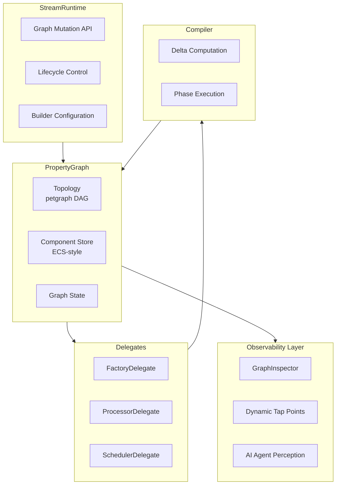

# StreamLib Architecture V2: Delegate-Based Runtime with Observability

**Status**: Proposed Architecture
**Last Updated**: 2024-12-01

This document describes the proposed architectural refactoring of StreamLib's runtime to address current pain points and enable new capabilities.

---

## Table of Contents

1. [Executive Summary](#executive-summary)
2. [Current Pain Points](#current-pain-points)
3. [Proposed Architecture](#proposed-architecture)
4. [Delegate Pattern](#delegate-pattern)
5. [PropertyGraph: Unified Graph + ECS](#propertygraph-unified-graph--ecs)
6. [Execution Mode vs Scheduling Strategy](#execution-mode-vs-scheduling-strategy)
7. [Observability Layer](#observability-layer)
8. [Transparent Internal Refactoring](#transparent-internal-refactoring)
9. [Codebase Cleanup](#codebase-cleanup)
10. [Rust Patterns and Idioms](#rust-patterns-and-idioms)
11. [Migration Path](#migration-path)
12. [File Structure](#file-structure)

---

## Executive Summary

The current architecture has three main issues:

1. **Muddled Responsibilities**: `StreamRuntime` and `SimpleExecutor` have overlapping concerns
2. **Dual Graph Problem**: `Graph` and `ExecutionGraph` can drift out of sync
3. **No Observability**: No way to dynamically inspect/tap into the running pipeline

The proposed architecture introduces:

1. **Delegate Pattern**: Clear separation via `FactoryDelegate`, `ProcessorDelegate`, `SchedulerDelegate`
2. **PropertyGraph**: Unified graph with ECS-style components (no more dual storage)
3. **Observability Layer**: Dynamic attach/detach observation for debugging and AI agents

---

## Current Pain Points

### 1. StreamRuntime Does Too Much

```
┌─────────────────────────────────────────────────────────────────┐
│                    StreamRuntime (current)                       │
│                                                                  │
│  • Graph mutations (add/remove/connect)     ← Core concern      │
│  • Factory registration                     ← Should be separate│
│  • Event publishing                         ← Side effects      │
│  • Lifecycle delegation                     ← OK                │
│  • Commit mode handling                     ← OK                │
│                                                                  │
└─────────────────────────────────────────────────────────────────┘
```

### 2. SimpleExecutor Has Overlapping Responsibilities

```
┌─────────────────────────────────────────────────────────────────┐
│                   SimpleExecutor (current)                       │
│                                                                  │
│  • Lifecycle state machine (Idle/Running/Paused)                │
│  • Graph compilation (4-phase pipeline)     ← Should be Compiler│
│  • Processor thread management              ← Should be Scheduler│
│  • Link channel wiring                      ← Part of Compiler   │
│  • ID generation                            ← Should be Graph    │
│  • Event listening                          ← Side effect        │
│                                                                  │
└─────────────────────────────────────────────────────────────────┘
```

### 3. Dual Graph Synchronization

```
┌─────────────┐                    ┌─────────────────┐
│    Graph    │                    │ ExecutionGraph  │
│  (Desired)  │                    │    (Actual)     │
├─────────────┤                    ├─────────────────┤
│ • Nodes     │──── must sync ────▶│ • Nodes (copy!) │ ← Can drift!
│ • Links     │                    │ • Links (copy!) │
│             │                    │ • Thread handles│
│             │                    │ • Ring buffers  │
└─────────────┘                    └─────────────────┘

Problem: Two sources of truth that must be kept in sync manually
```

---

## Proposed Architecture

### High-Level Overview

```
┌─────────────────────────────────────────────────────────────────────┐
│                         StreamRuntime                                │
│                                                                      │
│  • Graph mutation API (add/remove/connect/disconnect)               │
│  • Builder-style configuration (.with_factory(), .with_scheduler()) │
│  • Lifecycle (start/stop/pause/resume)                              │
│  • Commit mode handling                                              │
│                                                                      │
└────────────────────────────────┬────────────────────────────────────┘
                                 │
                                 │ owns
                                 ▼
┌─────────────────────────────────────────────────────────────────────┐
│                         PropertyGraph                                │
│                                                                      │
│  ┌───────────────────────┐    ┌───────────────────────────────┐    │
│  │   Topology (petgraph) │    │   Component Store (ECS-style) │    │
│  │   • ProcessorId nodes │    │   • ProcessorInstance         │    │
│  │   • LinkId edges      │    │   • ThreadHandle              │    │
│  │   • Connections       │    │   • ShutdownChannel           │    │
│  └───────────────────────┘    │   • ProcessorMetrics          │    │
│                               │   • (any component...)        │    │
│                               └───────────────────────────────┘    │
│                                                                      │
│  State: Idle | Running | Paused                                     │
│                                                                      │
└────────────────────────────────┬────────────────────────────────────┘
                                 │
                   ┌─────────────┼─────────────┐
                   │             │             │
                   ▼             ▼             ▼
           ┌────────────┐ ┌────────────┐ ┌────────────┐
           │  Factory   │ │ Processor  │ │ Scheduler  │
           │  Delegate  │ │  Delegate  │ │  Delegate  │
           │            │ │            │ │            │
           │ • create() │ │ • will_*() │ │ • strategy │
           │ • ports()  │ │ • did_*()  │ │   for each │
           └────────────┘ └────────────┘ └────────────┘
                                 │
                                 ▼
                         ┌────────────┐
                         │  Compiler  │
                         │            │
                         │ • compile()│
                         │ • phases   │
                         └────────────┘
                                 │
                                 ▼
                   ┌─────────────────────────┐
                   │   Observability Layer   │
                   │                         │
                   │ • Dynamic tap points    │
                   │ • Processor inspection  │
                   │ • Link inspection       │
                   │ • AI Agent perception   │
                   └─────────────────────────┘
```

### Mermaid Diagram



---

## Delegate Pattern

The delegate pattern (inspired by Apple's UIKit/AppKit) provides clear extension points without subclassing.

### FactoryDelegate

Creates processor instances from node definitions.

```rust
/// Delegate for processor instantiation.
pub trait FactoryDelegate: Send + Sync {
    /// Create a processor instance from a node definition.
    fn create(&self, node: &ProcessorNode) -> Result<BoxedProcessor>;
    
    /// Get port information for a processor type.
    fn port_info(&self, processor_type: &str) -> Option<(Vec<PortInfo>, Vec<PortInfo>)>;
    
    /// Check if this factory can create a processor type.
    fn can_create(&self, processor_type: &str) -> bool;
}
```

**Default Implementation**: `RegistryBackedFactory` (current behavior)

### ProcessorDelegate

Lifecycle callbacks for processors.

```rust
/// Delegate for processor lifecycle events.
pub trait ProcessorDelegate: Send + Sync {
    /// Called before a processor is created.
    fn will_create(&self, node: &ProcessorNode) -> Result<()> { Ok(()) }
    
    /// Called after a processor is created.
    fn did_create(&self, node: &ProcessorNode, processor: &BoxedProcessor) -> Result<()> { Ok(()) }
    
    /// Called before a processor starts.
    fn will_start(&self, id: &ProcessorId) -> Result<()> { Ok(()) }
    
    /// Called after a processor starts.
    fn did_start(&self, id: &ProcessorId) -> Result<()> { Ok(()) }
    
    /// Called before a processor stops.
    fn will_stop(&self, id: &ProcessorId) -> Result<()> { Ok(()) }
    
    /// Called after a processor stops.
    fn did_stop(&self, id: &ProcessorId) -> Result<()> { Ok(()) }
    
    /// Called when a processor's config is updated.
    fn did_update_config(&self, id: &ProcessorId, config: &serde_json::Value) -> Result<()> { Ok(()) }
}
```

**Default Implementation**: `DefaultProcessorDelegate` (no-ops)

### SchedulerDelegate

Determines how processors are scheduled/threaded.

```rust
/// Delegate for processor scheduling decisions.
pub trait SchedulerDelegate: Send + Sync {
    /// Determine scheduling strategy for a processor.
    fn scheduling_strategy(&self, node: &ProcessorNode) -> SchedulingStrategy;
}

/// How a processor should be scheduled.
pub enum SchedulingStrategy {
    /// Dedicated OS thread with priority.
    DedicatedThread {
        priority: ThreadPriority,
        name: Option<String>,
    },
    
    /// Run on Rayon work-stealing pool (for parallel video processing).
    /// Enables scaling to 50k+ processors like a game engine.
    WorkStealingPool,
    
    /// Run on main thread (required for Apple frameworks).
    MainThread,
    
    /// Lightweight - no dedicated resources, scheduled opportunistically.
    Lightweight,
}

pub enum ThreadPriority {
    /// Real-time priority (for audio - glitch-free).
    RealTime,
    /// High priority.
    High,
    /// Normal priority.
    Normal,
    /// Background/low priority.
    Background,
}
```

**Default Implementation**: `DefaultScheduler`

```rust
impl SchedulerDelegate for DefaultScheduler {
    fn scheduling_strategy(&self, node: &ProcessorNode) -> SchedulingStrategy {
        match node.processor_type.as_str() {
            // Audio processors get real-time threads
            t if t.contains("Audio") => SchedulingStrategy::DedicatedThread {
                priority: ThreadPriority::RealTime,
                name: Some(format!("audio-{}", node.id)),
            },
            
            // Apple framework processors go to main thread
            "CameraProcessor" | "DisplayProcessor" => SchedulingStrategy::MainThread,
            
            // Default: normal dedicated thread
            _ => SchedulingStrategy::DedicatedThread {
                priority: ThreadPriority::Normal,
                name: None,
            },
        }
    }
}
```

### Runtime Builder Pattern

```rust
impl StreamRuntime {
    /// Simple constructor with all defaults.
    pub fn new() -> Self {
        Self::default()
    }
    
    /// Builder for customization.
    pub fn builder() -> RuntimeBuilder {
        RuntimeBuilder::default()
    }
}

impl Default for StreamRuntime {
    fn default() -> Self {
        Self {
            graph: PropertyGraph::new(),
            factory: Arc::new(RegistryBackedFactory::new()),
            processor_delegate: Arc::new(DefaultProcessorDelegate),
            scheduler: Arc::new(DefaultScheduler),
            commit_mode: CommitMode::Auto,
        }
    }
}

// Usage
let runtime = StreamRuntime::new();  // Simple case - just works

// Power user customization
let runtime = StreamRuntime::builder()
    .with_factory(my_factory)
    .with_processor_delegate(my_lifecycle_hooks)
    .with_scheduler(my_custom_scheduler)
    .with_commit_mode(CommitMode::Manual)
    .build()?;
```

---

## PropertyGraph: Unified Graph + ECS

The PropertyGraph unifies `Graph` and `ExecutionGraph` into a single structure with ECS-style component storage.

### The Problem with Dual Graphs

Currently:
- `Graph` holds topology + node/link metadata
- `ExecutionGraph` holds copies of nodes/links + runtime state (threads, channels)
- These must be synchronized, and can drift

### The Solution: Components

```rust
pub struct PropertyGraph {
    /// Topology - just IDs and connections (petgraph).
    topology: DiGraph<ProcessorId, LinkId>,
    
    /// Node data indexed by ProcessorId.
    nodes: HashMap<ProcessorId, ProcessorNode>,
    
    /// Link data indexed by LinkId.
    links: HashMap<LinkId, Link>,
    
    /// ECS-style component storage for runtime state.
    components: ComponentStore,
    
    /// Graph-level state.
    state: GraphState,
}

#[derive(Default)]
pub enum GraphState {
    #[default]
    Idle,
    Running,
    Paused,
}
```

### Component Store

```rust
pub struct ComponentStore {
    /// Type-erased storage for each component type.
    processor_components: HashMap<TypeId, Box<dyn AnyComponentMap>>,
    link_components: HashMap<TypeId, Box<dyn AnyComponentMap>>,
}

// Components are just regular structs
pub struct ProcessorInstance(pub Arc<Mutex<BoxedProcessor>>);
pub struct ThreadHandle(pub JoinHandle<()>);
pub struct ShutdownChannel(pub Sender<()>);
pub struct ProcessFunctionInvokeChannel(pub Sender<ProcessFunctionEvent>);
pub struct ProcessorMetrics { pub throughput: f64, pub latency_p50: f64 }

// Marker components (zero-sized)
pub struct ReactiveMarker;
pub struct MainThreadMarker;
```

### Component API

```rust
impl PropertyGraph {
    // === Component Operations ===
    
    /// Attach a component to a processor.
    pub fn insert<C: Component>(&mut self, id: &ProcessorId, component: C) {
        self.components.insert(id, component);
    }
    
    /// Get a component for a processor.
    pub fn get<C: Component>(&self, id: &ProcessorId) -> Option<&C> {
        self.components.get::<C>(id)
    }
    
    /// Get a mutable component for a processor.
    pub fn get_mut<C: Component>(&mut self, id: &ProcessorId) -> Option<&mut C> {
        self.components.get_mut::<C>(id)
    }
    
    /// Remove a component from a processor.
    pub fn remove<C: Component>(&mut self, id: &ProcessorId) -> Option<C> {
        self.components.remove::<C>(id)
    }
    
    /// Check if a processor has a component.
    pub fn has<C: Component>(&self, id: &ProcessorId) -> bool {
        self.components.contains::<C>(id)
    }
    
    // === Queries ===
    
    /// Find all processors with a specific component.
    pub fn query<C: Component>(&self) -> impl Iterator<Item = &ProcessorId> {
        self.components.query::<C>()
    }
    
    /// Find all processors matching a predicate.
    pub fn query_filter<F>(&self, predicate: F) -> impl Iterator<Item = &ProcessorId>
    where
        F: Fn(&ProcessorNode) -> bool
    {
        self.nodes.iter()
            .filter(move |(_, node)| predicate(node))
            .map(|(id, _)| id)
    }
}
```

### Compilation as Component Attachment

With PropertyGraph, "compilation" is just attaching components to nodes:

```rust
impl Compiler {
    pub fn compile(&self, graph: &mut PropertyGraph, delta: &GraphDelta) -> Result<()> {
        // Phase 1: Create processor instances
        for id in &delta.processors_to_add {
            let node = graph.nodes.get(id).unwrap();
            let instance = self.factory.create(node)?;
            graph.insert(id, ProcessorInstance(Arc::new(Mutex::new(instance))));
        }
        
        // Phase 2: Wire links
        for link_id in &delta.links_to_add {
            self.wire_link(graph, link_id)?;
        }
        
        // Phase 3: Setup processors
        for id in &delta.processors_to_add {
            self.setup_processor(graph, id)?;
        }
        
        // Phase 4: Start (spawn threads based on scheduler)
        for id in &delta.processors_to_add {
            let node = graph.nodes.get(id).unwrap();
            let strategy = self.scheduler.scheduling_strategy(node);
            
            match strategy {
                SchedulingStrategy::DedicatedThread { priority, name } => {
                    let handle = self.spawn_thread(graph, id, priority, name)?;
                    graph.insert(id, ThreadHandle(handle));
                }
                SchedulingStrategy::WorkStealingPool => {
                    self.register_with_rayon(graph, id)?;
                    graph.insert(id, RayonMarker);
                }
                SchedulingStrategy::MainThread => {
                    self.schedule_on_main(graph, id)?;
                    graph.insert(id, MainThreadMarker);
                }
                SchedulingStrategy::Lightweight => {
                    graph.insert(id, LightweightMarker);
                }
            }
        }
        
        Ok(())
    }
}
```

### Benefits

1. **Single Source of Truth**: No more dual graph synchronization
2. **Flexible Queries**: Find processors by component (e.g., "all with ThreadHandle")
3. **Extensible**: Add new components without changing core structures
4. **Clean Teardown**: Remove components on shutdown, nothing lingers

---

## Execution Mode vs Scheduling Strategy

These are two **separate concerns** that should not be conflated.

### Execution Mode (Intrinsic to Processor)

How the processor fundamentally works - set at design time:

```rust
/// How a processor receives/generates data.
/// (Current API: `ProcessExecution` enum)
pub enum ProcessExecution {
    /// Generates data on its own schedule (camera, microphone, timer).
    /// Often involves hardware callbacks or system events.
    Continuous { interval_ms: u64 },
    
    /// Reacts to input data arriving.
    /// Wakes when upstream pushes data.
    Reactive,
    
    /// User explicitly calls process().
    /// For testing, scripting, step-by-step debugging.
    Manual,
}
```

**Examples**:
- `CameraProcessor` → `Continuous` (hardware pushes frames)
- `H264Encoder` → `Reactive` (processes frames when they arrive)
- `TestProcessor` → `Manual` (test harness controls timing)

### Scheduling Strategy (Runtime Decision)

How we allocate resources - can vary per deployment:

```rust
/// How a processor is scheduled at runtime.
pub enum SchedulingStrategy {
    DedicatedThread { priority: ThreadPriority },
    WorkStealingPool,  // Rayon - for 50k+ parallel processors
    MainThread,        // Apple framework requirement
    Lightweight,       // No dedicated resources
}
```

**These are orthogonal**:

| ProcessExecution | Possible Scheduling Strategies |
|------------------|-------------------------------|
| Continuous       | DedicatedThread, MainThread    |
| Reactive         | DedicatedThread, WorkStealingPool, Lightweight |
| Manual           | Any (caller controls timing)   |

A `Reactive` processor could run on:
- Dedicated thread (wakes on input)
- Rayon pool (task submitted when input arrives)
- Lightweight (inlined into caller's context)

---

## Observability Layer

The observability layer enables **dynamic, zero-overhead-when-unused inspection** of the running pipeline.

### Core Principles

1. **Zero overhead when not observing** - No taps installed by default
2. **Attach anytime** - While the graph is running
3. **Detach anytime** - Observer goes away, overhead disappears
4. **Multiple observers** - Several can watch the same point

### Architecture

```
                    Runtime is running normally...
                    (no observability overhead)
                    
   ┌──────────┐         ┌──────────┐         ┌──────────┐
   │ Camera   │────────▶│ Encoder  │────────▶│ Writer   │
   └──────────┘         └──────────┘         └──────────┘
   
   
   
                    Developer attaches observer...
                    
   ┌──────────┐         ┌──────────┐         ┌──────────┐
   │ Camera   │────────▶│ Encoder  │────────▶│ Writer   │
   └──────────┘         └─────┬────┘         └──────────┘
                              │
                              │ (dynamic tap)
                              ▼
                        ┌───────────┐
                        │ Observer  │  ← receives copies of data
                        └───────────┘
   
   
   
                    Done observing, detach...
                    (back to zero overhead)
                    
   ┌──────────┐         ┌──────────┐         ┌──────────┐
   │ Camera   │────────▶│ Encoder  │────────▶│ Writer   │
   └──────────┘         └──────────┘         └──────────┘
```

### GraphInspector API

```rust
pub struct GraphInspector {
    graph: Arc<RwLock<PropertyGraph>>,
}

impl GraphInspector {
    // === Snapshot Queries (point-in-time) ===
    
    /// Get current state of a processor.
    pub fn processor(&self, id: &ProcessorId) -> Option<ProcessorSnapshot>;
    
    /// Get current state of a link.
    pub fn link(&self, id: &LinkId) -> Option<LinkSnapshot>;
    
    /// Get full graph topology.
    pub fn topology(&self) -> GraphTopology;
    
    /// Get overall graph health.
    pub fn health(&self) -> GraphHealth;
    
    // === Dynamic Observation (streaming) ===
    
    /// Observe a processor - returns handle that auto-detaches on drop.
    pub fn observe_processor(&self, id: &ProcessorId) -> ObserverHandle<ProcessorEvent>;
    
    /// Observe a link - returns handle that auto-detaches on drop.
    pub fn observe_link(&self, id: &LinkId) -> ObserverHandle<LinkEvent>;
    
    /// Subscribe to graph-level events.
    pub fn observe_graph(&self) -> ObserverHandle<GraphEvent>;
}

/// Handle that automatically detaches observation when dropped.
pub struct ObserverHandle<T> {
    receiver: broadcast::Receiver<T>,
    // Drop impl removes the observation point
}

impl<T> Drop for ObserverHandle<T> {
    fn drop(&mut self) {
        // Automatically uninstall tap point
        // Zero overhead once dropped
    }
}
```

### Snapshot Types

```rust
pub struct ProcessorSnapshot {
    pub id: ProcessorId,
    pub processor_type: String,
    pub state: ProcessorState,
    pub throughput_fps: f64,
    pub latency: LatencyStats,
    pub config: serde_json::Value,
}

pub struct LinkSnapshot {
    pub id: LinkId,
    pub source: LinkEndpoint,
    pub target: LinkEndpoint,
    pub queue_depth: usize,
    pub capacity: usize,
    pub throughput_fps: f64,
}

pub struct GraphHealth {
    pub state: GraphState,
    pub processor_count: usize,
    pub link_count: usize,
    pub dropped_frames: u64,
    pub error_count: u64,
    pub bottlenecks: Vec<ProcessorId>,  // Processors with full queues
}

pub struct LatencyStats {
    pub p50: Duration,
    pub p90: Duration,
    pub p99: Duration,
    pub max: Duration,
}
```

### Event Types

```rust
pub enum ProcessorEvent {
    StateChanged { old: ProcessorState, new: ProcessorState },
    ConfigUpdated { config: serde_json::Value },
    FrameProcessed { timestamp: i64, latency: Duration },
    Error { error: String },
}

pub enum LinkEvent {
    DataPushed { timestamp: i64, size: usize },
    QueueFull { dropped: bool },
    QueueEmpty,
}

pub enum GraphEvent {
    // Uses Apple's Will/Did naming pattern
    GraphWillAddProcessor { processor_id: String, processor_type: String },
    GraphDidAddProcessor { processor_id: String, processor_type: String },
    GraphWillRemoveProcessor { processor_id: String },
    GraphDidRemoveProcessor { processor_id: String },
    GraphWillCreateLink { link_id: String, source: String, target: String },
    GraphDidCreateLink { link_id: String, source: String, target: String },
    GraphWillRemoveLink { link_id: String },
    GraphDidRemoveLink { link_id: String },
    StateChanged { old: GraphState, new: GraphState },
}
```

### AI Agent Perception

The observability layer enables AI agents to **perceive** the running pipeline:

```
┌─────────────────────────────────────────────────────────────────────┐
│                         Running Graph                                │
│                                                                      │
│   ┌──────────┐         ┌──────────┐         ┌──────────┐           │
│   │ Camera   │────────▶│ Encoder  │────────▶│ Writer   │           │
│   └──────────┘         └──────────┘         └──────────┘           │
│                                                                      │
└──────────────────────────────┬──────────────────────────────────────┘
                               │
                               ▼
┌─────────────────────────────────────────────────────────────────────┐
│                      Perception Layer                                │
│                                                                      │
│  • Sample video frames (thumbnails, keyframes, periodic)            │
│  • Sample audio (waveforms, levels, transcription-ready chunks)     │
│  • Query processor state ("is encoder keeping up?")                 │
│  • Query link health ("where's the bottleneck?")                    │
│  • Receive alerts ("encoder dropped 5 frames")                      │
│                                                                      │
└──────────────────────────────┬──────────────────────────────────────┘
                               │
                               ▼
┌─────────────────────────────────────────────────────────────────────┐
│                         AI Agent                                     │
│                                                                      │
│  "I can see the video feed, hear the audio, and understand          │
│   what's happening in the pipeline"                                  │
│                                                                      │
│  Perception:                                                         │
│  • sample_video() → Image for vision models                         │
│  • sample_audio() → Audio for speech/audio models                   │
│  • processor_status() → Metrics and state                           │
│  • graph_health() → Overall pipeline health                         │
│                                                                      │
│  Actions:                                                            │
│  • Adjust encoder bitrate based on content complexity               │
│  • Switch camera input when detecting scene change                  │
│  • Add processors dynamically (e.g., noise reduction)               │
│  • Route audio through different processing chains                  │
│                                                                      │
└─────────────────────────────────────────────────────────────────────┘
```

### AgentPerception API

```rust
pub trait AgentPerception: Send + Sync {
    /// Sample a video frame from a processor's output.
    fn sample_video(&self, id: &ProcessorId, config: SampleConfig) -> Option<SampledFrame>;
    
    /// Sample audio from a processor's output.
    fn sample_audio(&self, id: &ProcessorId, duration_ms: u32) -> Option<SampledAudio>;
    
    /// Get current status of a processor.
    fn processor_status(&self, id: &ProcessorId) -> ProcessorStatus;
    
    /// Get overall graph health.
    fn graph_health(&self) -> GraphHealth;
    
    /// Subscribe to events.
    fn subscribe(&self) -> EventStream;
}

pub struct SampleConfig {
    /// How to sample: thumbnail, full frame, keyframes only.
    pub mode: SampleMode,
    /// Maximum dimensions for thumbnails.
    pub max_dimensions: Option<(u32, u32)>,
    /// Output format.
    pub format: ImageFormat,
}

pub struct SampledFrame {
    pub timestamp: i64,
    pub width: u32,
    pub height: u32,
    pub format: ImageFormat,
    pub data: Vec<u8>,
}

pub struct SampledAudio {
    pub timestamp: i64,
    pub sample_rate: u32,
    pub channels: u8,
    pub samples: Vec<f32>,
}
```

### AgentActions API

```rust
pub trait AgentActions: Send + Sync {
    /// Update a processor's config.
    fn update_config(&self, id: &ProcessorId, config: serde_json::Value) -> Result<()>;
    
    /// Add a processor dynamically.
    fn add_processor(&self, processor_type: &str, config: serde_json::Value) -> Result<ProcessorId>;
    
    /// Remove a processor.
    fn remove_processor(&self, id: &ProcessorId) -> Result<()>;
    
    /// Create a connection.
    fn connect(&self, from: PortRef, to: PortRef) -> Result<LinkId>;
    
    /// Remove a connection.
    fn disconnect(&self, link_id: &LinkId) -> Result<()>;
}
```

### Example: AI Agent Loop

```rust
async fn agent_loop(
    perception: impl AgentPerception,
    actions: impl AgentActions,
) -> Result<()> {
    let encoder_id = ProcessorId::from("encoder_0");
    let camera_id = ProcessorId::from("camera_0");
    
    loop {
        // Sample current video frame
        if let Some(frame) = perception.sample_video(&encoder_id, SampleConfig::thumbnail()) {
            // Send to vision model for analysis
            let analysis = vision_model.analyze(&frame.data).await?;
            
            if analysis.scene_complexity > 0.8 {
                // Complex scene - increase bitrate for quality
                actions.update_config(&encoder_id, json!({ 
                    "bitrate": 8_000_000 
                }))?;
            } else if analysis.scene_complexity < 0.3 {
                // Simple scene - reduce bitrate to save bandwidth
                actions.update_config(&encoder_id, json!({ 
                    "bitrate": 2_000_000 
                }))?;
            }
        }
        
        // Check pipeline health
        let health = perception.graph_health();
        
        if health.dropped_frames > 10 {
            // Pipeline is struggling - reduce input resolution
            actions.update_config(&camera_id, json!({ 
                "resolution": "720p" 
            }))?;
        }
        
        if !health.bottlenecks.is_empty() {
            log::warn!("Bottleneck detected: {:?}", health.bottlenecks);
        }
        
        tokio::time::sleep(Duration::from_secs(1)).await;
    }
}
```

---

## Transparent Internal Refactoring

A key principle of this refactoring: **the external API stays exactly the same**. Users continue to use `runtime.add_processor()`, `runtime.connect()`, etc. The ECS and delegate patterns are purely internal implementation details.

### External API: Unchanged

```rust
// User code - looks exactly the same as today
let mut runtime = StreamRuntime::new();

let camera = runtime.add_processor::<CameraProcessor>(CameraConfig {
    device_id: None,
})?;

let encoder = runtime.add_processor::<H264Encoder>(EncoderConfig {
    bitrate: 4_000_000,
})?;

runtime.connect(&camera, &encoder)?;

runtime.start()?;
runtime.wait_for_signal()?;
```

**Users never see the ECS.** It's like the database engine behind a web app - users interact with clean APIs, but internally everything is stored efficiently and queryable.

### Internal: Before (Scattered State)

```rust
// Current: State scattered across multiple structures
pub struct SimpleExecutor {
    graph: Option<Arc<RwLock<Graph>>>,           // Topology + node definitions
    execution_graph: Option<ExecutionGraph>,      // Runtime state (duplicated!)
    factory: Option<Arc<dyn ProcessorNodeFactory>>,
    link_channel: LinkChannel,                    // More state
    next_processor_id: usize,                     // More state
    next_link_id: usize,                          // More state
    dirty: bool,
    // ...
}

pub struct ExecutionGraph {
    graph: Arc<RwLock<Graph>>,                              // Reference back
    processor_runtime: HashMap<ProcessorId, RunningProcessor>,  // Runtime state
    link_runtime: HashMap<LinkId, WiredLink>,                   // More runtime state
    metadata: CompilationMetadata,
}

pub struct RunningProcessor {
    pub node: ProcessorNode,                    // COPY of graph node - can drift!
    pub thread: Option<JoinHandle<()>>,
    pub shutdown_tx: Sender<()>,
    pub process_function_invoke_send: Sender<ProcessFunctionEvent>,
    pub state: Arc<Mutex<ProcessorState>>,
    pub processor: Option<Arc<Mutex<BoxedProcessor>>>,
}

// Syncing is a nightmare - must manually keep in sync
fn sync_graphs(&mut self) -> Result<()> {
    // Compare graph to execution_graph
    // Compute delta
    // Apply changes
    // Hope nothing drifted...
}
```

### Internal: After (ECS - Single Source of Truth)

```rust
use hecs::World;  // Or bevy_ecs - a real ECS library

// After: Everything in one place
pub struct PropertyGraph {
    world: World,                                    // All state lives here
    topology: DiGraph<Entity, Entity>,               // Just for graph algorithms
    processors: HashMap<ProcessorId, Entity>,        // Quick lookup
    links: HashMap<LinkId, Entity>,                  // Quick lookup
}

// Components - just data structs
pub struct ProcessorNode { pub id: ProcessorId, pub processor_type: String, pub config: Value }
pub struct ProcessorInstance(pub Arc<Mutex<BoxedProcessor>>);
pub struct ThreadHandle(pub JoinHandle<()>);
pub struct ShutdownChannel(pub Sender<()>);
pub struct ProcessFunctionInvokeChannel(pub Sender<ProcessFunctionEvent>);
pub struct ProcessorMetrics { pub throughput: f64, pub latency_p50: Duration }
pub struct Link { pub id: LinkId, pub source: Endpoint, pub target: Endpoint }
pub struct WiredChannel { pub producer: OwnedProducer, pub consumer: OwnedConsumer }

// No syncing needed - there's only ONE place state lives
```

### Using a Real ECS Library

We use `hecs` (lightweight) or `bevy_ecs` (feature-rich) instead of rolling our own:

```rust
// Entity = Processor or Link
// Component = Any data attached to it

// Spawn a processor entity with initial components
let entity = world.spawn((
    ProcessorNode { id, processor_type, config },
    ProcessorState::Idle,
));

// Attach components dynamically during compilation
world.insert_one(entity, ProcessorInstance(instance))?;
world.insert_one(entity, ThreadHandle(handle))?;
world.insert_one(entity, ProcessorMetrics::default())?;

// Powerful queries
for (entity, (node, metrics)) in world.query::<(&ProcessorNode, &ProcessorMetrics)>().iter() {
    println!("{}: {} fps", node.id, metrics.throughput);
}

// Find all running processors (have ThreadHandle)
let running: Vec<_> = world.query::<&ThreadHandle>().iter().collect();

// Find processors without metrics yet
for (entity, node) in world.query::<&ProcessorNode>().without::<&ProcessorMetrics>().iter() {
    world.insert_one(entity, ProcessorMetrics::default())?;
}
```

### Visual Node Graph Analogy

This is similar to **Unreal Blueprints**, **DaVinci Resolve Fusion**, or **Effect House**:

```
┌─────────────────────────────────────────────────────────────────────────────┐
│                    Visual Node Graph (Fusion/Blueprints)                     │
│                                                                             │
│   ┌─────────────┐         ┌─────────────┐         ┌─────────────┐          │
│   │   Camera    │────────▶│   Blur      │────────▶│   Output    │          │
│   │             │         │             │         │             │          │
│   │ ┌─────────┐ │         │ ┌─────────┐ │         │ ┌─────────┐ │          │
│   │ │ Props   │ │         │ │ Props   │ │         │ │ Props   │ │          │
│   │ │•device  │ │         │ │•radius  │ │         │ │•format  │ │          │
│   │ │•fps     │ │         │ │•quality │ │         │ │•path    │ │          │
│   │ └─────────┘ │         │ └─────────┘ │         │ └─────────┘ │          │
│   └─────────────┘         └─────────────┘         └─────────────┘          │
│                                                                             │
│   Each node can have arbitrary data attached (components):                 │
│   • The node itself (type, name)                                           │
│   • Its properties/config                                                   │
│   • Runtime state (is it processing? what's the output?)                   │
│   • UI metadata (position on canvas, collapsed state)                      │
│   • Debug info (timings, error messages)                                   │
│   • User annotations                                                        │
│                                                                             │
└─────────────────────────────────────────────────────────────────────────────┘
```

### Benefits of ECS Approach

| Aspect | Before | After |
|--------|--------|-------|
| State storage | Scattered HashMaps | Single ECS World |
| Synchronization | Manual, error-prone | Gone - single source of truth |
| Adding features | Modify multiple structs | Just add a component |
| Queries | Write custom code | Powerful ECS query system |
| Testing | Mock multiple structures | Query/insert components directly |

---

## Codebase Cleanup

Beyond the architectural changes, the codebase needs organizational cleanup.

### Bloated Files to Split

| File | Lines | Problem | Solution |
|------|-------|---------|----------|
| `apple/processors/mp4_writer.rs` | 1258 | Handles encoding, muxing, multiple codecs | Split into `mp4/encoder.rs`, `mp4/muxer.rs`, `mp4/formats.rs` |
| `apple/webrtc/session.rs` | 1147 | Complex WebRTC session | Split into `session/state.rs`, `session/negotiation.rs`, `session/media.rs` |
| `core/pubsub/events.rs` | 824 | Many event types + 350 lines tests | Split into `events/runtime.rs`, `events/processor.rs`, `events/input.rs` |
| `core/schema.rs` | 760 | Schema types + version logic + constants | Split into `schema/types.rs`, `schema/compatibility.rs`, `schema/builtins.rs` |
| `core/frames/audio_frame.rs` | 586 | AudioFrame + DynamicFrame + Signal impl | Extract `dynamic_frame.rs` |

### Scattered Code to Consolidate

**Audio code is spread across 6 locations:**

```
Current (scattered):
├── core/frames/audio_frame.rs      # AudioFrame, AudioChannelCount, DynamicFrame
├── core/utils/audio_frame.rs       # convert_channels(), resample_frame()
├── core/utils/audio_resample.rs    # AudioResampler, StereoResampler
├── core/processors/audio_mixer.rs
├── core/processors/audio_channel_converter.rs
└── core/processors/audio_resampler.rs

Proposed (consolidated):
└── core/audio/
    ├── mod.rs
    ├── frame.rs                    # AudioFrame, AudioChannelCount
    ├── dynamic_frame.rs            # DynamicFrame + dasp traits
    ├── resampler.rs                # AudioResampler
    ├── utils.rs                    # convert_channels, etc.
    └── processors/
        ├── mixer.rs
        ├── channel_converter.rs
        └── resampler.rs
```

### Deprecated Modules to Remove

```rust
// Current: backwards-compat shim in core/mod.rs
#[deprecated(since = "0.2.0", note = "Use `execution` module instead of `scheduling`")]
pub mod scheduling {
    pub use super::execution::*;
}

// Action: Remove entirely in next major version
```

### Confusing Names to Clarify

| Current | Problem | Proposed |
|---------|---------|----------|
| `RuntimeContext` in `context/` | Confusing - sounds like runtime but isn't | `MediaConfig` or `AudioVideoConfig` |
| `StreamRuntime` in `runtime/` | Fine, but paired naming is confusing | Keep, rename other |
| `simple/` subdirectory | Implies other executors that don't exist | Just `executor/` |

### Test Code Organization

Files with 30-50% test code:

```rust
// Current: 350 lines of tests in events.rs (out of 824)
#[cfg(test)]
mod tests {
    // ... 350 lines
}

// Better: Move to separate file
// core/pubsub/events.rs (code only, ~450 lines)
// core/pubsub/tests/events_tests.rs (tests only)
```

---

## Global State and Naming Cleanup

### Problem: Global Executor Singleton

The current code has a problematic global static:

```rust
// In simple/mod.rs
static EXECUTOR_REF: std::sync::OnceLock<Weak<Mutex<SimpleExecutor>>> = std::sync::OnceLock::new();

pub fn set_executor_ref(executor: Arc<Mutex<SimpleExecutor>>) {
    let _ = EXECUTOR_REF.set(Arc::downgrade(&executor));
    PUBSUB.subscribe(topics::RUNTIME_GLOBAL, executor);
}
```

**Why it's wrong:**
- Global mutable state makes testing hard
- Prevents multiple runtime instances
- Hidden dependency - must call `set_executor_ref()` at right time
- Implicit coupling between event bus and executor
- Event-driven compilation is backwards (runtime should call compiler directly)

**The fix:** With the delegate pattern, this disappears:

```rust
// OLD: Global singleton + event-driven compilation
static EXECUTOR_REF: OnceLock<...>;
PUBSUB.subscribe(..., executor);  // Executor listens for RuntimeStarted
// ... somewhere, RuntimeStarted triggers compile()

// NEW: Direct call, no globals
impl StreamRuntime {
    pub fn start(&mut self) -> Result<()> {
        self.graph.state = GraphState::Running;
        self.compiler.compile(&mut self.graph)?;  // Direct call!
        Ok(())
    }
}
```

### Problem: Confusing Trait Hierarchy and Names

Current hierarchy has meaningless names:

```rust
// Current - names describe Rust mechanics, not meaning
pub trait BaseProcessor: Send + 'static { ... }
pub trait Processor: BaseProcessor { type Config; ... }
pub trait DynProcessor: Send + 'static { ... }  // Object-safe
pub type BoxedProcessor = Box<dyn DynProcessor + Send>;  // What IS this?
```

**Problems:**
- `BoxedProcessor` tells you it's boxed, not what it *is*
- `DynProcessor` tells you it's dynamic, not what it *does*
- `BaseProcessor` vs `Processor` split is confusing
- Users see too many traits

**Proposed cleanup:**

```rust
/// The main processor trait - what users implement.
/// (Combines current BaseProcessor + Processor)
pub trait Processor: Send + 'static {
    type Config: Serialize + DeserializeOwned + Default;
    
    fn from_config(config: Self::Config) -> Result<Self> where Self: Sized;
    fn name(&self) -> &str;
    fn process(&mut self, ctx: &ProcessContext) -> Result<()>;
    fn setup(&mut self, ctx: &RuntimeContext) -> Result<()> { Ok(()) }
    fn teardown(&mut self) -> Result<()> { Ok(()) }
}

/// Object-safe version for dynamic dispatch.
/// Internal use only - auto-implemented for all Processors.
pub(crate) trait ProcessorDyn: Send + 'static {
    fn name(&self) -> &str;
    fn process(&mut self, ctx: &ProcessContext) -> Result<()>;
    fn setup(&mut self, ctx: &RuntimeContext) -> Result<()>;
    fn teardown(&mut self) -> Result<()>;
}

impl<P: Processor> ProcessorDyn for P {
    fn name(&self) -> &str { Processor::name(self) }
    fn process(&mut self, ctx: &ProcessContext) -> Result<()> { Processor::process(self, ctx) }
    fn setup(&mut self, ctx: &RuntimeContext) -> Result<()> { Processor::setup(self, ctx) }
    fn teardown(&mut self) -> Result<()> { Processor::teardown(self) }
}

/// A live, running processor instance (ECS component).
/// This is what gets stored in the graph and executed.
pub struct ProcessorInstance(pub Arc<Mutex<dyn ProcessorDyn>>);
```

**Benefits:**
- Users only see `Processor` trait
- `ProcessorInstance` is self-documenting - it's an instance!
- `ProcessorDyn` is internal, users don't care about dynamic dispatch
- No more `BoxedProcessor` - meaningless name gone

---

## Rust Patterns and Idioms

### Pattern 1: Macro for Repetitive Channel Matching

**Problem**: 8-way match arms repeated in audio code:

```rust
// Current: 8 nearly identical arms
let inner = match channels {
    AudioChannelCount::One => {
        let resampler = SincFixedIn::<f32>::new(ratio, 2.0, params, chunk_size, 1)?;
        ResamplerInner::One(resampler)
    }
    AudioChannelCount::Two => {
        let resampler = SincFixedIn::<f32>::new(ratio, 2.0, params, chunk_size, 2)?;
        ResamplerInner::Two(resampler)
    }
    // ... 6 more identical patterns
};
```

**Solution**: Macro to generate:

```rust
macro_rules! impl_for_channel_counts {
    ($($variant:ident => $count:expr),+ $(,)?) => {
        match channels {
            $(
                AudioChannelCount::$variant => {
                    let resampler = SincFixedIn::<f32>::new(ratio, 2.0, params, chunk_size, $count)?;
                    ResamplerInner::$variant(resampler)
                }
            )+
        }
    }
}

let inner = impl_for_channel_counts!(
    One => 1, Two => 2, Three => 3, Four => 4,
    Five => 5, Six => 6, Seven => 7, Eight => 8,
);
```

### Pattern 2: Lifecycle Event Helper

**Problem**: Repeated event publishing pattern:

```rust
// Current: Same pattern in start(), stop(), pause(), resume()
pub fn start(&mut self) -> Result<()> {
    PUBSUB.publish(..., &Event::RuntimeGlobal(RuntimeEvent::RuntimeStarting));
    match self.executor.lock().start() {
        Ok(()) => {
            PUBSUB.publish(..., &Event::RuntimeGlobal(RuntimeEvent::RuntimeStarted));
            Ok(())
        }
        Err(e) => {
            PUBSUB.publish(..., &Event::RuntimeGlobal(RuntimeEvent::RuntimeStartFailed { error: e.to_string() }));
            Err(e)
        }
    }
}
```

**Solution**: Helper method:

```rust
fn with_lifecycle_events<T, F>(
    &mut self,
    starting: RuntimeEvent,
    success: impl FnOnce() -> RuntimeEvent,
    failure: impl FnOnce(String) -> RuntimeEvent,
    operation: F,
) -> Result<T>
where
    F: FnOnce(&mut Self) -> Result<T>,
{
    PUBSUB.publish(RUNTIME_TOPIC, &Event::RuntimeGlobal(starting));
    match operation(self) {
        Ok(value) => {
            PUBSUB.publish(RUNTIME_TOPIC, &Event::RuntimeGlobal(success()));
            Ok(value)
        }
        Err(e) => {
            PUBSUB.publish(RUNTIME_TOPIC, &Event::RuntimeGlobal(failure(e.to_string())));
            Err(e)
        }
    }
}

// Usage
pub fn start(&mut self) -> Result<()> {
    self.with_lifecycle_events(
        RuntimeEvent::RuntimeStarting,
        || RuntimeEvent::RuntimeStarted,
        |e| RuntimeEvent::RuntimeStartFailed { error: e },
        |this| this.executor.lock().start(),
    )
}
```

### Pattern 3: Prelude Module for Common Re-exports

**Problem**: Large `lib.rs` with ~180 lines of re-exports:

```rust
// Current lib.rs - hard to know what's public API
pub use core::frames::VideoFrame;
pub use core::frames::AudioFrame;
pub use core::runtime::StreamRuntime;
// ... 180 more lines
```

**Solution**: Prelude pattern:

```rust
// core/prelude.rs - commonly used types
pub use crate::core::{
    // Runtime
    runtime::StreamRuntime,
    
    // Frames
    frames::{VideoFrame, AudioFrame, DataFrame},
    
    // Processors
    processors::Processor,
    
    // Errors
    error::{StreamError, Result},
};

// lib.rs - clean and simple
pub mod core;
pub mod apple;  // #[cfg(target_os = "macos")]

pub mod prelude {
    pub use crate::core::prelude::*;
}

// User code
use streamlib::prelude::*;
```

### Pattern 4: Builder with Defaults

**Problem**: Forcing users to configure everything:

```rust
// Bad: User must know about all these
let runtime = StreamRuntime::new(
    factory,
    scheduler,
    processor_delegate,
    commit_mode,
);
```

**Solution**: Default + Builder:

```rust
// Simple case - just works
let runtime = StreamRuntime::new();

// Power user - customize what you need
let runtime = StreamRuntime::builder()
    .with_scheduler(MyScheduler)
    .build()?;

// Implementation
impl Default for StreamRuntime {
    fn default() -> Self {
        Self {
            graph: PropertyGraph::new(),
            factory: Arc::new(RegistryBackedFactory::new()),
            scheduler: Arc::new(DefaultScheduler),
            processor_delegate: Arc::new(DefaultProcessorDelegate),
            commit_mode: CommitMode::Auto,
        }
    }
}

pub struct RuntimeBuilder {
    factory: Option<Arc<dyn FactoryDelegate>>,
    scheduler: Option<Arc<dyn SchedulerDelegate>>,
    // ...
}

impl RuntimeBuilder {
    pub fn with_scheduler(mut self, s: impl SchedulerDelegate + 'static) -> Self {
        self.scheduler = Some(Arc::new(s));
        self
    }
    
    pub fn build(self) -> Result<StreamRuntime> {
        let mut runtime = StreamRuntime::default();
        if let Some(s) = self.scheduler {
            runtime.scheduler = s;
        }
        Ok(runtime)
    }
}
```

### Pattern 5: Consolidate Deprecation Aliases

**Problem**: Deprecated type aliases scattered:

```rust
// Scattered in core/mod.rs
#[deprecated] pub type SchedulingConfig = ExecutionConfig;
#[deprecated] pub type OldName = NewName;
// ... more scattered
```

**Solution**: Central compatibility module:

```rust
// core/compat.rs - all deprecation aliases in one place
//! Backwards compatibility aliases.
//! 
//! These will be removed in the next major version.

#[deprecated(since = "0.2.0", note = "Use ExecutionConfig")]
pub type SchedulingConfig = super::execution::ExecutionConfig;

#[deprecated(since = "0.2.0", note = "Use ProcessExecution")]
pub type SchedulingMode = super::execution::ProcessExecution;

// Easy to find, easy to remove in next major version
```

---

## Migration Path

### Phase 1: Extract Compiler

Move compilation logic from `SimpleExecutor` to dedicated `Compiler` struct.

```
libs/streamlib/src/core/
├── compiler/           ← NEW
│   ├── mod.rs
│   ├── compiler.rs     # Main compiler struct
│   ├── phases.rs       # Create, wire, setup, start
│   └── delta.rs        # Moved from executor/
└── executor/
    ├── simple/
    │   ├── mod.rs      # Much smaller now
    │   └── lifecycle.rs
    └── ...
```

### Phase 2: Introduce Delegates

Add delegate traits with default implementations. `StreamRuntime` uses defaults.

```rust
// Can be done incrementally - current behavior becomes the default
pub struct DefaultProcessorDelegate;
impl ProcessorDelegate for DefaultProcessorDelegate {
    // All methods are no-ops
}
```

### Phase 3: Implement PropertyGraph

Replace `Graph` + `ExecutionGraph` with unified `PropertyGraph`.

```rust
// Migration: ExecutionGraph fields become components
// Before: execution_graph.processors[id].thread
// After:  property_graph.get::<ThreadHandle>(id)
```

### Phase 4: Add Observability Layer

Add `GraphInspector` and dynamic tap points.

```rust
// New module
libs/streamlib/src/core/
└── observability/
    ├── mod.rs
    ├── inspector.rs
    ├── tap.rs
    └── perception.rs
```

---

## File Structure

### Proposed Structure

```
libs/streamlib/src/
├── lib.rs                  # Clean - just module declarations + prelude re-export
│
├── core/
│   ├── mod.rs              # Core module exports
│   ├── prelude.rs          # NEW - commonly used types for `use streamlib::prelude::*`
│   ├── compat.rs           # NEW - all deprecation aliases in one place
│   │
│   ├── runtime/
│   │   ├── mod.rs          # StreamRuntime public API
│   │   ├── runtime.rs      # Implementation
│   │   └── builder.rs      # NEW - RuntimeBuilder
│   │
│   ├── graph/
│   │   ├── mod.rs          # PropertyGraph + types
│   │   ├── property_graph.rs  # NEW - Unified graph with ECS (uses hecs)
│   │   ├── node.rs         # ProcessorNode
│   │   ├── link.rs         # Link
│   │   └── topology.rs     # petgraph operations (cycle detection, topo sort)
│   │
│   ├── compiler/           # NEW - extracted from executor
│   │   ├── mod.rs
│   │   ├── compiler.rs     # Main Compiler struct
│   │   ├── phases.rs       # Create, wire, setup, start phases
│   │   ├── delta.rs        # GraphDelta computation (moved from executor/)
│   │   └── wiring.rs       # Ring buffer setup (moved from executor/)
│   │
│   ├── delegates/          # NEW
│   │   ├── mod.rs
│   │   ├── factory.rs      # FactoryDelegate trait + RegistryBackedFactory
│   │   ├── processor.rs    # ProcessorDelegate trait + DefaultProcessorDelegate
│   │   └── scheduler.rs    # SchedulerDelegate trait + DefaultScheduler
│   │
│   ├── observability/      # NEW
│   │   ├── mod.rs
│   │   ├── inspector.rs    # GraphInspector
│   │   ├── tap.rs          # Dynamic tap points (zero-overhead when unused)
│   │   ├── snapshots.rs    # ProcessorSnapshot, LinkSnapshot, GraphHealth
│   │   └── perception.rs   # AgentPerception, AgentActions traits
│   │
│   ├── audio/              # NEW - consolidated audio module
│   │   ├── mod.rs
│   │   ├── frame.rs        # AudioFrame, AudioChannelCount
│   │   ├── dynamic_frame.rs # DynamicFrame + dasp Frame trait
│   │   ├── resampler.rs    # AudioResampler (from utils/)
│   │   ├── utils.rs        # convert_channels, etc.
│   │   └── processors/
│   │       ├── mod.rs
│   │       ├── mixer.rs
│   │       ├── channel_converter.rs
│   │       └── resampler.rs
│   │
│   ├── execution/
│   │   ├── mod.rs
│   │   ├── process_execution.rs  # ProcessExecution (Continuous/Reactive/Manual)
│   │   ├── config.rs       # ExecutionConfig
│   │   ├── priority.rs     # ThreadPriority
│   │   └── runner.rs       # Thread/task runner implementations
│   │
│   ├── frames/
│   │   ├── mod.rs
│   │   ├── video_frame.rs  # VideoFrame
│   │   └── data_frame.rs   # DataFrame
│   │   # NOTE: audio moved to core/audio/
│   │
│   ├── schema/             # NEW - split from single schema.rs
│   │   ├── mod.rs
│   │   ├── types.rs        # Schema, Field, FieldType
│   │   ├── version.rs      # SemanticVersion, compatibility
│   │   ├── processor.rs    # ProcessorDescriptor, PortDescriptor
│   │   └── builtins.rs     # SCHEMA_VIDEO_FRAME, etc. constants
│   │
│   ├── pubsub/
│   │   ├── mod.rs
│   │   ├── bus.rs          # EventBus
│   │   ├── events/         # NEW - split events
│   │   │   ├── mod.rs
│   │   │   ├── runtime.rs  # RuntimeEvent
│   │   │   ├── processor.rs # ProcessorEvent
│   │   │   └── input.rs    # KeyCode, MouseButton, Modifiers
│   │   └── topics.rs       # Topic constants
│   │
│   ├── context/
│   │   ├── mod.rs
│   │   ├── gpu_context.rs  # GPU/wgpu setup
│   │   └── media_config.rs # RENAMED from runtime_context.rs
│   │
│   ├── link_channel/       # Unchanged - ring buffers (rtrb)
│   │   └── ...
│   │
│   ├── processors/
│   │   ├── mod.rs
│   │   ├── processor.rs    # Processor trait
│   │   ├── base.rs         # BaseProcessor trait
│   │   └── ...             # Other non-audio processors
│   │
│   ├── error.rs            # StreamError, Result
│   └── signals.rs          # Signal handling
│
└── apple/                  # macOS/iOS specific (unchanged structure)
    ├── processors/
    │   ├── mp4/            # NEW - split from mp4_writer.rs
    │   │   ├── mod.rs
    │   │   ├── writer.rs   # Main processor
    │   │   ├── encoder.rs  # Encoding logic
    │   │   ├── muxer.rs    # Muxing logic
    │   │   └── formats.rs  # Format handling
    │   └── ...
    │
    └── webrtc/
        ├── session/        # NEW - split from session.rs
        │   ├── mod.rs
        │   ├── state.rs    # State machine
        │   ├── negotiation.rs # SDP, ICE
        │   └── media.rs    # Media handling
        └── ...
```

### Key Changes Summary

| Change | Before | After |
|--------|--------|-------|
| ECS library | Custom HashMaps | `hecs` crate |
| Graph + ExecutionGraph | Two separate structs | Single `PropertyGraph` |
| Executor | `simple/` with compiler logic | Thin lifecycle + separate `compiler/` |
| Delegates | N/A | `delegates/` module |
| Observability | N/A | `observability/` module |
| Audio code | Scattered in 6 places | Consolidated `audio/` module |
| Schema | Single 760-line file | Split into `schema/` submodule |
| Events | Single 824-line file | Split into `pubsub/events/` |
| RuntimeContext | Confusing name | Renamed to `MediaConfig` |
| Deprecations | Scattered | Consolidated in `compat.rs` |
| Common types | 180 lines in lib.rs | `prelude.rs` module |

---

## Summary

| Current Problem | Proposed Solution |
|-----------------|-------------------|
| Runtime does too much | Delegate pattern - Factory, Processor, Scheduler delegates |
| Executor does too much | Extract Compiler, simplify executor to lifecycle only |
| Dual graph sync issues | PropertyGraph with ECS components - single source of truth |
| No observability | GraphInspector with dynamic tap points |
| Hard-coded threading | SchedulerDelegate - per-processor strategies |
| No AI agent support | AgentPerception/AgentActions APIs |

### Key Principles

1. **Sane Defaults**: `StreamRuntime::new()` works out of the box
2. **Power User Extensibility**: Builder pattern for customization
3. **Single Source of Truth**: PropertyGraph replaces Graph + ExecutionGraph
4. **Zero-Overhead Observability**: Only pay for what you use
5. **Keep Ring Buffers**: rtrb is battle-tested, don't over-engineer alternatives

---

*This document describes the target architecture. See RUNTIME_ARCHITECTURE.md for current implementation details.*
