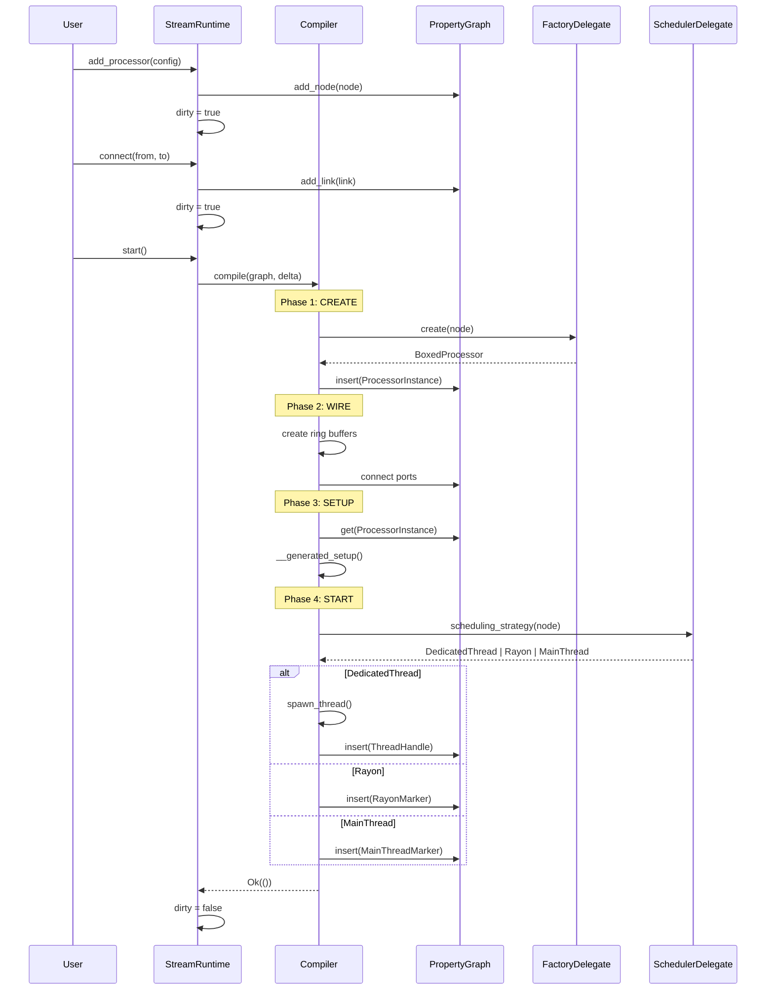
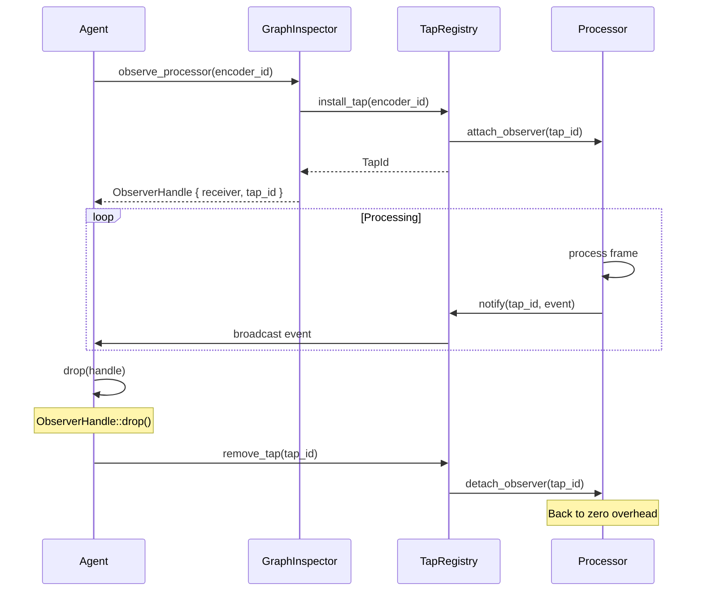
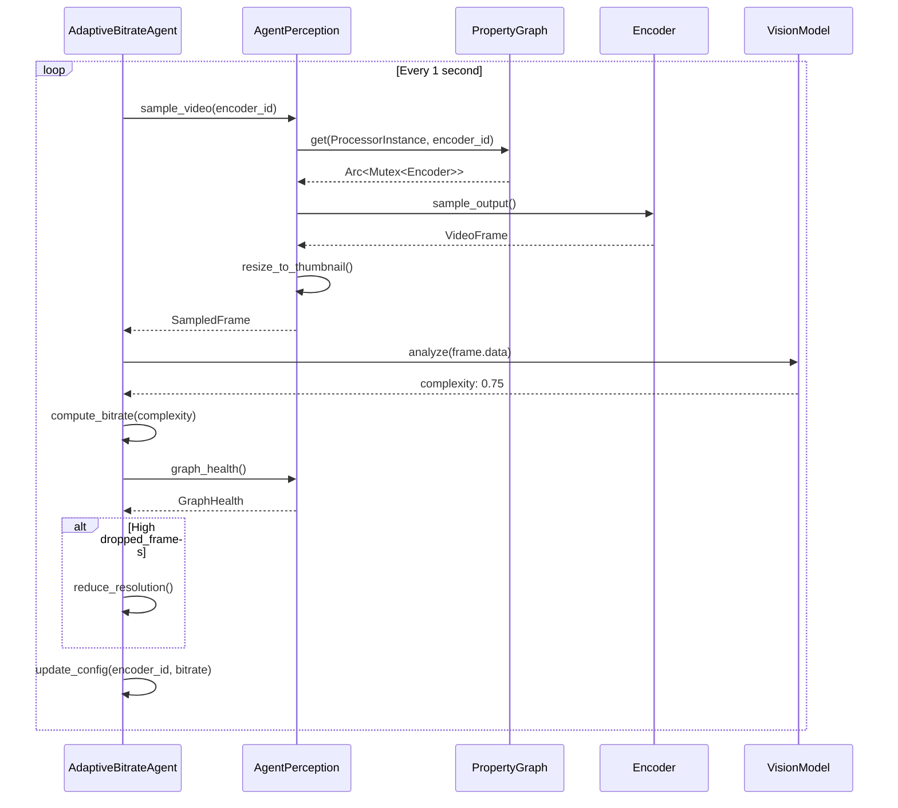

# Architecture V2: Visual Reference for Claude Code

<role>
This document provides visual diagrams for the architecture refactoring. Use these diagrams when implementing phases from ARCHITECTURE_V2.md to understand structural relationships.
</role>

---

## Current vs Target State

<current_state>
```
┌─────────────────────────────────────────────────────────────────────────────┐
│                              StreamRuntime                                   │
│  ┌─────────────────────────────────────────────────────────────────────┐   │
│  │  Fields (verified via rust-analyzer):                                │   │
│  │  • graph: Arc<RwLock<Graph>>                                         │   │
│  │  • executor: Arc<Mutex<SimpleExecutor>>                              │   │
│  │  • factory: Arc<RegistryBackedFactory>                               │   │
│  │  • commit_mode: CommitMode                                           │   │
│  └─────────────────────────────────────────────────────────────────────┘   │
│                                    │                                        │
│                                    ▼                                        │
│  ┌─────────────────────────────────────────────────────────────────────┐   │
│  │                         SimpleExecutor                               │   │
│  │  • state: ExecutorState                                              │   │
│  │  • graph: Option<Arc<RwLock<Graph>>>                                 │   │
│  │  • execution_graph: Option<ExecutionGraph>    ← PROBLEM: Dual graphs│   │
│  │  • factory: Option<Arc<dyn ProcessorNodeFactory>>                    │   │
│  │  • next_processor_id: usize                                          │   │
│  │  • next_link_id: usize                                               │   │
│  │  • dirty: bool                                                       │   │
│  └─────────────────────────────────────────────────────────────────────┘   │
│                                                                             │
│  ⚠️ EXECUTOR_REF: static OnceLock<Weak<Mutex<SimpleExecutor>>>             │
│     (Global singleton - prevents testing, prevents multiple runtimes)      │
│                                                                             │
└─────────────────────────────────────────────────────────────────────────────┘
```
</current_state>

<target_state>
```
┌─────────────────────────────────────────────────────────────────────────────┐
│                              StreamRuntime                                   │
│  ┌─────────────────────────────────────────────────────────────────────┐   │
│  │  Fields (target):                                                    │   │
│  │  • graph: Arc<RwLock<PropertyGraph>>     ← UNIFIED: Single source   │   │
│  │  • compiler: Compiler                     ← EXTRACTED from executor │   │
│  │  • factory: Arc<dyn FactoryDelegate>      ← DELEGATE pattern        │   │
│  │  • processor_delegate: Arc<dyn ProcessorDelegate>                    │   │
│  │  • scheduler: Arc<dyn SchedulerDelegate>                             │   │
│  │  • commit_mode: CommitMode                                           │   │
│  └─────────────────────────────────────────────────────────────────────┘   │
│                                                                             │
│  ✅ No EXECUTOR_REF global                                                 │
│  ✅ No dual graph synchronization                                          │
│  ✅ Delegates for extension points                                         │
│                                                                             │
└─────────────────────────────────────────────────────────────────────────────┘
```
</target_state>

---

## Phase 1: Extract Compiler

<phase_1_diagram>
```
BEFORE (current):
┌─────────────────────────────────────────┐
│            SimpleExecutor               │
│  ┌───────────────────────────────────┐  │
│  │  compiler.rs (submodule)          │  │
│  │  wiring.rs (submodule)            │  │
│  │  lifecycle.rs (submodule)         │  │
│  │  processors.rs (submodule)        │  │
│  └───────────────────────────────────┘  │
│                                         │
│  Compilation mixed with lifecycle       │
└─────────────────────────────────────────┘

AFTER (target):
┌─────────────────────────────────────────┐
│            SimpleExecutor               │
│  ┌───────────────────────────────────┐  │
│  │  lifecycle.rs                     │  │
│  │  (lifecycle only, delegates to    │  │
│  │   Compiler for compilation)       │  │
│  └───────────────────────────────────┘  │
│                  │                      │
│                  ▼ uses                 │
│  ┌───────────────────────────────────┐  │
│  │        Compiler (new module)      │  │
│  │  ┌─────────────────────────────┐  │  │
│  │  │ compiler.rs - orchestration │  │  │
│  │  │ phases.rs - 4 phases        │  │  │
│  │  │ delta.rs - change detection │  │  │
│  │  │ wiring.rs - ring buffers    │  │  │
│  │  └─────────────────────────────┘  │  │
│  └───────────────────────────────────┘  │
└─────────────────────────────────────────┘
```

<file_moves>
| From | To |
|------|-----|
| executor/simple/compiler.rs | compiler/phases.rs |
| executor/simple/wiring.rs | compiler/wiring.rs |
| (new) | compiler/compiler.rs |
| (new) | compiler/delta.rs |
</file_moves>
</phase_1_diagram>

---

## Phase 2: Delegate Pattern

<phase_2_diagram>
```
Delegate Hierarchy:
                         ┌─────────────────┐
                         │  StreamRuntime  │
                         └────────┬────────┘
                                  │ owns
        ┌─────────────────────────┼─────────────────────────┐
        │                         │                         │
        ▼                         ▼                         ▼
┌───────────────┐       ┌─────────────────┐       ┌────────────────┐
│FactoryDelegate│       │ProcessorDelegate│       │SchedulerDelegate│
├───────────────┤       ├─────────────────┤       ├────────────────┤
│ create()      │       │ will_create()   │       │ strategy()     │
│ port_info()   │       │ did_create()    │       │                │
│ can_create()  │       │ will_start()    │       │ Returns:       │
│               │       │ did_start()     │       │ • Dedicated    │
│ Default:      │       │ will_stop()     │       │ • Rayon        │
│ Registry      │       │ did_stop()      │       │ • MainThread   │
│ Backed        │       │                 │       │ • Lightweight  │
│ Factory       │       │ Default: no-ops │       │                │
└───────────────┘       └─────────────────┘       └────────────────┘
```

<builder_pattern>
```rust
// Simple case - just works
let runtime = StreamRuntime::new();

// Power user customization
let runtime = StreamRuntime::builder()
    .with_factory(MyFactory)
    .with_scheduler(MyScheduler)
    .with_processor_delegate(MyLifecycle)
    .build()?;
```
</builder_pattern>
</phase_2_diagram>

---

## Phase 3: PropertyGraph (ECS)

<phase_3_diagram>
```
PropertyGraph Structure:
┌─────────────────────────────────────────────────────────────────────────────┐
│                              PropertyGraph                                   │
│                                                                             │
│  ┌───────────────────────────────────────────────────────────────────────┐ │
│  │                          Topology Layer                                │ │
│  │    petgraph DiGraph<ProcessorId, LinkId>                              │ │
│  │                                                                        │ │
│  │    ┌─────────┐         ┌─────────┐         ┌─────────┐               │ │
│  │    │camera_0 │────────▶│encoder_0│────────▶│writer_0 │               │ │
│  │    │         │  link_0 │         │  link_1 │         │               │ │
│  │    └─────────┘         └─────────┘         └─────────┘               │ │
│  └───────────────────────────────────────────────────────────────────────┘ │
│                                                                             │
│  ┌───────────────────────────────────────────────────────────────────────┐ │
│  │                    ECS Component Store (hecs)                          │ │
│  │                                                                        │ │
│  │  ProcessorInstance:                                                    │ │
│  │  ┌──────────────────────────────────────────────────────────────────┐ │ │
│  │  │ camera_0  → Arc<Mutex<CameraProcessor>>                          │ │ │
│  │  │ encoder_0 → Arc<Mutex<H264Encoder>>                              │ │ │
│  │  │ writer_0  → Arc<Mutex<MP4Writer>>                                │ │ │
│  │  └──────────────────────────────────────────────────────────────────┘ │ │
│  │                                                                        │ │
│  │  ThreadHandle:                                                         │ │
│  │  ┌──────────────────────────────────────────────────────────────────┐ │ │
│  │  │ encoder_0 → JoinHandle<()>                                       │ │ │
│  │  │ writer_0  → JoinHandle<()>                                       │ │ │
│  │  └──────────────────────────────────────────────────────────────────┘ │ │
│  │                                                                        │ │
│  │  MainThreadMarker (zero-sized):                                        │ │
│  │  ┌──────────────────────────────────────────────────────────────────┐ │ │
│  │  │ camera_0 → ()                                                    │ │ │
│  │  └──────────────────────────────────────────────────────────────────┘ │ │
│  │                                                                        │ │
│  └───────────────────────────────────────────────────────────────────────┘ │
│                                                                             │
│  state: GraphState::Running                                                 │
└─────────────────────────────────────────────────────────────────────────────┘
```

<component_operations>
```rust
// Attach component
graph.insert(&id, ProcessorInstance(instance))?;

// Query component
let instance = graph.get::<ProcessorInstance>(&id)?;

// Check existence
if graph.has::<MainThreadMarker>(&id) {
    // runs on main thread
}

// Find all with component
for id in graph.query::<ThreadHandle>() {
    // processors with dedicated threads
}
```
</component_operations>

<migration_mapping>
| RunningProcessor Field | PropertyGraph Component |
|----------------------|-------------------------|
| processor | ProcessorInstance |
| thread | ThreadHandle |
| shutdown_tx | ShutdownChannel |
| process_function_invoke_send | ProcessInvokeChannel |
| state | ProcessorStateComponent |
| node | (stored in nodes HashMap, not component) |
</migration_mapping>
</phase_3_diagram>

---

## Phase 4: Compilation Pipeline

<compilation_phases>
```
Delta Computation → Phase 1 → Phase 2 → Phase 3 → Phase 4
                    CREATE     WIRE      SETUP     START

┌─────────────────────────────────────────────────────────────────────────────┐
│ Delta Computation                                                            │
│ ┌─────────────────────────────────────────────────────────────────────────┐ │
│ │  Graph State    →    Compiled State    =    Delta                       │ │
│ │  (desired)           (actual)               (difference)                │ │
│ │                                                                          │ │
│ │  + camera_0          (empty)                + add camera_0              │ │
│ │  + encoder_0                                + add encoder_0             │ │
│ │  + link_0                                   + add link_0                │ │
│ └─────────────────────────────────────────────────────────────────────────┘ │
└─────────────────────────────────────────────────────────────────────────────┘
                                    │
                                    ▼
┌─────────────────────────────────────────────────────────────────────────────┐
│ Phase 1: CREATE                                                              │
│                                                                              │
│   for id in delta.processors_to_add:                                        │
│       processor_delegate.will_create(node)                                  │
│       instance = factory.create(node)                                       │
│       graph.insert(id, ProcessorInstance(instance))                         │
│       processor_delegate.did_create(node, instance)                         │
│                                                                              │
│   Result: ProcessorInstance components attached                             │
└─────────────────────────────────────────────────────────────────────────────┘
                                    │
                                    ▼
┌─────────────────────────────────────────────────────────────────────────────┐
│ Phase 2: WIRE                                                                │
│                                                                              │
│   for link_id in delta.links_to_add:                                        │
│       channel = rtrb::RingBuffer::new(capacity)                             │
│       connect producer to source.output                                     │
│       connect consumer to target.input                                      │
│                                                                              │
│   Result: Ring buffers created and connected                                │
└─────────────────────────────────────────────────────────────────────────────┘
                                    │
                                    ▼
┌─────────────────────────────────────────────────────────────────────────────┐
│ Phase 3: SETUP                                                               │
│                                                                              │
│   for id in delta.processors_to_add:                                        │
│       instance = graph.get::<ProcessorInstance>(id)                         │
│       instance.lock().__generated_setup(runtime_context)                    │
│                                                                              │
│   Result: GPU resources allocated, devices opened                           │
└─────────────────────────────────────────────────────────────────────────────┘
                                    │
                                    ▼
┌─────────────────────────────────────────────────────────────────────────────┐
│ Phase 4: START                                                               │
│                                                                              │
│   for id in delta.processors_to_add:                                        │
│       strategy = scheduler.scheduling_strategy(node)                        │
│       processor_delegate.will_start(id)                                     │
│                                                                              │
│       match strategy:                                                        │
│           DedicatedThread → spawn thread, insert ThreadHandle               │
│           WorkStealingPool → register with rayon, insert RayonMarker        │
│           MainThread → schedule on main, insert MainThreadMarker            │
│           Lightweight → insert LightweightMarker                            │
│                                                                              │
│       processor_delegate.did_start(id)                                      │
│                                                                              │
│   Result: Threads spawned, markers attached                                 │
└─────────────────────────────────────────────────────────────────────────────┘
```
</compilation_phases>

---

## Scheduling Strategy Matrix

<scheduling_matrix>
```
┌─────────────────────────────────────────────────────────────────────────────┐
│              ProcessExecution × Scheduling Strategy Matrix                   │
│                                                                              │
│  ProcessExecution: HOW the processor works (intrinsic, design-time)         │
│  SchedulingStrategy: HOW we run it (deployment decision, runtime)           │
│                                                                              │
│                    │ Dedicated  │ Work-Stealing │ MainThread │ Lightweight │
│                    │  Thread    │    (Rayon)    │            │             │
│  ──────────────────┼────────────┼───────────────┼────────────┼─────────────│
│                    │            │               │            │             │
│  Continuous        │  ✓ Common  │   ✗ N/A       │  ✓ Apple   │  ✗ N/A      │
│  (Camera, Mic)     │  Own loop  │   (pushes     │  Callbacks │  (needs     │
│                    │            │    frames)    │  on main   │   thread)   │
│                    │            │               │            │             │
│  ──────────────────┼────────────┼───────────────┼────────────┼─────────────│
│                    │            │               │            │             │
│  Reactive          │  ✓ Common  │   ✓ Ideal!    │  ✓ If      │  ✓ Simple   │
│  (Encoder, Filter) │  Wait for  │   Task per    │  required  │  Inline in  │
│                    │  invoke    │   frame       │            │  caller     │
│                    │            │               │            │             │
│  ──────────────────┼────────────┼───────────────┼────────────┼─────────────│
│                    │            │               │            │             │
│  Manual            │  ✓ Test    │   ✓ Test      │  ✓ Test    │  ✓ Test     │
│  (Test harness)    │  harness   │   harness     │  harness   │  harness    │
│                    │  controls  │   controls    │  controls  │  controls   │
│                    │            │               │            │             │
└─────────────────────────────────────────────────────────────────────────────┘

Key: These are ORTHOGONAL concerns!
```
</scheduling_matrix>

---

## Observability Layer

<observability_diagram>
```
Zero-overhead when not observing:
┌─────────────────────────────────────────────────────────────────────────────┐
│   ┌─────────┐  frame   ┌─────────┐  frame   ┌─────────┐                    │
│   │ Camera  │─────────▶│ Encoder │─────────▶│ Writer  │                    │
│   └─────────┘          └─────────┘          └─────────┘                    │
│                                                                             │
│   No taps installed = No overhead                                          │
└─────────────────────────────────────────────────────────────────────────────┘

After attaching observer:
┌─────────────────────────────────────────────────────────────────────────────┐
│   ┌─────────┐  frame   ┌─────────┐  frame   ┌─────────┐                    │
│   │ Camera  │─────────▶│ Encoder │─────────▶│ Writer  │                    │
│   └─────────┘          └────┬────┘          └─────────┘                    │
│                             │                                               │
│                             │ tap (clones events)                           │
│                             ▼                                               │
│                        ┌─────────┐                                         │
│                        │Observer │                                         │
│                        │ Handle  │                                         │
│                        └─────────┘                                         │
│                                                                             │
│   Tap installed = Small overhead (event cloning only)                      │
└─────────────────────────────────────────────────────────────────────────────┘

After dropping observer:
┌─────────────────────────────────────────────────────────────────────────────┐
│   ┌─────────┐  frame   ┌─────────┐  frame   ┌─────────┐                    │
│   │ Camera  │─────────▶│ Encoder │─────────▶│ Writer  │                    │
│   └─────────┘          └─────────┘          └─────────┘                    │
│                                                                             │
│   ObserverHandle dropped = Tap auto-removed = Back to zero overhead        │
└─────────────────────────────────────────────────────────────────────────────┘
```

<observer_api>
```rust
// Attach observer
let handle = inspector.observe_processor(&encoder_id);

// Receive events
while let Ok(event) = handle.receiver.recv().await {
    match event {
        ProcessorEvent::FrameProcessed { latency, .. } => {
            metrics.record(latency);
        }
        _ => {}
    }
}

// Drop handle - tap automatically removed
drop(handle);
```
</observer_api>
</observability_diagram>

---

## Event System (Already Implemented)

<event_system status="complete">
```
RuntimeEvent enum (libs/streamlib/src/core/pubsub/events.rs):

┌─────────────────────────────────────────────────────────────────────────────┐
│  Apple-style Will/Did naming pattern - ALREADY IMPLEMENTED ✅               │
│                                                                             │
│  Graph Lifecycle:                                                           │
│  ├── GraphWillAddProcessor { processor_id, processor_type }                │
│  ├── GraphDidAddProcessor { processor_id, processor_type }                 │
│  ├── GraphWillRemoveProcessor { processor_id }                             │
│  ├── GraphDidRemoveProcessor { processor_id }                              │
│  ├── GraphWillCreateLink { from_processor, from_port, to_processor, ... } │
│  ├── GraphDidCreateLink { link_id, from_port, to_port }                    │
│  ├── GraphWillRemoveLink { link_id, from_port, to_port }                   │
│  └── GraphDidRemoveLink { link_id, from_port, to_port }                    │
│                                                                             │
│  Processor Lifecycle:                                                       │
│  ├── ProcessorConfigDidChange { processor_id }                             │
│  └── ProcessorStateDidChange { processor_id, old_state, new_state }        │
│                                                                             │
│  Compilation:                                                               │
│  ├── GraphWillCompile                                                       │
│  ├── GraphDidCompile                                                        │
│  └── GraphCompileFailed { error }                                          │
│                                                                             │
│  NO CHANGES NEEDED - This is already the target state                      │
└─────────────────────────────────────────────────────────────────────────────┘
```
</event_system>

---

## Threading Models Comparison

<threading_comparison>
```
┌─────────────────────────────────────────────────────────────────────────────┐
│                    CURRENT THREADING MODEL                                   │
│                                                                             │
│  Main Thread            Worker Thread 1        Worker Thread 2              │
│  ┌──────────┐          ┌──────────────┐       ┌──────────────┐             │
│  │ macOS    │          │ Encoder      │       │ Writer       │             │
│  │ Event    │          │ ┌──────────┐ │       │ ┌──────────┐ │             │
│  │ Loop     │          │ │ loop {   │ │       │ │ loop {   │ │             │
│  │          │          │ │  wait()  │ │       │ │  wait()  │ │             │
│  │ Camera   │──frame──▶│ │  encode()│ │──────▶│ │  write() │ │             │
│  │ callbacks│          │ │ }        │ │       │ │ }        │ │             │
│  │          │          │ └──────────┘ │       │ └──────────┘ │             │
│  └──────────┘          └──────────────┘       └──────────────┘             │
│                                                                             │
│  Problem: One thread per processor doesn't scale to 50k+ processors        │
└─────────────────────────────────────────────────────────────────────────────┘

┌─────────────────────────────────────────────────────────────────────────────┐
│                    PROPOSED THREADING MODEL                                  │
│                                                                             │
│  Main Thread    RT Thread     Rayon Pool (4-8 threads)                      │
│  ┌──────────┐  ┌──────────┐  ┌──────────────────────────────────────────┐  │
│  │ macOS    │  │ Audio    │  │ ┌────────┐ ┌────────┐ ┌────────┐        │  │
│  │ Event    │  │ Capture  │  │ │Worker 1│ │Worker 2│ │Worker 3│ ...    │  │
│  │ Loop     │  │          │  │ ├────────┤ ├────────┤ ├────────┤        │  │
│  │          │  │ RealTime │  │ │Encoder │ │Filter  │ │Encoder │        │  │
│  │ Camera   │  │ priority │  │ │  #1    │ │  #1    │ │  #2    │        │  │
│  │ Display  │  └──────────┘  │ └────────┘ └────────┘ └────────┘        │  │
│  │          │                │                                          │  │
│  └──────────┘                │ Work-stealing: Idle workers steal tasks  │  │
│                              └──────────────────────────────────────────┘  │
│                                                                             │
│  Benefits:                                                                  │
│  • MainThread: Required for Apple frameworks (Camera, Display)             │
│  • RT Thread: Glitch-free audio with fixed priority                        │
│  • Rayon Pool: Scales to 50k+ reactive processors                          │
│                                                                             │
└─────────────────────────────────────────────────────────────────────────────┘
```
</threading_comparison>

---

## Mermaid Sequence Diagrams

<mermaid_diagrams>

### Compilation Flow



### Dynamic Tap Lifecycle



### Agent Perception Loop



</mermaid_diagrams>

---

## Migration Summary

<migration_summary>
```
┌─────────────────────────────────────────────────────────────────────────────┐
│                         COMPLETE MIGRATION PATH                              │
│                                                                             │
│  PHASE 0 (Current State):                                                   │
│  ┌─────────────────────────────────────────────────────────────────────┐   │
│  │  StreamRuntime → SimpleExecutor → Graph + ExecutionGraph            │   │
│  │                                                                      │   │
│  │  + EXECUTOR_REF global singleton                                     │   │
│  │  + Compilation logic mixed in SimpleExecutor                         │   │
│  │  + Dual graph synchronization                                        │   │
│  └─────────────────────────────────────────────────────────────────────┘   │
│                                     │                                       │
│                                     ▼ Phase 1                               │
│  ┌─────────────────────────────────────────────────────────────────────┐   │
│  │  StreamRuntime → SimpleExecutor → Graph + ExecutionGraph            │   │
│  │                         ↓                                            │   │
│  │                    Compiler (new)                                    │   │
│  │                                                                      │   │
│  │  + Compilation logic extracted to Compiler                           │   │
│  │  + SimpleExecutor delegates compilation                              │   │
│  │  = No breaking changes                                               │   │
│  └─────────────────────────────────────────────────────────────────────┘   │
│                                     │                                       │
│                                     ▼ Phase 2                               │
│  ┌─────────────────────────────────────────────────────────────────────┐   │
│  │  StreamRuntime → SimpleExecutor → Graph + ExecutionGraph            │   │
│  │       │                ↓                                             │   │
│  │       │           Compiler                                           │   │
│  │       │              ↓                                               │   │
│  │       └──────► Delegates (Factory, Processor, Scheduler)            │   │
│  │                                                                      │   │
│  │  + RuntimeBuilder for customization                                  │   │
│  │  + Default delegates preserve existing behavior                      │   │
│  │  = No breaking changes                                               │   │
│  └─────────────────────────────────────────────────────────────────────┘   │
│                                     │                                       │
│                                     ▼ Phase 3                               │
│  ┌─────────────────────────────────────────────────────────────────────┐   │
│  │  StreamRuntime → Compiler → PropertyGraph (ECS)                     │   │
│  │       │              ↓                                               │   │
│  │       └──────► Delegates                                             │   │
│  │                                                                      │   │
│  │  - SimpleExecutor REMOVED                                            │   │
│  │  - EXECUTOR_REF REMOVED                                              │   │
│  │  - Graph + ExecutionGraph → PropertyGraph                            │   │
│  │  = Internal breaking (no public API changes)                         │   │
│  └─────────────────────────────────────────────────────────────────────┘   │
│                                     │                                       │
│                                     ▼ Phase 4 (Target)                      │
│  ┌─────────────────────────────────────────────────────────────────────┐   │
│  │  StreamRuntime → Compiler → PropertyGraph (ECS)                     │   │
│  │       │              ↓                                               │   │
│  │       ├──────► Delegates                                             │   │
│  │       │                                                              │   │
│  │       └──────► GraphInspector (new)                                  │   │
│  │                    ↓                                                 │   │
│  │               AgentPerception + AgentActions                         │   │
│  │                                                                      │   │
│  │  + Observability layer                                               │   │
│  │  + Dynamic taps for monitoring                                       │   │
│  │  + AI agent integration APIs                                         │   │
│  │  = New features, no breaking changes                                 │   │
│  └─────────────────────────────────────────────────────────────────────┘   │
│                                                                             │
│  SUMMARY:                                                                   │
│  • SimpleExecutor: Exists in Phase 0-2, REMOVED in Phase 3                 │
│  • EXECUTOR_REF:   Exists in Phase 0-2, REMOVED in Phase 3                 │
│  • PropertyGraph:  Added in Phase 3, becomes single source of truth        │
│  • Delegates:      Added in Phase 2, optional extension points             │
│  • Observability:  Added in Phase 4, new capability                        │
│                                                                             │
└─────────────────────────────────────────────────────────────────────────────┘
```
</migration_summary>

---

## File Structure Reference

<file_structure>
```
libs/streamlib/src/
├── lib.rs
│
├── core/
│   ├── mod.rs
│   ├── prelude.rs          # NEW - Phase 2
│   ├── compat.rs           # NEW - cleanup
│   │
│   ├── runtime/
│   │   ├── mod.rs
│   │   ├── runtime.rs
│   │   └── builder.rs      # NEW - Phase 2
│   │
│   ├── graph/
│   │   ├── mod.rs
│   │   ├── property_graph.rs  # NEW - Phase 3
│   │   ├── components.rs      # NEW - Phase 3
│   │   ├── node.rs
│   │   ├── link.rs
│   │   └── topology.rs
│   │
│   ├── compiler/           # NEW - Phase 1
│   │   ├── mod.rs
│   │   ├── compiler.rs
│   │   ├── phases.rs
│   │   ├── delta.rs
│   │   └── wiring.rs
│   │
│   ├── delegates/          # NEW - Phase 2
│   │   ├── mod.rs
│   │   ├── factory.rs
│   │   ├── processor.rs
│   │   └── scheduler.rs
│   │
│   ├── observability/      # NEW - Phase 4
│   │   ├── mod.rs
│   │   ├── inspector.rs
│   │   ├── snapshots.rs
│   │   ├── tap.rs
│   │   └── perception.rs
│   │
│   └── ... (existing modules)
```
</file_structure>
