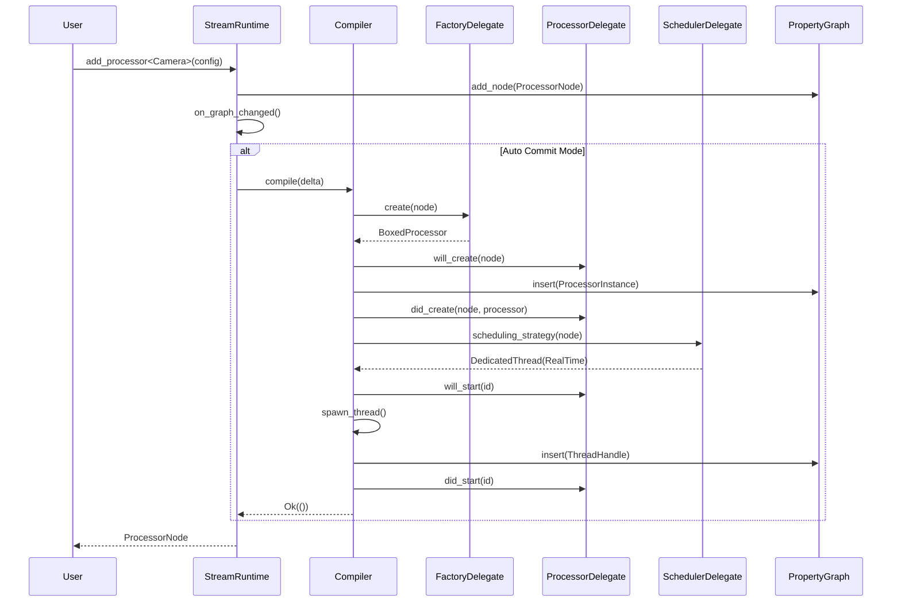
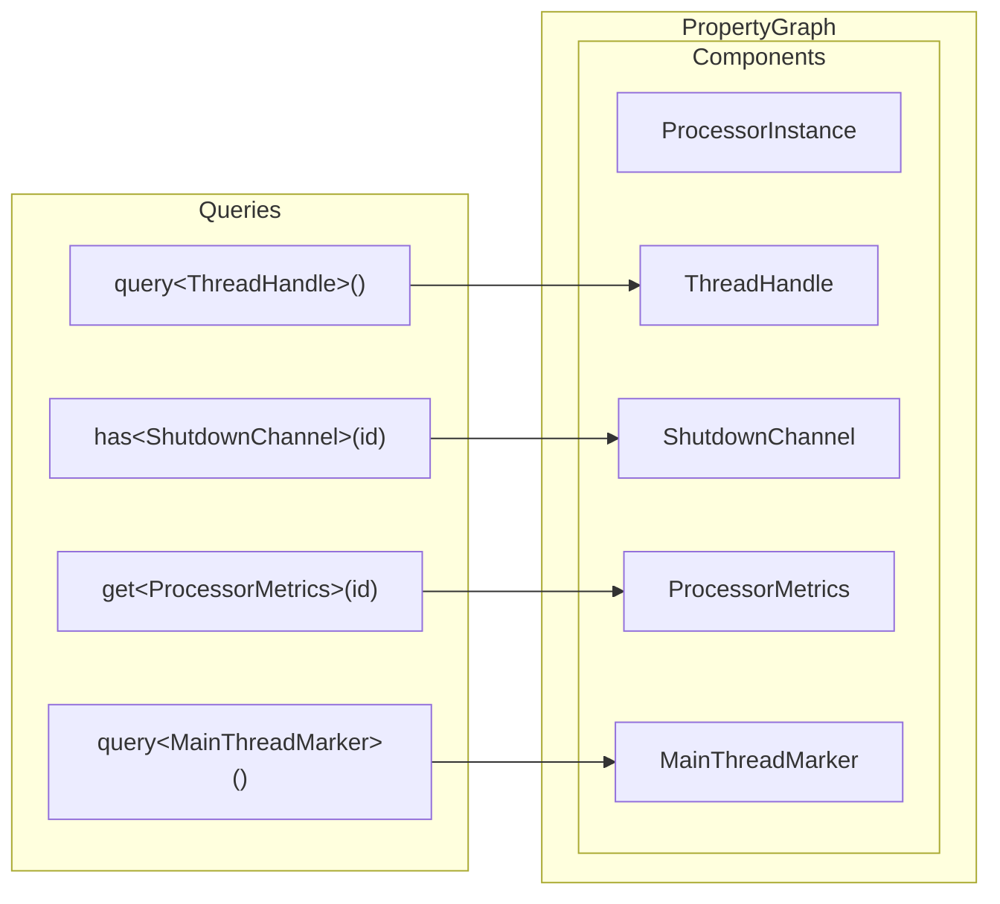
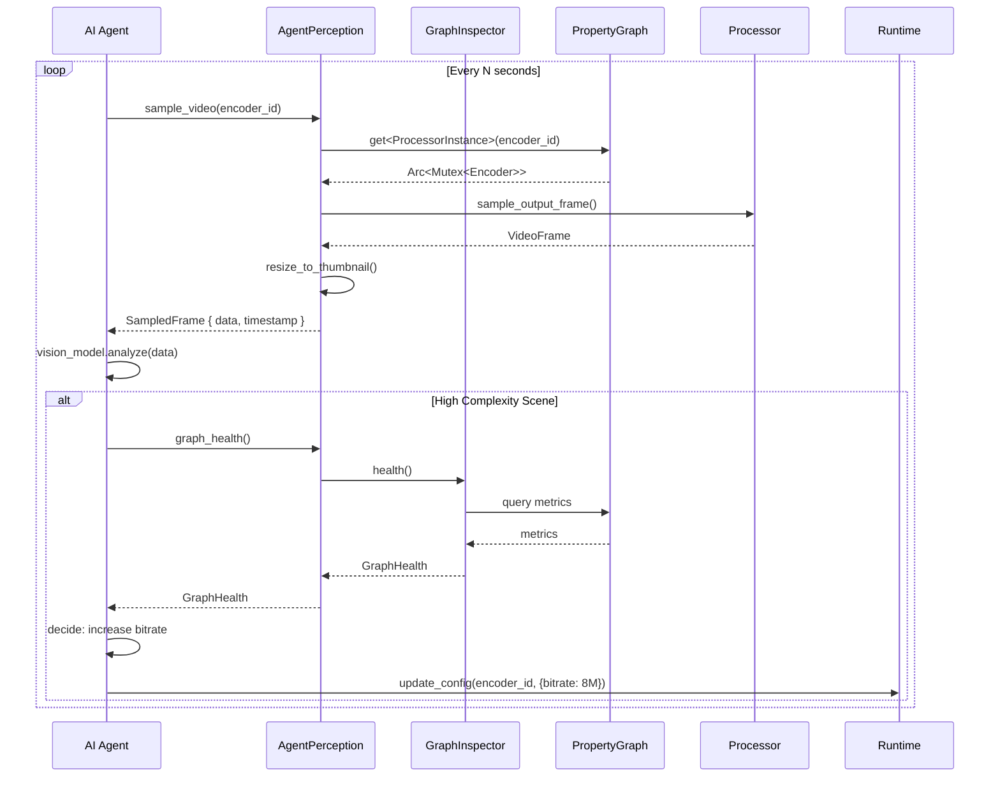

# Architecture V2: Detailed Diagrams

This document provides detailed visual representations of the proposed architecture.

---

## Table of Contents

1. [Current vs Proposed Comparison](#current-vs-proposed-comparison)
2. [Delegate Flow Diagrams](#delegate-flow-diagrams)
3. [PropertyGraph Internals](#propertygraph-internals)
4. [Compilation Pipeline](#compilation-pipeline)
5. [Observability Data Flow](#observability-data-flow)
6. [Threading Models](#threading-models)

---

## Current vs Proposed Comparison

### Current Architecture

```
┌─────────────────────────────────────────────────────────────────────────────┐
│                              StreamRuntime                                   │
│  ┌─────────────────────────────────────────────────────────────────────┐   │
│  │  Responsibilities (too many!):                                       │   │
│  │  • Graph mutations                                                   │   │
│  │  • Factory registration (implicit)                                   │   │
│  │  • Event publishing (inline)                                         │   │
│  │  • Lifecycle delegation                                              │   │
│  │  • Commit mode                                                       │   │
│  └─────────────────────────────────────────────────────────────────────┘   │
│                                    │                                        │
│                                    ▼                                        │
│  ┌─────────────────────────────────────────────────────────────────────┐   │
│  │                         SimpleExecutor                               │   │
│  │  ┌─────────────────────────────────────────────────────────────┐    │   │
│  │  │  Responsibilities (also too many!):                          │    │   │
│  │  │  • State machine (Idle/Running/Paused)                       │    │   │
│  │  │  • Graph compilation (4 phases)                              │    │   │
│  │  │  • Thread management                                         │    │   │
│  │  │  • Link wiring                                               │    │   │
│  │  │  • ID generation                                             │    │   │
│  │  │  • Event listening                                           │    │   │
│  │  └─────────────────────────────────────────────────────────────┘    │   │
│  │                                    │                                 │   │
│  │           ┌────────────────────────┼────────────────────────┐       │   │
│  │           ▼                        ▼                        ▼       │   │
│  │    ┌───────────┐            ┌───────────┐            ┌──────────┐  │   │
│  │    │   Graph   │            │ Execution │            │ Factory  │  │   │
│  │    │ (Desired) │───sync────▶│   Graph   │◀───────────│          │  │   │
│  │    │           │            │ (Actual)  │            │          │  │   │
│  │    └───────────┘            └───────────┘            └──────────┘  │   │
│  │           │                        │                                │   │
│  │           │    CAN DRIFT!          │                                │   │
│  │           └────────────────────────┘                                │   │
│  └─────────────────────────────────────────────────────────────────────┘   │
└─────────────────────────────────────────────────────────────────────────────┘
```

### Proposed Architecture

```
┌─────────────────────────────────────────────────────────────────────────────┐
│                              StreamRuntime                                   │
│  ┌─────────────────────────────────────────────────────────────────────┐   │
│  │  Focused Responsibilities:                                           │   │
│  │  • Graph mutation API                                                │   │
│  │  • Builder configuration                                             │   │
│  │  • Lifecycle (start/stop)                                           │   │
│  │  • Commit mode                                                       │   │
│  └─────────────────────────────────────────────────────────────────────┘   │
│                                    │                                        │
│                    ┌───────────────┼───────────────┐                       │
│                    ▼               ▼               ▼                       │
│             ┌──────────┐    ┌──────────┐    ┌──────────┐                  │
│             │ Factory  │    │Processor │    │Scheduler │                  │
│             │ Delegate │    │ Delegate │    │ Delegate │                  │
│             └────┬─────┘    └────┬─────┘    └────┬─────┘                  │
│                  │               │               │                         │
│                  └───────────────┼───────────────┘                         │
│                                  ▼                                          │
│                         ┌────────────────┐                                 │
│                         │    Compiler    │                                 │
│                         │                │                                 │
│                         │ • Delta calc   │                                 │
│                         │ • 4 phases     │                                 │
│                         └───────┬────────┘                                 │
│                                 │                                           │
│                                 ▼                                           │
│  ┌─────────────────────────────────────────────────────────────────────┐   │
│  │                         PropertyGraph                                │   │
│  │  ┌─────────────────────────┐    ┌───────────────────────────────┐   │   │
│  │  │   Topology (petgraph)   │    │   Component Store (ECS)       │   │   │
│  │  │   • ProcessorId nodes   │    │   • ProcessorInstance         │   │   │
│  │  │   • LinkId edges        │    │   • ThreadHandle              │   │   │
│  │  │   • Connections         │    │   • Metrics                   │   │   │
│  │  └─────────────────────────┘    └───────────────────────────────┘   │   │
│  │                                                                      │   │
│  │  SINGLE SOURCE OF TRUTH - NO DRIFT POSSIBLE                         │   │
│  └─────────────────────────────────────────────────────────────────────┘   │
│                                 │                                           │
│                                 ▼                                           │
│                    ┌────────────────────────┐                              │
│                    │  Observability Layer   │                              │
│                    │  • GraphInspector      │                              │
│                    │  • Dynamic taps        │                              │
│                    │  • AI perception       │                              │
│                    └────────────────────────┘                              │
└─────────────────────────────────────────────────────────────────────────────┘
```

---

## Delegate Flow Diagrams

### Mermaid: Delegate Interactions



### ASCII: Delegate Responsibility Flow

```
                                User Request
                                     │
                                     ▼
                         ┌───────────────────────┐
                         │    StreamRuntime      │
                         │                       │
                         │  "I just mutate the   │
                         │   graph and delegate  │
                         │   everything else"    │
                         └───────────┬───────────┘
                                     │
              ┌──────────────────────┼──────────────────────┐
              │                      │                      │
              ▼                      ▼                      ▼
    ┌─────────────────┐    ┌─────────────────┐    ┌─────────────────┐
    │ FactoryDelegate │    │ProcessorDelegate│    │SchedulerDelegate│
    │                 │    │                 │    │                 │
    │ "How do I       │    │ "What happens   │    │ "How should     │
    │  create this    │    │  during         │    │  this processor │
    │  processor?"    │    │  lifecycle?"    │    │  be scheduled?" │
    │                 │    │                 │    │                 │
    │ • create()      │    │ • will_create() │    │ • strategy()    │
    │ • port_info()   │    │ • did_create()  │    │   → Dedicated   │
    │                 │    │ • will_start()  │    │   → Rayon       │
    │                 │    │ • did_start()   │    │   → MainThread  │
    │                 │    │ • will_stop()   │    │   → Lightweight │
    │                 │    │ • did_stop()    │    │                 │
    └────────┬────────┘    └────────┬────────┘    └────────┬────────┘
             │                      │                      │
             └──────────────────────┼──────────────────────┘
                                    │
                                    ▼
                         ┌───────────────────────┐
                         │      Compiler         │
                         │                       │
                         │  "I orchestrate the   │
                         │   compilation using   │
                         │   the delegates"      │
                         │                       │
                         │  Phase 1: Create      │
                         │  Phase 2: Wire        │
                         │  Phase 3: Setup       │
                         │  Phase 4: Start       │
                         └───────────────────────┘
```

---

## PropertyGraph Internals

### Component Store Architecture

```
┌─────────────────────────────────────────────────────────────────────────────┐
│                              PropertyGraph                                   │
│                                                                             │
│  ┌───────────────────────────────────────────────────────────────────────┐ │
│  │                          Topology Layer                                │ │
│  │                                                                        │ │
│  │    ┌─────────┐         ┌─────────┐         ┌─────────┐               │ │
│  │    │camera_0 │────────▶│encoder_0│────────▶│writer_0 │               │ │
│  │    │         │  link_0 │         │  link_1 │         │               │ │
│  │    └─────────┘         └─────────┘         └─────────┘               │ │
│  │                                                                        │ │
│  │    petgraph: DiGraph<ProcessorId, LinkId>                            │ │
│  └───────────────────────────────────────────────────────────────────────┘ │
│                                                                             │
│  ┌───────────────────────────────────────────────────────────────────────┐ │
│  │                        Component Store                                 │ │
│  │                                                                        │ │
│  │  ┌─────────────────────────────────────────────────────────────────┐  │ │
│  │  │  ProcessorInstance (TypeId: 0x1234)                             │  │ │
│  │  │  ┌──────────────────────────────────────────────────────────┐   │  │ │
│  │  │  │ camera_0  → Arc<Mutex<CameraProcessor>>                  │   │  │ │
│  │  │  │ encoder_0 → Arc<Mutex<H264Encoder>>                      │   │  │ │
│  │  │  │ writer_0  → Arc<Mutex<MP4Writer>>                        │   │  │ │
│  │  │  └──────────────────────────────────────────────────────────┘   │  │ │
│  │  └─────────────────────────────────────────────────────────────────┘  │ │
│  │                                                                        │ │
│  │  ┌─────────────────────────────────────────────────────────────────┐  │ │
│  │  │  ThreadHandle (TypeId: 0x5678)                                  │  │ │
│  │  │  ┌──────────────────────────────────────────────────────────┐   │  │ │
│  │  │  │ camera_0  → JoinHandle<()>                               │   │  │ │
│  │  │  │ encoder_0 → JoinHandle<()>                               │   │  │ │
│  │  │  │ writer_0  → JoinHandle<()>                               │   │  │ │
│  │  │  └──────────────────────────────────────────────────────────┘   │  │ │
│  │  └─────────────────────────────────────────────────────────────────┘  │ │
│  │                                                                        │ │
│  │  ┌─────────────────────────────────────────────────────────────────┐  │ │
│  │  │  ProcessorMetrics (TypeId: 0x9ABC)                              │  │ │
│  │  │  ┌──────────────────────────────────────────────────────────┐   │  │ │
│  │  │  │ camera_0  → { throughput: 30.0, latency_p50: 1.2ms }     │   │  │ │
│  │  │  │ encoder_0 → { throughput: 29.8, latency_p50: 8.5ms }     │   │  │ │
│  │  │  │ writer_0  → { throughput: 29.8, latency_p50: 2.1ms }     │   │  │ │
│  │  │  └──────────────────────────────────────────────────────────┘   │  │ │
│  │  └─────────────────────────────────────────────────────────────────┘  │ │
│  │                                                                        │ │
│  │  ┌─────────────────────────────────────────────────────────────────┐  │ │
│  │  │  MainThreadMarker (TypeId: 0xDEF0) - Zero-sized marker          │  │ │
│  │  │  ┌──────────────────────────────────────────────────────────┐   │  │ │
│  │  │  │ camera_0 → ()   (marked for main thread)                 │   │  │ │
│  │  │  └──────────────────────────────────────────────────────────┘   │  │ │
│  │  └─────────────────────────────────────────────────────────────────┘  │ │
│  │                                                                        │ │
│  └───────────────────────────────────────────────────────────────────────┘ │
│                                                                             │
│  State: Running                                                             │
│                                                                             │
└─────────────────────────────────────────────────────────────────────────────┘
```

### Mermaid: Component Queries



---

## Compilation Pipeline

### Phase Sequence

```
┌─────────────────────────────────────────────────────────────────────────────┐
│                           Compilation Pipeline                               │
│                                                                             │
│   Delta Computation                                                         │
│   ┌─────────────────────────────────────────────────────────────────────┐  │
│   │  Graph State    →    Compiled State    =    Delta                    │  │
│   │  (desired)           (actual)               (difference)             │  │
│   │                                                                       │  │
│   │  + camera_0          (empty)                + add camera_0           │  │
│   │  + encoder_0                                + add encoder_0          │  │
│   │  + link_0                                   + add link_0             │  │
│   └─────────────────────────────────────────────────────────────────────┘  │
│                                     │                                        │
│                                     ▼                                        │
│   Phase 1: CREATE                                                           │
│   ┌─────────────────────────────────────────────────────────────────────┐  │
│   │  for each processor in delta.processors_to_add:                      │  │
│   │      instance = factory.create(node)                                 │  │
│   │      graph.insert(id, ProcessorInstance(instance))                   │  │
│   │                                                                       │  │
│   │  ┌─────────┐         ┌─────────┐         ┌─────────┐                │  │
│   │  │camera_0 │         │encoder_0│         │writer_0 │                │  │
│   │  │ ┌─────┐ │         │ ┌─────┐ │         │ ┌─────┐ │                │  │
│   │  │ │ Inst│ │         │ │ Inst│ │         │ │ Inst│ │                │  │
│   │  │ └─────┘ │         │ └─────┘ │         │ └─────┘ │                │  │
│   │  └─────────┘         └─────────┘         └─────────┘                │  │
│   └─────────────────────────────────────────────────────────────────────┘  │
│                                     │                                        │
│                                     ▼                                        │
│   Phase 2: WIRE                                                             │
│   ┌─────────────────────────────────────────────────────────────────────┐  │
│   │  for each link in delta.links_to_add:                                │  │
│   │      channel = create_ring_buffer(capacity)                          │  │
│   │      connect producer to source.output                               │  │
│   │      connect consumer to target.input                                │  │
│   │                                                                       │  │
│   │  ┌─────────┐  rtrb   ┌─────────┐  rtrb   ┌─────────┐                │  │
│   │  │camera_0 │━━━━━━━━▶│encoder_0│━━━━━━━━▶│writer_0 │                │  │
│   │  │         │ link_0  │         │ link_1  │         │                │  │
│   │  └─────────┘         └─────────┘         └─────────┘                │  │
│   └─────────────────────────────────────────────────────────────────────┘  │
│                                     │                                        │
│                                     ▼                                        │
│   Phase 3: SETUP                                                            │
│   ┌─────────────────────────────────────────────────────────────────────┐  │
│   │  for each processor in delta.processors_to_add:                      │  │
│   │      processor.__generated_setup(context)                            │  │
│   │      // Initializes GPU resources, opens devices, etc.               │  │
│   │                                                                       │  │
│   │  ┌─────────┐         ┌─────────┐         ┌─────────┐                │  │
│   │  │camera_0 │         │encoder_0│         │writer_0 │                │  │
│   │  │ ┌─────┐ │         │ ┌─────┐ │         │ ┌─────┐ │                │  │
│   │  │ │Setup│ │         │ │Setup│ │         │ │Setup│ │                │  │
│   │  │ │ ✓   │ │         │ │ ✓   │ │         │ │ ✓   │ │                │  │
│   │  │ └─────┘ │         │ └─────┘ │         │ └─────┘ │                │  │
│   │  └─────────┘         └─────────┘         └─────────┘                │  │
│   └─────────────────────────────────────────────────────────────────────┘  │
│                                     │                                        │
│                                     ▼                                        │
│   Phase 4: START                                                            │
│   ┌─────────────────────────────────────────────────────────────────────┐  │
│   │  for each processor in delta.processors_to_add:                      │  │
│   │      strategy = scheduler.scheduling_strategy(node)                  │  │
│   │      match strategy:                                                 │  │
│   │          DedicatedThread → spawn thread, store ThreadHandle          │  │
│   │          WorkStealingPool → register with rayon                      │  │
│   │          MainThread → schedule on main                               │  │
│   │          Lightweight → attach marker only                            │  │
│   │                                                                       │  │
│   │  ┌─────────┐         ┌─────────┐         ┌─────────┐                │  │
│   │  │camera_0 │         │encoder_0│         │writer_0 │                │  │
│   │  │ Thread  │         │ Thread  │         │ Thread  │                │  │
│   │  │ Main▲   │         │ Normal  │         │ Normal  │                │  │
│   │  └────┼────┘         └────┼────┘         └────┼────┘                │  │
│   │       │                   │                   │                      │  │
│   │       └───────────────────┴───────────────────┘                      │  │
│   │                     All Running!                                      │  │
│   └─────────────────────────────────────────────────────────────────────┘  │
│                                                                             │
└─────────────────────────────────────────────────────────────────────────────┘
```

---

## Observability Data Flow

### Dynamic Tap Lifecycle

```
Timeline ──────────────────────────────────────────────────────────────────────▶

T0: Normal Operation (zero overhead)
┌─────────────────────────────────────────────────────────────────────────────┐
│                                                                             │
│   ┌─────────┐  frame   ┌─────────┐  frame   ┌─────────┐                   │
│   │ Camera  │─────────▶│ Encoder │─────────▶│ Writer  │                   │
│   └─────────┘          └─────────┘          └─────────┘                   │
│                                                                             │
│   No taps installed = No overhead                                          │
│                                                                             │
└─────────────────────────────────────────────────────────────────────────────┘


T1: Developer attaches observer
┌─────────────────────────────────────────────────────────────────────────────┐
│                                                                             │
│   let handle = inspector.observe_processor(&encoder_id);                   │
│                                                                             │
│   ┌─────────┐  frame   ┌─────────┐  frame   ┌─────────┐                   │
│   │ Camera  │─────────▶│ Encoder │─────────▶│ Writer  │                   │
│   └─────────┘          └────┬────┘          └─────────┘                   │
│                             │                                               │
│                             │ clone events                                  │
│                             ▼                                               │
│                        ┌─────────┐                                         │
│                        │Observer │  ← receiving ProcessorEvents            │
│                        │ Handle  │    • FrameProcessed { ts, latency }     │
│                        └─────────┘    • StateChanged { ... }               │
│                                                                             │
│   Tap installed = Small overhead (event cloning)                           │
│                                                                             │
└─────────────────────────────────────────────────────────────────────────────┘


T2: Multiple observers (broadcast)
┌─────────────────────────────────────────────────────────────────────────────┐
│                                                                             │
│   let handle1 = inspector.observe_processor(&encoder_id);                  │
│   let handle2 = inspector.observe_processor(&encoder_id);                  │
│                                                                             │
│   ┌─────────┐          ┌─────────┐          ┌─────────┐                   │
│   │ Camera  │─────────▶│ Encoder │─────────▶│ Writer  │                   │
│   └─────────┘          └────┬────┘          └─────────┘                   │
│                             │                                               │
│                       broadcast::Sender                                     │
│                        ┌────┴────┐                                         │
│                        │         │                                          │
│                        ▼         ▼                                          │
│                   ┌────────┐ ┌────────┐                                    │
│                   │Handle 1│ │Handle 2│                                    │
│                   └────────┘ └────────┘                                    │
│                                                                             │
│   Multiple observers share same tap point                                  │
│                                                                             │
└─────────────────────────────────────────────────────────────────────────────┘


T3: Observer dropped (auto-detach)
┌─────────────────────────────────────────────────────────────────────────────┐
│                                                                             │
│   drop(handle);  // ObserverHandle::drop() removes tap point               │
│                                                                             │
│   ┌─────────┐  frame   ┌─────────┐  frame   ┌─────────┐                   │
│   │ Camera  │─────────▶│ Encoder │─────────▶│ Writer  │                   │
│   └─────────┘          └─────────┘          └─────────┘                   │
│                                                                             │
│   Tap automatically removed = Back to zero overhead                        │
│                                                                             │
└─────────────────────────────────────────────────────────────────────────────┘
```

### AI Agent Perception Flow



---

## Threading Models

### Scheduling Strategy Comparison

```
┌─────────────────────────────────────────────────────────────────────────────┐
│                         Scheduling Strategies                                │
│                                                                             │
│  DedicatedThread (default)                                                  │
│  ┌─────────────────────────────────────────────────────────────────────┐   │
│  │                                                                       │   │
│  │   Thread 1          Thread 2          Thread 3          Thread 4     │   │
│  │   ┌───────┐         ┌───────┐         ┌───────┐         ┌───────┐   │   │
│  │   │Camera │         │Encoder│         │Writer │         │Audio  │   │   │
│  │   │       │         │       │         │       │         │       │   │   │
│  │   │Normal │         │Normal │         │Normal │         │RT ▲   │   │   │
│  │   └───────┘         └───────┘         └───────┘         └───────┘   │   │
│  │                                                                       │   │
│  │   Good for: Most processors, I/O bound work                          │   │
│  │   Thread count: 1 per processor                                      │   │
│  │                                                                       │   │
│  └─────────────────────────────────────────────────────────────────────┘   │
│                                                                             │
│  WorkStealingPool (Rayon)                                                  │
│  ┌─────────────────────────────────────────────────────────────────────┐   │
│  │                                                                       │   │
│  │   ┌─────────────────────────────────────────────────────────────┐    │   │
│  │   │                    Rayon Thread Pool                         │    │   │
│  │   │   ┌──────┐ ┌──────┐ ┌──────┐ ┌──────┐        (N = CPU cores)│    │   │
│  │   │   │Worker│ │Worker│ │Worker│ │Worker│                       │    │   │
│  │   │   └──────┘ └──────┘ └──────┘ └──────┘                       │    │   │
│  │   │      ▲        ▲        ▲        ▲                            │    │   │
│  │   │      └────────┴────────┴────────┘                            │    │   │
│  │   │                   │                                          │    │   │
│  │   │   ┌───────────────┴───────────────┐                          │    │   │
│  │   │   │ Task Queue (work stealing)    │                          │    │   │
│  │   │   │ [P1] [P2] [P3] ... [P50000]   │ ← 50k processors OK!    │    │   │
│  │   │   └───────────────────────────────┘                          │    │   │
│  │   └─────────────────────────────────────────────────────────────┘    │   │
│  │                                                                       │   │
│  │   Good for: Parallel video processing, many similar processors       │   │
│  │   Thread count: Fixed (CPU cores), scales to 50k+ processors         │   │
│  │                                                                       │   │
│  └─────────────────────────────────────────────────────────────────────┘   │
│                                                                             │
│  MainThread (Apple requirement)                                            │
│  ┌─────────────────────────────────────────────────────────────────────┐   │
│  │                                                                       │   │
│  │   Main Thread (NSApplication run loop)                               │   │
│  │   ┌─────────────────────────────────────────────────────────────┐    │   │
│  │   │                                                              │    │   │
│  │   │   ┌────────┐  ┌────────┐  ┌────────┐                        │    │   │
│  │   │   │ Camera │  │Display │  │  Metal │   (Apple framework     │    │   │
│  │   │   │AVFound.│  │ Window │  │ Render │    processors)         │    │   │
│  │   │   └────────┘  └────────┘  └────────┘                        │    │   │
│  │   │                                                              │    │   │
│  │   └─────────────────────────────────────────────────────────────┘    │   │
│  │                                                                       │   │
│  │   Required for: AVFoundation, Metal, AppKit, UIKit                   │   │
│  │   Must use: run_on_main_blocking() / run_on_main_async()             │   │
│  │                                                                       │   │
│  └─────────────────────────────────────────────────────────────────────┘   │
│                                                                             │
│  Lightweight (no dedicated resources)                                      │
│  ┌─────────────────────────────────────────────────────────────────────┐   │
│  │                                                                       │   │
│  │   Caller's Thread                                                     │   │
│  │   ┌─────────────────────────────────────────────────────────────┐    │   │
│  │   │                                                              │    │   │
│  │   │   push(frame)                                                │    │   │
│  │   │       │                                                      │    │   │
│  │   │       ▼                                                      │    │   │
│  │   │   ┌────────────┐                                             │    │   │
│  │   │   │ Lightweight│  ← Runs inline in caller's context          │    │   │
│  │   │   │ Processor  │                                             │    │   │
│  │   │   └────────────┘                                             │    │   │
│  │   │       │                                                      │    │   │
│  │   │       ▼                                                      │    │   │
│  │   │   push(result)                                               │    │   │
│  │   │                                                              │    │   │
│  │   └─────────────────────────────────────────────────────────────┘    │   │
│  │                                                                       │   │
│  │   Good for: Simple transformations, no I/O, very fast operations    │   │
│  │   No thread overhead at all                                          │   │
│  │                                                                       │   │
│  └─────────────────────────────────────────────────────────────────────┘   │
│                                                                             │
└─────────────────────────────────────────────────────────────────────────────┘
```

### ProcessExecution vs Scheduling Strategy Matrix

```
┌─────────────────────────────────────────────────────────────────────────────┐
│              ProcessExecution × Scheduling Strategy Matrix                   │
│                                                                             │
│                    │ Dedicated  │ Work-Stealing │ MainThread │ Lightweight │
│                    │  Thread    │    (Rayon)    │            │             │
│  ──────────────────┼────────────┼───────────────┼────────────┼─────────────│
│                    │            │               │            │             │
│  Continuous        │  ✓ Common  │   ✗ N/A       │  ✓ Apple   │  ✗ N/A      │
│  (Camera, Mic)     │  Own loop  │   (pushes     │  Callbacks │  (needs     │
│                    │            │    frames)    │  on main   │   thread)   │
│                    │            │               │            │             │
│  ──────────────────┼────────────┼───────────────┼────────────┼─────────────│
│                    │            │               │            │             │
│  Reactive          │  ✓ Common  │   ✓ Ideal!    │  ✓ If      │  ✓ Simple   │
│  (Encoder, Filter) │  Wait for  │   Task per    │  required  │  Inline in  │
│                    │  invoke    │   frame       │            │  caller     │
│                    │            │               │            │             │
│  ──────────────────┼────────────┼───────────────┼────────────┼─────────────│
│                    │            │               │            │             │
│  Manual            │  ✓ Test    │   ✓ Test      │  ✓ Test    │  ✓ Test     │
│  (Test harness)    │  harness   │   harness     │  harness   │  harness    │
│                    │  controls  │   controls    │  controls  │  controls   │
│                    │            │               │            │             │
│  ──────────────────┴────────────┴───────────────┴────────────┴─────────────│
│                                                                             │
│  Key insight: These are ORTHOGONAL concerns!                               │
│  - ProcessExecution: How the processor works (intrinsic)                   │
│  - Scheduling Strategy: How we run it (deployment decision)                │
│                                                                             │
└─────────────────────────────────────────────────────────────────────────────┘
```

---

## Summary

These diagrams illustrate:

1. **Current vs Proposed**: How we're simplifying by separating concerns
2. **Delegate Flow**: How delegates interact during processor lifecycle
3. **PropertyGraph**: Single source of truth with ECS-style components
4. **Compilation**: The 4-phase pipeline using delegates
5. **Observability**: Dynamic, zero-overhead-when-unused observation
6. **Threading**: Multiple strategies for different workloads

For implementation details, see [ARCHITECTURE_V2.md](./ARCHITECTURE_V2.md).
