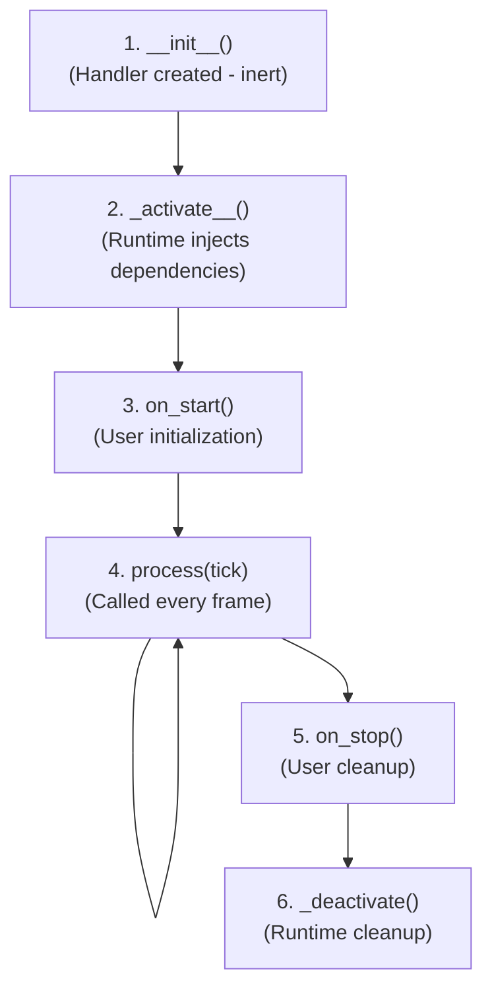

# StreamHandler

The `StreamHandler` is the core abstraction in streamlib. It's a stateless processing unit that transforms video frames, similar to Unix command-line tools.

## Philosophy

**Handlers are inert until activated by the runtime.** They don't own threads, don't auto-start, and don't manage their own lifecycle. The runtime coordinates everything.

Think of handlers like Unix tools:
- `grep` doesn't run until you pipe data into it
- A handler doesn't process until the runtime sends it clock ticks

## Interface

```python
from abc import ABC, abstractmethod
from typing import Dict, Optional
from streamlib.ports import StreamInput, StreamOutput
from streamlib.clocks import TimedTick

class StreamHandler(ABC):
    """Base class for all stream handlers.

    Handlers are pure processing logic - inert until runtime activates them.
    """

    # Preferred execution context (can be overridden by Stream())
    preferred_dispatcher: str = 'asyncio'  # or 'threadpool', 'gpu', 'processpool'

    def __init__(self, handler_id: str = None):
        """Initialize handler.

        Args:
            handler_id: Unique identifier for this handler instance.
                       Auto-generated if not provided.
        """
        self.handler_id = handler_id or f"{self.__class__.__name__}-{id(self)}"
        self.inputs: Dict[str, StreamInput] = {}
        self.outputs: Dict[str, StreamOutput] = {}

        # Runtime-managed (not user-accessible)
        self._runtime = None
        self._event_bus = None
        self._dispatcher: Optional[Dispatcher] = None

    @abstractmethod
    async def process(self, tick: TimedTick) -> None:
        """Process one frame/tick.

        Called by runtime for each clock tick. Read from inputs,
        process data, write to outputs.

        Args:
            tick: Clock tick containing timestamp and frame number.
        """
        pass

    async def on_start(self) -> None:
        """Called once when handler starts.

        Use this to:
        - Initialize resources (GPU contexts, models, etc.)
        - Allocate buffers
        - Set up state

        Default implementation does nothing.
        """
        pass

    async def on_stop(self) -> None:
        """Called once when handler stops.

        Use this to:
        - Clean up resources
        - Close files/connections
        - Free GPU memory

        Default implementation does nothing.
        """
        pass
```

## Lifecycle



## Creating a Handler

### Minimal Example

```python
from streamlib import StreamHandler, VideoInput, VideoOutput, TimedTick

class PassThroughHandler(StreamHandler):
    """Simplest possible handler - passes frames through unchanged."""

    def __init__(self):
        super().__init__()
        # Declare ports
        self.inputs['video'] = VideoInput('video', capabilities=['cpu'])
        self.outputs['video'] = VideoOutput('video', capabilities=['cpu'])

    async def process(self, tick: TimedTick):
        """Read frame, pass it through."""
        frame = self.inputs['video'].read_latest()
        if frame:
            self.outputs['video'].write(frame)
```

### With Initialization

```python
from streamlib import StreamHandler, VideoInput, VideoOutput, TimedTick, VideoFrame
import numpy as np

class GrayscaleHandler(StreamHandler):
    """Convert color video to grayscale."""

    preferred_dispatcher = 'threadpool'  # CPU-intensive

    def __init__(self):
        super().__init__()
        self.inputs['video'] = VideoInput('video', capabilities=['cpu'])
        self.outputs['video'] = VideoOutput('video', capabilities=['cpu'])

        # State (initialized in on_start)
        self.frame_count = 0

    async def on_start(self):
        """Initialize handler."""
        print(f"[{self.handler_id}] Starting grayscale conversion")
        self.frame_count = 0

    async def process(self, tick: TimedTick):
        """Convert frame to grayscale."""
        frame = self.inputs['video'].read_latest()
        if frame:
            # Convert RGB to grayscale
            gray = np.mean(frame.data, axis=2, keepdims=True)
            gray_rgb = np.repeat(gray, 3, axis=2).astype(np.uint8)

            output = VideoFrame(
                data=gray_rgb,
                timestamp=frame.timestamp,
                frame_number=frame.frame_number,
                width=frame.width,
                height=frame.height
            )
            self.outputs['video'].write(output)
            self.frame_count += 1

    async def on_stop(self):
        """Cleanup."""
        print(f"[{self.handler_id}] Processed {self.frame_count} frames")
```

### GPU Handler

```python
from streamlib import StreamHandler, VideoInput, VideoOutput, TimedTick, VideoFrame
import torch

class BlurFilterGPU(StreamHandler):
    """GPU-accelerated blur filter."""

    preferred_dispatcher = 'gpu'  # GPU execution

    def __init__(self, kernel_size: int = 5):
        super().__init__()
        self.kernel_size = kernel_size

        # GPU-capable ports
        self.inputs['video'] = VideoInput('video', capabilities=['gpu', 'cpu'])
        self.outputs['video'] = VideoOutput('video', capabilities=['gpu'])

        self.blur_kernel = None

    async def on_start(self):
        """Initialize GPU resources."""
        device = torch.device('mps' if torch.backends.mps.is_available() else 'cpu')

        # Create blur kernel on GPU
        self.blur_kernel = torch.ones(
            (self.kernel_size, self.kernel_size),
            device=device
        ) / (self.kernel_size ** 2)

        print(f"[{self.handler_id}] GPU blur initialized (kernel={self.kernel_size})")

    async def process(self, tick: TimedTick):
        """Apply blur on GPU."""
        frame = self.inputs['video'].read_latest()
        if frame:
            # Blur operation on GPU
            blurred = self._apply_blur(frame.data)

            output = VideoFrame(
                data=blurred,
                timestamp=frame.timestamp,
                frame_number=frame.frame_number,
                width=frame.width,
                height=frame.height
            )
            self.outputs['video'].write(output)

    def _apply_blur(self, tensor):
        """Apply Gaussian blur using PyTorch."""
        # Implementation details...
        return tensor  # Blurred version
```

## Port Declaration

Handlers declare their inputs and outputs in `__init__()`:

```python
# CPU-only handler
self.inputs['video'] = VideoInput('video', capabilities=['cpu'])
self.outputs['video'] = VideoOutput('video', capabilities=['cpu'])

# GPU-only handler
self.inputs['video'] = VideoInput('video', capabilities=['gpu'])
self.outputs['video'] = VideoOutput('video', capabilities=['gpu'])

# Flexible handler (accepts both CPU and GPU)
self.inputs['video'] = VideoInput('video', capabilities=['cpu', 'gpu'])
self.outputs['video'] = VideoOutput('video', capabilities=['gpu'])
```

See [Ports](ports.md) for detailed port documentation.

## Dispatcher Selection

The `preferred_dispatcher` tells the runtime where to execute this handler:

- **`asyncio`** - Non-blocking I/O, lightweight operations (TestPatternHandler)
- **`threadpool`** - Blocking calls, CPU-intensive work (DisplayHandler, CPU blur)
- **`gpu`** - GPU operations (GPU blur, compositing)
- **`processpool`** - Heavy compute requiring process isolation

Can be overridden when adding to runtime:

```python
runtime.add_stream(Stream(blur_handler, dispatcher='threadpool'))  # Override
```

See `docs/dispatcher-guidelines.md` for detailed selection rules.

## Key Principles

1. **Handlers are stateless processors** - All state should be in ports or internal variables
2. **Runtime manages lifecycle** - Don't create threads or start processing manually
3. **Ports declare capabilities** - Let runtime handle CPU/GPU transfers
4. **process() is called every tick** - Make it fast, don't block unnecessarily
5. **Use on_start() for initialization** - Don't do heavy work in `__init__()`

## See Also

- [Runtime](runtime.md) - How to run handlers
- [Ports](ports.md) - Input/Output port system
- [Quick Start](../guides/quickstart.md) - Build your first pipeline
- [Composition](../guides/composition.md) - Connect multiple handlers
