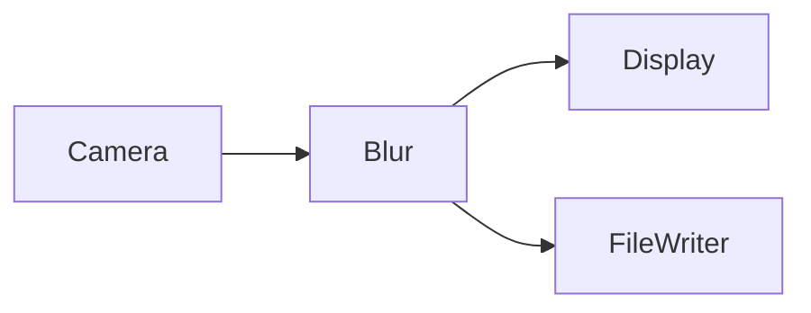
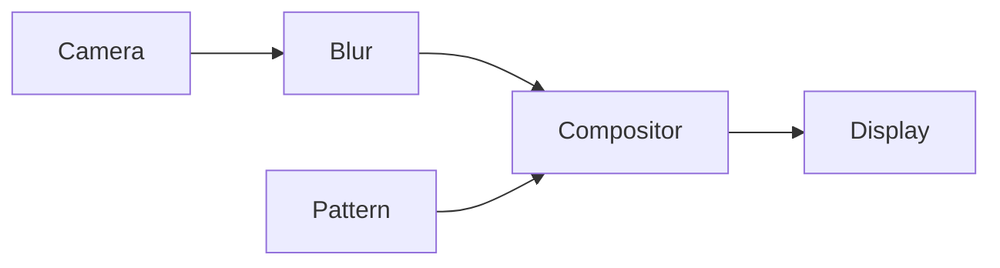
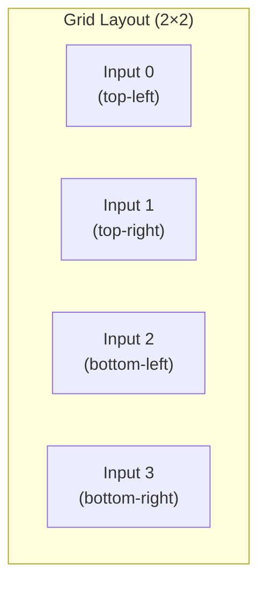
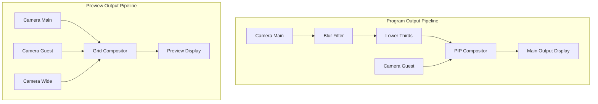

# Composition Guide

Learn how to build complex pipelines by composing simple handlers.

## The Unix Pipe Philosophy

streamlib is inspired by Unix pipes. Just like you can chain command-line tools:

```bash
cat file.txt | grep "error" | sed 's/ERROR/WARNING/' | awk '{print $1}'
```

You can chain video handlers:

```python
runtime.connect(camera.outputs['video'], blur.inputs['video'])
runtime.connect(blur.outputs['video'], compositor.inputs['input_0'])
runtime.connect(compositor.outputs['video'], display.inputs['video'])
```

## Basic Patterns

### Linear Pipeline

The simplest composition: A → B → C

```python
# Camera → Blur → Display
runtime.connect(camera.outputs['video'], blur.inputs['video'])
runtime.connect(blur.outputs['video'], display.inputs['video'])
```


### Fork (One Source, Multiple Outputs)

One handler feeds multiple downstream handlers:

```python
# Camera → Blur → Display
#       └─────▶ FileWriter

runtime.connect(camera.outputs['video'], blur.inputs['video'])
runtime.connect(blur.outputs['video'], display.inputs['video'])
runtime.connect(blur.outputs['video'], file_writer.inputs['video'])
```



### Merge (Multiple Sources, One Output)

Multiple handlers feed into a compositor:

```python
# Pipeline 1: Camera → Blur ──┐
#                               ├─→ Compositor → Display
# Pipeline 2: Test Pattern ────┘

compositor = MultiInputCompositor(num_inputs=2, mode='pip')

runtime.connect(camera.outputs['video'], blur.inputs['video'])
runtime.connect(blur.outputs['video'], compositor.inputs['input_0'])
runtime.connect(pattern.outputs['video'], compositor.inputs['input_1'])
runtime.connect(compositor.outputs['video'], display.inputs['video'])
```



## Multi-Input Compositor

The `MultiInputCompositor` is your Swiss Army knife for combining video streams.

### Picture-in-Picture (PIP)

```python
compositor = MultiInputCompositor(
    num_inputs=2,
    mode='pip',
    pip_position='bottom_right',  # or 'top_left', 'top_right', 'bottom_left'
    pip_scale=0.25,  # 25% of main video size
    width=1920,
    height=1080
)

# Main video
runtime.connect(camera.outputs['video'], compositor.inputs['input_0'])

# PIP overlay
runtime.connect(pattern.outputs['video'], compositor.inputs['input_1'])

runtime.connect(compositor.outputs['video'], display.inputs['video'])
```

### Side-by-Side

```python
compositor = MultiInputCompositor(
    num_inputs=2,
    mode='side_by_side',
    width=1920,
    height=1080
)

runtime.connect(camera1.outputs['video'], compositor.inputs['input_0'])
runtime.connect(camera2.outputs['video'], compositor.inputs['input_1'])
runtime.connect(compositor.outputs['video'], display.inputs['video'])
```

### Vertical Stack

```python
compositor = MultiInputCompositor(
    num_inputs=2,
    mode='vertical_stack',
    width=1920,
    height=1080
)

runtime.connect(camera1.outputs['video'], compositor.inputs['input_0'])
runtime.connect(camera2.outputs['video'], compositor.inputs['input_1'])
runtime.connect(compositor.outputs['video'], display.inputs['video'])
```

### Grid Layout

```python
compositor = MultiInputCompositor(
    num_inputs=4,
    mode='grid',
    width=1920,
    height=1080
)

runtime.connect(camera1.outputs['video'], compositor.inputs['input_0'])
runtime.connect(camera2.outputs['video'], compositor.inputs['input_1'])
runtime.connect(camera3.outputs['video'], compositor.inputs['input_2'])
runtime.connect(camera4.outputs['video'], compositor.inputs['input_3'])
```



## Independent Pipelines

Multiple pipelines can run independently in the same runtime:

```python
# Pipeline 1: Camera → Display 1
runtime.connect(camera1.outputs['video'], display1.inputs['video'])

# Pipeline 2: Test Pattern → Display 2 (completely independent)
runtime.connect(pattern.outputs['video'], display2.inputs['video'])
```

This is like running two separate Unix processes:
```bash
# Process 1
cat file1.txt | grep "error" &

# Process 2 (independent)
cat file2.txt | grep "warning" &
```

## Complex Example: Broadcast Studio

Let's build a multi-camera broadcast setup:

```python
from streamlib import StreamRuntime, Stream
from streamlib.handlers import (
    CameraHandlerGPU,
    BlurFilterGPU,
    LowerThirdsGPUHandler,
    MultiInputCompositor,
    DisplayGPUHandler
)

async def main():
    runtime = StreamRuntime(fps=30)

    # 3 cameras
    camera_main = CameraHandlerGPU(device_name="Main Camera", width=1920, height=1080)
    camera_guest = CameraHandlerGPU(device_name="Guest Camera", width=1920, height=1080)
    camera_wide = CameraHandlerGPU(device_name="Wide Camera", width=1920, height=1080)

    # Effects
    blur = BlurFilterGPU(kernel_size=15, sigma=8.0)
    lower_thirds = LowerThirdsGPUHandler(
        text="John Smith - CEO",
        position='bottom',
        width=1920,
        height=1080
    )

    # Compositors
    pip_compositor = MultiInputCompositor(
        num_inputs=2,
        mode='pip',
        pip_position='top_right',
        pip_scale=0.2,
        width=1920,
        height=1080
    )

    preview_compositor = MultiInputCompositor(
        num_inputs=3,
        mode='grid',
        width=1920,
        height=1080
    )

    # Displays
    main_output = DisplayGPUHandler(window_name='Program', width=1920, height=1080)
    preview = DisplayGPUHandler(window_name='Preview', width=1920, height=1080)

    # Add all to runtime
    for handler in [camera_main, camera_guest, camera_wide, blur, lower_thirds,
                    pip_compositor, preview_compositor, main_output, preview]:
        runtime.add_stream(Stream(handler, dispatcher='asyncio'))

    # Main program output: Main camera → Blur → Lower Thirds → PIP (with guest) → Display
    runtime.connect(camera_main.outputs['video'], blur.inputs['video'])
    runtime.connect(blur.outputs['video'], lower_thirds.inputs['video'])
    runtime.connect(lower_thirds.outputs['video'], pip_compositor.inputs['input_0'])
    runtime.connect(camera_guest.outputs['video'], pip_compositor.inputs['input_1'])
    runtime.connect(pip_compositor.outputs['video'], main_output.inputs['video'])

    # Preview multiview: All 3 cameras in grid
    runtime.connect(camera_main.outputs['video'], preview_compositor.inputs['input_0'])
    runtime.connect(camera_guest.outputs['video'], preview_compositor.inputs['input_1'])
    runtime.connect(camera_wide.outputs['video'], preview_compositor.inputs['input_2'])
    runtime.connect(preview_compositor.outputs['video'], preview.inputs['video'])

    runtime.start()

    try:
        while runtime._running:
            await asyncio.sleep(1)
    except KeyboardInterrupt:
        pass

    runtime.stop()
```

This creates two windows:
1. **Program** - Main output with blur, lower thirds, and guest PIP
2. **Preview** - Grid showing all 3 cameras



## GPU Optimization

The runtime automatically keeps data on GPU when possible:

```python
# All GPU-capable handlers
camera = CameraHandlerGPU(...)      # outputs: capabilities=['gpu']
blur = BlurFilterGPU(...)           # inputs/outputs: capabilities=['gpu']
compositor = MultiInputCompositor() # inputs/outputs: capabilities=['gpu']
display = DisplayGPUHandler(...)    # inputs: capabilities=['gpu', 'cpu']

# These connections stay on GPU - zero CPU transfers!
runtime.connect(camera.outputs['video'], blur.inputs['video'])
# ✅ Negotiated: gpu

runtime.connect(blur.outputs['video'], compositor.inputs['input_0'])
# ✅ Negotiated: gpu

runtime.connect(compositor.outputs['video'], display.inputs['video'])
# ✅ Negotiated: gpu

# Entire pipeline runs on GPU with zero-copy!
```

## Dispatcher Strategy

Different handlers need different execution contexts:

```python
# I/O bound (camera capture, pattern generation)
runtime.add_stream(Stream(camera, dispatcher='asyncio'))
runtime.add_stream(Stream(pattern, dispatcher='asyncio'))

# GPU compute
runtime.add_stream(Stream(blur, dispatcher='gpu'))
runtime.add_stream(Stream(compositor, dispatcher='gpu'))

# Blocking calls (display with cv2.imshow, file I/O)
runtime.add_stream(Stream(display, dispatcher='threadpool'))
runtime.add_stream(Stream(file_writer, dispatcher='threadpool'))
```

See `docs/dispatcher-guidelines.md` for detailed rules.

## Error Handling

Handlers that encounter errors during `process()` continue running:

```python
async def process(self, tick: TimedTick):
    frame = self.inputs['video'].read_latest()
    if not frame:
        return  # No frame available, skip this tick

    try:
        result = self.process_frame(frame)
        self.outputs['video'].write(result)
    except Exception as e:
        print(f"Error processing frame {tick.frame_number}: {e}")
        # Runtime continues, handler gets next tick
```

## Dynamic Reconfiguration

(Future feature)

```python
# Switch compositor mode at runtime
compositor.set_mode('grid')  # Was 'pip'

# Add/remove handlers dynamically
runtime.add_handler(new_camera)
runtime.connect(new_camera.outputs['video'], compositor.inputs['input_3'])
```

## Best Practices

1. **Design pipelines on paper first** - Draw the flow diagram
2. **Start simple, then compose** - Get each handler working independently
3. **Use appropriate dispatchers** - Match execution context to handler type
4. **Let runtime handle transfers** - Don't manually move data between CPU/GPU
5. **Monitor FPS** - If dropping frames, profile your handlers
6. **Keep handlers stateless** - State should be in ports, not global variables

## See Also

- [Quick Start](quickstart.md) - Your first pipeline
- [Runtime API](../api/runtime.md) - Connection and negotiation details
- [Handler API](../api/handler.md) - Writing custom handlers
- [Examples](../examples/) - Complete working examples
