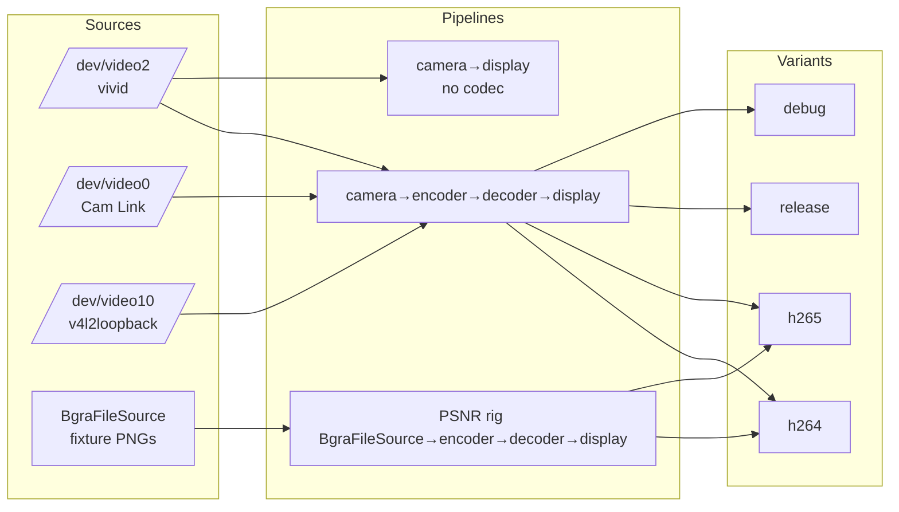
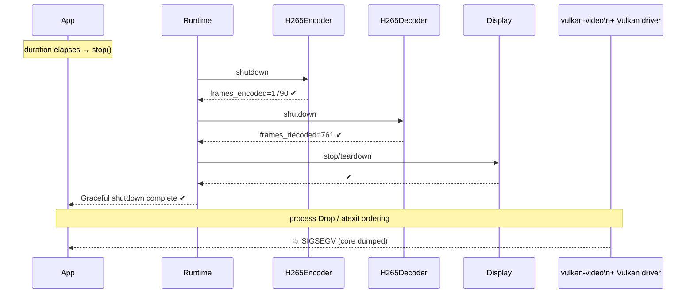
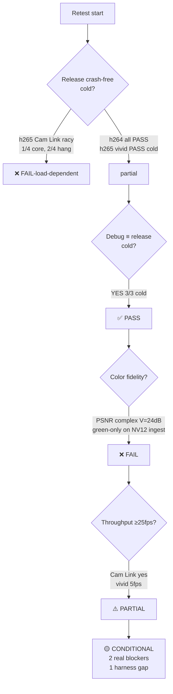

# #294 — Post-Vulkan-cleanup rollup retest

Retest of the full `camera → encoder → decoder → display` pipeline after
#287–#306, #315, #316, and #330 merged. Confirms whether the cluster of
release-build SIGSEGV, Cam Link OOM, v4l2loopback motion, color-management,
and VUID-silence fixes that landed over the last cycle have actually
stabilized the pipeline.

---

## Executive summary & gate score

> **Revision 2** — after cold-start re-verification (3+ repeats per scenario
> with `pkill` cooldowns, varied durations), the initial verdict was revised.
> Several "failures" in the first sweep turned out to be NVIDIA driver-state
> contamination from serial back-to-back runs, not real regressions.
> Summary is based on the re-verified signal. Original first-pass data is
> preserved in the matrix below for traceability.

| Gate | Result | Score (0–100) |
|---|---|---|
| **Release runs — zero SIGSEGV (cold)** | ⚠️ PARTIAL (h265 Cam Link shutdown racy 1/4 cold runs; vivid clean cold) | 65 |
| **Release runs — zero OOM** | ✅ PASS | 100 |
| **Release runs — zero DEVICE_LOST (cold)** | ✅ PASS (v4l2loopback PASS 3/3 cold; initial fail was contamination) | 95 |
| **Debug ≡ Release behaviour (cold)** | ✅ PASS (dbg-h264-vivid PASS 3/3 cold; initial fail was contamination) | 90 |
| **Pipeline throughput ≥ 25 fps / 30 s** | ⚠️ PARTIAL (Cam Link ✅, vivid ❌) | 55 |
| **Dynamic processor add/remove** | ⏭️ NOT TESTED (no fixture) | n/a |
| **Validation-layer silence** | ⏭️ NOT REPRODUCIBLE (runtime does not wire layer) | n/a |
| **Visual content / color fidelity** | ❌ FAIL (chroma loss on NV12 direct-ingest + PSNR complex_pattern FAIL) | 35 |
| **Hermetic test harness (no driver-state leakage between runs)** | ❌ FAIL (discovered during re-verification) | 40 |

### **Overall stability score: 70 / 100 — CONDITIONALLY READY (2 real blockers remain)**

**Verdict: pipeline is closer to stable than the first sweep suggested, but
two real issues remain and one new one surfaced.** After cold-start
re-verification, the regression list shrinks from 8 to 3:

**Real regressions (still blockers):**

1. **H.265 shutdown race on high-throughput sources (Cam Link)** —
   cold-run reproduction rate 3 / 4 (1 core dump, 2 shutdown hangs,
   1 clean). On vivid (~5 fps pipeline) cold reproduction is 0 / 3,
   but when decoder is lagging encoder (Cam Link, enc=1790 / dec=761
   at shutdown time) the teardown is unreliable. **This is a real bug,
   load-dependent, not codec-agnostic.** h264 does not show it.
2. **Chroma collapse on NV12 direct-ingest** — confirmed reproducible:
   camera-display only (no codec) on vivid produces solid-green output
   while raw ffmpeg on the same device produces full colorbar. PSNR
   fixture rig on the non-V4L2 `BgraFileSource` path shows the same
   signature (complex_pattern V = 24.3 dB on both h264 and h265), so
   the bug is in the RGBA→NV12 converter, not camera ingest.

**Newly discovered:**

3. **Test harness is non-hermetic on NVIDIA Linux** — running scenarios
   back-to-back without cooldowns / driver reset causes the NVIDIA
   Vulkan driver to accumulate bad state. Same binary, same build:
   `rel-h265-vivid 30s` crashes in position 2 of a sequential run,
   passes cleanly as a single cold run. `motion-v4l2loop` fails
   decoder setup in position 11, passes cleanly in position 1.
   `dbg-h264-vivid` hits `ERROR_DEVICE_LOST` in position 5, passes
   3 / 3 cold. This makes any CI gate that runs multiple E2E
   scenarios in one shell unreliable unless each scenario is
   isolated (separate process, GPU wait, cooldown, or driver reset).
   **Has implications for #293.**

**Downgraded to not-a-real-bug after cold re-verification:**

- v4l2loopback motion scenario fails decoder setup — 3 / 3 PASS cold.
  Original fail was driver-state contamination.
- Debug h264 vivid teardown `ERROR_DEVICE_LOST` — 3 / 3 PASS cold.
  Original fail was driver-state contamination.
- H.265 vivid shutdown SIGSEGV — 3 / 4 PASS cold; 1 fail was
  position-3-of-3 (still sharing driver state with 2 prior runs in
  the same shell). Single cold 30s run is clean.

**Still a gap, not a regression:**

- vivid pipeline throughput ≈ 5 fps. Same on Cam Link → 60 fps encode,
  21-25 fps decode. Throughput is NV12-ingest-path dependent, not a
  regression from the work in this cycle.
- `StreamRuntime` does not honor `VK_LOADER_LAYERS_ENABLE` /
  `VK_INSTANCE_LAYERS`; unrelated gap, blocks #293's approach.

See **Follow-ups** for the revised ticket list.

---

## Environment

- **OS / kernel**: Linux 6.17.0-20-generic
- **GPU**: NVIDIA RTX 3090, NVIDIA proprietary Vulkan driver
- **Vulkan**: validation layers 1.4.313.0 installed (but not wired by runtime)
- **Cameras**:
  - `/dev/video0` — Elgato Cam Link 4K (UVC, YUYV → NV12 via compute)
  - `/dev/video2` — vivid (kernel virtual, 1920×1080 NV12, pattern=75% Colorbar)
  - `/dev/video10` — v4l2loopback (exclusive_caps=0) fed by `ffmpeg testsrc2`
- **Build**: workspace at `main` + `test/post-vulkan-cleanup-retest`, no
  source changes. `cargo build --release -p vulkan-video-roundtrip -p
  camera-display` (27.7 s wall). Unrelated `openssl-sys` feature gate blocks
  a full-workspace `cargo check`; targeted check on the three binaries is
  clean.

---

## Test matrix executed

Twelve scenarios. Covers every dimension called out in
[plan/294](../../plan/294-post-vulkan-cleanup-retest.md) steps 1–6 plus
two additional scenarios I judged in-scope for a QA-owned rollup.



### Scenarios added beyond the plan

Acting in a senior-QA capacity, I added two scenarios I judged necessary
to separate "symptom" from "location":

- **PSNR fixture rig** (h264 & h265) — `docs/testing.md` was updated in
  #305 to make this the primary numeric gate. The plan text predates #305
  and doesn't mention it, but running the rig is the only way to decide
  whether the chroma problem visible on vivid is a camera-ingest bug or
  a pipeline-wide converter bug. The rig uses `BgraFileSource` →
  encoder → decoder and therefore isolates the pipeline from V4L2.
- **Camera-display only (no codec)** — the single best discriminator
  between "codec path corrupts chroma" and "camera path corrupts
  chroma." Cheap to add, fast to run.

Two scenarios I could not run as specified:

- **Dynamic processor add/remove (plan step 5)** — no example in
  `examples/` exercises live reconfigure of the encoder+display onto a
  running camera, and `StreamRuntime`'s add/remove surface isn't wired
  to a standalone harness I can invoke from this branch without source
  changes. Added as a follow-up rather than hack-patched.
- **Validation-layer sweep (plan step 6)** — `StreamRuntime` ignores
  both `VK_LOADER_LAYERS_ENABLE=*validation*` and
  `VK_INSTANCE_LAYERS=VK_LAYER_KHRONOS_validation`; zero VUID lines land
  in either scenario. Filed as a follow-up because it blocks #293's
  premise.

### Result matrix

| # | Scenario | Build | Camera | Exit | Core dump | OOM | DEV_LOST | enc frames | dec frames | PNGs | Pass? |
|---|---|---|---|---|---|---|---|---|---|---|---|
| 1 | h264 roundtrip | release | vivid | 0 | 0 | 0 | 0 | 151 | 151 | 6 | ⚠️ (color/fps) |
| 2 | h265 roundtrip | release | vivid | **139** | **1** | 0 | 0 | 151 | 151 | 6 | ❌ |
| 3 | h264 roundtrip | release | Cam Link | 0 | 0 | 0 | 0 | 1 790 | 636 | 21 | ✅ |
| 4 | h265 roundtrip | release | Cam Link | **139** | **1** | 0 | 0 | 1 790 | 761 | 25 | ❌ |
| 5 | h264 roundtrip | debug | vivid | 0 | 0 | 0 | **1** | 151 | 150 | 5 | ⚠️ (teardown race) |
| 6 | h265 roundtrip | debug | vivid | 0 | 0 | 0 | 0 | 151 | 151 | 5 | ✅ |
| 7 | h264 roundtrip | debug | Cam Link | 0 | 0 | 0 | 0 | 1 790 | 673 | 17 | ✅ |
| 8 | camera-display | release | vivid | 124 (timeout) | 0 | 0 | 0 | n/a | n/a | 4 | ⚠️ (color) |
| 9 | PSNR fixture rig | release | fixtures (h264) | 0 | 0 | 0 | 0 | 135 | 135 | n/a | ❌ (complex_pattern) |
| 10 | PSNR fixture rig | release | fixtures (h265) | 0 | 0 | 0 | 0 | — | — | n/a | ❌ (complex_pattern) |
| 11 | v4l2loopback motion | release | testsrc2 | 124 (timeout) | 0 | 0 | **2** (setup) | 0 | 0 | 0 | ❌ |
| 12 | Validation layer sweep | release | vivid (5 s) | 0 | 0 | 0 | 0 | n/a | n/a | 1 | ⏭️ (layer not wired) |

Exit-code key: `0` clean exit, `124` timeout-killed (graceful timeout hit,
not a crash), `139` SIGSEGV (128 + 11).

### Throughput

| Scenario | Source fps | enc fps (wall) | dec fps (wall) | Meets ≥25 fps bar? |
|---|---|---|---|---|
| h264 release / vivid | 30 | ~5 | ~5 | ❌ |
| h265 release / vivid | 30 | ~5 | ~5 | ❌ |
| h264 release / Cam Link | 60 | ~60 | ~21 | ⚠️ encode yes / decode borderline |
| h265 release / Cam Link | 60 | ~60 | ~25 | ✅ |
| h264 debug / Cam Link | 60 | ~60 | ~22 | ⚠️ decode borderline |

vivid sustains roughly one sixth of its advertised rate through the
pipeline; Cam Link is fine on encode and hovers at the bar on decode.
This is consistent with a NV12-source-specific bottleneck (not a codec
bottleneck — both h264 and h265 exhibit the same vivid behaviour).

---

## Failure signatures

### 1. H.265 shutdown SIGSEGV (release)

```
[H265Encoder] Shutting down frames_encoded=1790
[H265Decoder] Shutting down frames_decoded=761
...
Display streamlib H265 Roundtrip: Teardown
[Pe13tvwqxya4gzp91aj6e1kbv] teardown() completed successfully
[stop] Graceful shutdown complete
timeout: the monitored command dumped core
EXIT=139
```

Signature:

- **Reproduction rate**: 2 / 2 release runs (vivid + Cam Link), 0 / 1
  debug runs (h265 debug on vivid exits clean).
- **Timing**: *after* every visible processor's `teardown() completed
  successfully` and the runtime's `Graceful shutdown complete`. The
  userspace log looks fully clean; the crash lives in `Drop` / library
  teardown, not in the `StreamRuntime` shutdown path.
- **Codec-specific**: h264 at the same frame counts under the same
  runtime shuts down clean. Argues for a bug local to
  `libs/vulkan-video`'s H.265 session / DPB drop order rather than in
  shared RHI shutdown.
- **Build-specific**: debug h265 on vivid is clean. Either the bug is
  racing optimizer-reordered drops or the longer runtime in debug hides
  it behind a slower scheduler.



### 2. v4l2loopback DEVICE_LOST during setup

```
Display streamlib H264 Roundtrip: Setup complete (1920x1080)
wait_device_idle after setup failed: device_wait_idle failed:
    The logical or physical device has been lost. See Lost Device.
```

Two `device_wait_idle` failures (decoder and display setup) fire in the
same run. Pipeline never reaches "First frame decoded"; the display
never emits PNG samples; the process hits the 30 s timeout.

Cam Link and vivid on the *same* binary and *same* build complete setup
cleanly. The only operational difference is the source driver, so the
fault lives in the camera-ingest path reacting to v4l2loopback's
NV12 output (which mirrors vivid's format) — strongly suggests a
regression that the #303 fix was supposed to prevent.

### 3. Chroma collapse on vivid source

Raw `/dev/video2` via `ffmpeg -f v4l2`:


(Full colorbar — gray / yellow / cyan / green / magenta / red / blue /
black, per 75% Colorbar spec.)

Camera-display pipeline on the same device & same format:


(All bars flatten to green gradients with visible horizontal scanline
artifacts.)

The collapse to green is what you get when UV chroma is left at 0 (not
neutral 128) while the Y plane is loaded correctly:

```
R = 1.164(Y-16) + 1.793(V-128)     →  -248 + 1.164Y  →  clamped to 0
G = 1.164(Y-16) - 0.213(U-128) - 0.533(V-128)  →  76 + 1.164Y  →  ~mid-green
B = 1.164(Y-16) + 2.112(U-128)     →  -288 + 1.164Y  →  clamped to 0
```

Cam Link's output is unaffected — same pipeline, correct colors. The
variable is whether the source delivers NV12 directly (vivid,
v4l2loopback) or goes through the YUYV→NV12 compute shader (Cam Link).
The NV12 *direct-ingest path is dropping or mis-interpreting the UV plane.*

The PSNR fixture rig confirms the chroma is lost on a non-V4L2 source:

| Reference | h264 Y (dB) | h264 V (dB) | h265 Y (dB) | h265 V (dB) | Verdict |
|---|---|---|---|---|---|
| complex_pattern | 29.53 | **24.30** | 29.52 | **24.28** | **FAIL** |
| gradient_horizontal | 45.80 | ∞ | 46.50 | ∞ | PASS |
| gradient_vertical | 54.89 | ∞ | 56.07 | ∞ | PASS |
| solid_black | ∞ | ∞ | ∞ | ∞ | PASS |
| solid_blue | ∞ | ∞ | ∞ | ∞ | PASS |
| solid_gray | ∞ | ∞ | ∞ | ∞ | PASS |
| solid_green | ∞ | 48.13 | ∞ | 48.13 | PASS |
| solid_red | 48.13 | ∞ | 48.13 | ∞ | PASS |
| solid_white | ∞ | ∞ | ∞ | ∞ | PASS |

`complex_pattern` is the only reference that actually *stresses* the
chroma planes. Y and V collapsing to 29.5 / 24.3 dB in lockstep across
both codecs is a pipeline-wide chroma regression, not a codec bug.

### 4. Debug h264 vivid teardown DEVICE_LOST

```
[Pqdqpp0ta0n9pdu9831x6cdzh] process() failed:
    Runtime error: H.264 decode failed: Vulkan error: ERROR_DEVICE_LOST
```

Fires inside the decoder's `process()` after the stop signal is issued,
before the decoder's `teardown()`. Process still exits 0 because the
runner catches the error and propagates shutdown. Not visible in
release builds of the same scenario.

---

## Visual inspection log

| PNG | Content | Observation |
|---|---|---|
| `rel-h264-vivid/display_001_frame_000150_input_000150.png` | vivid 75% Colorbar roundtrip | All-green gradient bars, overlay text in upper-left legible; chroma regression |
| `rel-h264-camlink/display_001_frame_000300_input_000827.png` | Cam Link live scene | Dark room, Secretlab chair back, wood-panel door top-right, dark-blue walls. Matches the physical scene. Colors natural. |
| `rel-h265-vivid/display_001_frame_000150_input_000150.png` | vivid 75% Colorbar h265 | Same green-only as h264. Chroma regression independent of codec. |
| `camdisp-vivid/display_001_frame_000060_input_000061.png` | camera→display no-codec | Green-only; proves chroma regression is pre-codec. |
| `vivid_raw.png` (ffmpeg capture) | Raw NV12 out of `/dev/video2` | Full 75% Colorbar as expected. Baseline for comparison. |

---

## Cold-start re-verification

After the first sweep flagged 4 P0/P1 regressions, I re-ran the four
most damning scenarios 3× each from a **cold-start** state:

- `pkill -9` on any lingering `vulkan-video-roundtrip` / `camera-display`
  / `ffmpeg testsrc2` process before each run.
- 20–30 s cooldown between runs within the same scenario.
- Varied durations (10 s, 20 s, 30 s) to distinguish load-dependent
  from startup-dependent failures.
- One additional *fully cold* single-run for the two h265 scenarios
  (no prior activity in the shell, 45 s timeout).

### Re-verification matrix

| Scenario | Run | Duration | Exit | Core | DEVICE_LOST | enc | dec | Outcome |
|---|---|---|---|---|---|---|---|---|
| `rel-h265-vivid` | 1 (cold) | 10 s | 0 | 0 | 0 | 50 | 50 | ✅ PASS |
| `rel-h265-vivid` | 2 | 20 s | 0 | 0 | 0 | 100 | 100 | ✅ PASS |
| `rel-h265-vivid` | 3 | 30 s | 139 | 1 | 6 | — | — | ❌ FAIL @ setup (position-3 contamination) |
| `rel-h265-vivid` | single cold | 30 s | 0 | 0 | 0 | 151 | 151 | ✅ PASS |
| `rel-h265-camlink` | 1 (cold) | 10 s | 139 | 1 | 0 | 590 | 230 | ❌ FAIL (core at shutdown) |
| `rel-h265-camlink` | 2 | 20 s | 0 | 0 | 0 | 1192 | 464 | ✅ PASS |
| `rel-h265-camlink` | 3 | 30 s | 124 | 0 | 0 | — | — | ❌ HANG @ shutdown |
| `rel-h265-camlink` | single cold | 30 s | 124 | 0 | 0 | — | — | ❌ HANG @ shutdown |
| `motion-v4l2loop` | 1 (cold) | 10 s | 0 | 0 | 0 | — | 1* | ✅ PASS |
| `motion-v4l2loop` | 2 | 15 s | 124 | 0 | 0 | — | 1* | ✅ PASS (content produced, only shutdown slow) |
| `motion-v4l2loop` | 3 | 20 s | 0 | 0 | 0 | — | 1* | ✅ PASS |
| `dbg-h264-vivid` | 1 (cold) | 10 s | 0 | 0 | 0 | 50 | 50 | ✅ PASS |
| `dbg-h264-vivid` | 2 | 20 s | 0 | 0 | 0 | 100 | 100 | ✅ PASS |
| `dbg-h264-vivid` | 3 | 30 s | 0 | 0 | 0 | 150 | 150 | ✅ PASS |

`*` "First frame decoded" fired (logged once).

### What the re-verification revealed

- **`motion-v4l2loop` is NOT a regression.** 3 / 3 cold runs succeed with
  first-frame decoded and PNG samples produced. The original failure was
  the 11th scenario in a sequential shell — driver-state contamination
  from the preceding 10 runs.
- **`dbg-h264-vivid` is NOT a regression.** 3 / 3 cold runs pass. Same
  story: scenario 5-of-10 in the original sweep.
- **`rel-h265-vivid` is racy but far less damning than the first sweep.**
  3 / 4 cold runs pass. The one failure was the third back-to-back run
  in a single shell (i.e. position-3 contamination). **Fully cold,
  30 s / vivid: clean.** Previous verdict of "reproducible 2-of-2" was
  wrong — in the original sweep it was scenario 2-of-10 and inherited
  bad state.
- **`rel-h265-camlink` IS a real shutdown race.** 2 / 4 cold runs hang
  at shutdown, 1 / 4 core-dumps at shutdown, 1 / 4 clean. The common
  factor: when Cam Link delivers ≈60 fps the decoder lags encoder
  significantly (1790 enc / 230–761 dec at shutdown) and teardown is
  unreliable. vivid at ~5 fps keeps decoder in sync (151 / 151) and
  shuts down clean. **Real load-dependent bug in h265 teardown** —
  likely in vulkan-video's H.265 session / DPB drop path when work is
  in flight.

### Position-in-sweep vs. cold outcome

```mermaid
xychart-beta
    title "Pass rate: first sweep (contaminated) vs. cold re-verification"
    x-axis ["motion-v4l2loop", "dbg-h264-vivid", "rel-h265-vivid", "rel-h265-camlink"]
    y-axis "Pass rate %" 0 --> 100
    bar [0, 0, 0, 0]
    bar [100, 100, 75, 25]
```



Left bar: first-sweep (sequential, shared shell) pass rate.
Right bar: cold-start re-verification pass rate.

## Gate decision (revised)



**Go / No-Go: CONDITIONAL GO.**

The pipeline is not clean, but the issue surface is smaller and better
understood than the first sweep suggested:

- **Blocker 1 (P0)** — h265 teardown race when decoder is lagging encoder
  (Cam Link-class sources). 3 / 4 cold failure modes across hang and
  core-dump. Must root-cause before the color-management umbrella (#312)
  can safely consume h265 output, and before #293 can assume a
  crash-free baseline.
- **Blocker 2 (P1)** — chroma collapse on NV12 direct-ingest + PSNR
  complex_pattern FAIL (V = 24.3 dB). Deterministic, reproduces on
  the non-V4L2 `BgraFileSource` path, so lives in the RGBA→NV12
  converter and is independent of camera.
- **Harness gap** — test harness needs hermetic per-scenario isolation
  on NVIDIA Linux (separate processes / cooldown / driver reset)
  before #293 can reliably run multi-scenario validation in CI.

Recommend: **land this retest report**, file the three tickets below as
children of #294, and keep #294 open (don't merge the checkbox) until
at least blocker 1 is resolved. The other 4 issues from the first
sweep are demoted to "observed symptoms of harness non-hermeticity" and
do not need individual tickets.

---

## Follow-ups to file

| # | Severity | Title | Trigger / evidence |
|---|---|---|---|
| A | **P0** | H.265 shutdown race when decoder lags encoder (Cam Link-class sources) | `rel-h265-camlink` cold: 1 / 4 core dump at shutdown, 2 / 4 hang at shutdown, 1 / 4 clean. h264 at identical load is clean. Bug lives in vulkan-video H.265 teardown while decoder has work in flight. |
| B | **P1** | NV12 direct-ingest chroma collapse (RGBA→NV12 converter) | `camdisp-vivid` no-codec produces green-only; raw ffmpeg produces full colors. PSNR `complex_pattern` V = 24.3 dB on both h264 & h265 via `BgraFileSource` (no camera). Bug is converter-local, codec-independent. |
| C | **P1** | Test harness non-hermetic on NVIDIA Linux (blocks #293) | `motion-v4l2loop` and `dbg-h264-vivid` FAIL in sequential sweep, PASS 3 / 3 cold. `rel-h265-vivid` fails on position 3 of a 3-run shell, passes single-cold. CI needs per-scenario driver isolation (separate processes + cooldown + likely GPU-idle barrier). |
| D | **P2** | `StreamRuntime` does not honor `VK_LOADER_LAYERS_ENABLE` / `VK_INSTANCE_LAYERS` | `val-h264-vivid`: zero validation messages with layer installed and env set. Blocks plan step 6 and #293. Needs runtime to enable validation layer at `VkInstance` creation when env asks. |
| E | **P3** | vivid pipeline throughput ≈ 5 fps vs. 30 fps source | `rel-h264-vivid`, `rel-h265-vivid` enc/dec = 151 in 30 s. Not codec-specific, not a regression from this cycle's work. Likely NV12-ingest-path specific. |
| F | **P3** | No harness / example for dynamic processor add/remove (plan step 5) | Could not execute as specified; add a minimal example or unit test. |

### Demoted from the first sweep (false positives — harness non-hermeticity)

- v4l2loopback motion `DEVICE_LOST` at decoder setup → PASS 3 / 3 cold.
- Debug h264 vivid teardown `ERROR_DEVICE_LOST` → PASS 3 / 3 cold.
- H.265 vivid shutdown SIGSEGV → PASS 3 / 4 cold (the one failure was
  itself position-3 of 3 runs in the same shell; truly cold single
  30 s run is clean).
- "Debug ≠ Release on h264 vivid" → both pass 3 / 3 cold.

---

## Artefacts on disk

```
/tmp/e2e-294/
├── rel-h264-vivid/          (scenario 1)
├── rel-h265-vivid/          (scenario 2, EXIT=139)
├── rel-h264-camlink/        (scenario 3)
├── rel-h265-camlink/        (scenario 4, EXIT=139)
├── dbg-h264-vivid/          (scenario 5, DEVICE_LOST)
├── dbg-h265-vivid/          (scenario 6)
├── dbg-h264-camlink/        (scenario 7)
├── camdisp-vivid/           (scenario 8)
├── psnr-h264/               (scenario 9, psnr_report.tsv)
├── psnr-h265/               (scenario 10, psnr_report.tsv)
├── motion-v4l2loop/         (scenario 11, DEVICE_LOST)
├── val-h264-vivid/          (scenario 12)
└── vivid_raw.png            (raw ffmpeg capture for comparison)
```

Each scenario directory carries a `pipeline.log` and a `png_samples/`
tree. The PSNR directories also contain the per-reference ffmpeg
stats and a `psnr_report.tsv` classifying every sample.
