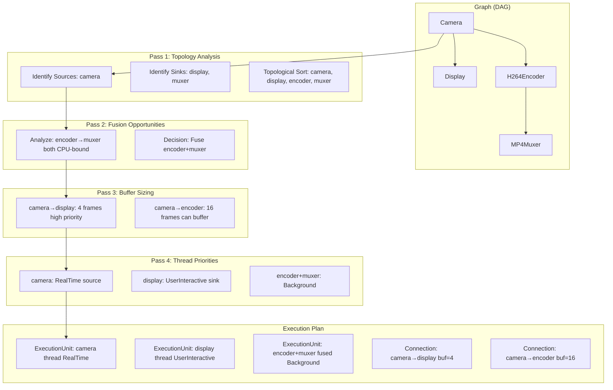
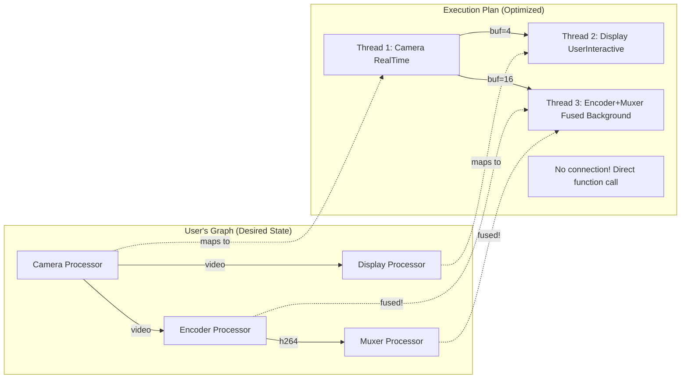

# Runtime Redesign: Graph-Based Declarative Architecture

**Date**: 2024-11-23
**Status**: Implementation Specification
**Context**: Consolidating runtime_redesign_graph_based.md with graph optimization prework/infrastructure/strategies

---

## ⚠️ CRITICAL IMPLEMENTATION INSTRUCTIONS FOR CLAUDE CODE ⚠️

This document is a **complete implementation specification**. You MUST follow it exactly as written.

### Rules for Implementation:

1. **NO DEVIATIONS**: Do not make design decisions, simplifications, or "improvements" without explicit approval
2. **ASK BEFORE CHANGING**: If you encounter:
   - Ambiguity in the spec
   - Something that seems "too complex"
   - Uncertainty about implementation details
   - Desire to refactor or simplify
   - **STOP IMMEDIATELY** and ask for clarification
3. **IMPLEMENT AS-IS**: Follow the code examples verbatim, including:
   - Exact struct field names
   - Exact method signatures
   - Exact error handling patterns
   - Exact comments and documentation
4. **VERIFY AGAINST SPEC**: Before completing any task:
   - Re-read the relevant section
   - Confirm your implementation matches the spec exactly
   - Check that you haven't added "helpful" changes
5. **REPORT DEVIATIONS**: If you must deviate (e.g., Rust syntax errors in spec), report the issue and propose the minimal fix

### This System is Critical:
- Powers real-time audio/video processing
- Must handle dynamic graph modifications safely
- Memory leaks or crashes are unacceptable
- Performance regressions will break production workloads

### When in Doubt:
**STOP. ASK. WAIT FOR APPROVAL.**

---

## Design Philosophy

This redesign consolidates two parallel design efforts:
1. **Graph Optimization Infrastructure** (Phase 0 from graph_optimizer_infrastructure.md)
2. **Runtime Redesign** (Original runtime_redesign_graph_based.md proposal)
3. **Plug Pattern for Ports** (Unreal Blueprint-style robustness)

**Core Principles:**
- **Graph as Single Source of Truth**: Desired state lives in the graph, actual state in runtime
- **Unified API**: No distinction between "before start()" and "after start()" operations
- **State-Agnostic Mutations**: Graph operations work identically regardless of runtime state
- **Interface Parity**: MCP, API, and direct code all use identical graph mutation paths
- **Auto-Recompile**: Dirty flag triggers automatic recompilation pipeline
- **Plugged Ports**: Every port has default plug (null object pattern), processors never crash from disconnections
- **Idempotent Operations**: Connect/disconnect are idempotent and safe to retry
- **Visualization**: petgraph enables DOT/JSON export for graph visualization and debugging

## Scope: Legacy Execution Only (For Now)

**IMPORTANT**: This implementation builds the FULL infrastructure (GraphOptimizer, ExecutionPlan enum, checksum caching, etc.) BUT only implements `ExecutionPlan::Legacy` variant.

**What This Means:**
- ✅ Complete graph-based architecture
- ✅ Checksum caching (for Legacy plans)
- ✅ Execution plan generation (returns Legacy only)
- ✅ Infrastructure ready for future optimization strategies
- ❌ NO optimization decisions (priorities, fusion, buffer sizing)
- ❌ NO `ExecutionPlan::Prioritized` variant (future work)
- ❌ NO `ExecutionPlan::Fused` variant (future work)
- ❌ NO multi-pass analysis for optimization (future work)

**Current Behavior**: `ExecutionPlan::Legacy` produces exactly the same threading model and buffer sizes as today (one thread per processor, default buffer capacities).

**Future Work**: Add optimization strategies by implementing additional `ExecutionPlan` variants (Prioritized, Fused, Pooled) - see `graph_optimizer_strategies.md`

**Why Build Full Infrastructure Now:**
1. Graph visualization and debugging capabilities available immediately
2. Architecture proven before adding optimization complexity
3. Can add optimizations incrementally without redesign
4. Checksum caching infrastructure ready for complex plans later

## Problem Statement

Current runtime has legacy dual-API design:
- **Before `start()`**: Use `connect(typed_refs)` → creates `PendingConnection`
- **After `start()`**: Use `connect_at_runtime(strings)` → wires immediately

This creates:
- API inconsistency (different methods depending on runtime state)
- Complexity (PendingConnection queue, dual wiring paths)
- Confusion (when to use which API?)

## Proposed Solution: Graph as Source of Truth

### Mental Model (React Virtual DOM Analogy)

```
Graph (Desired State) → Tree Walker → Execution Plan → Delta → Runtime State (Actual State)
       ↓                     ↓              ↓            ↓
    Like DOM            Reconciler      Virtual DOM    Apply Patch
```

**Key insight**: Graph is declarative desired state, runtime is imperative actual state, optimizer bridges the gap.

## Architecture Diagrams

### Overall State Flow

```mermaid
stateDiagram-v2
    [*] --> GraphState

    state "Graph State (Source of Truth)" as GraphState {
        state "Clean Graph" as clean
        state "Dirty Graph" as dirty

        [*] --> clean
        clean --> dirty: add_processor()
        clean --> dirty: remove_processor()
        clean --> dirty: connect()
        clean --> dirty: disconnect()

        note right of dirty
            Graph mutations mark dirty flag
            Returns handles immediately
            No validation yet
        end note
    }

    state "Auto-Recompile Triggers" as triggers {
        state "start() called" as start_trigger
        state "Mutation detected" as mutation_trigger

        [*] --> start_trigger
        [*] --> mutation_trigger

        note right of triggers
            Automatic recompile happens on:
            - runtime.start()
            - After any mutation (if running)

            No explicit commit() call needed
        end note
    }

    state "Recompile Pipeline" as pipeline {
        [*] --> validate: Validate graph
        validate --> optimize: Multi-pass tree walk
        optimize --> plan: Generate execution plan
        plan --> delta: Compute delta from old plan
        delta --> apply: Apply changes
        apply --> [*]: Mark clean

        note right of validate
            Check for:
            - Cycles (DAG validation)
            - Type mismatches
            - Missing processors
            - Invalid connections
        end note

        note right of optimize
            Multi-pass tree walking:
            Pass 1: Topology (sources, sinks)
            Pass 2: Fusion opportunities
            Pass 3: Buffer sizing
            Pass 4: Thread priorities
        end note

        note right of delta
            Compare old plan vs new plan:
            - New processors → spawn
            - New connections → wire
            - Removed processors → stop
            - Removed connections → unwire
            - Fused processors → restructure
        end note
    }

    GraphState --> triggers: dirty flag set
    triggers --> pipeline
    pipeline --> GraphState: clean flag set

    state RuntimeExecution {
        [*] --> NotStarted
        NotStarted --> Running: start() + recompile
        Running --> Running: mutation + recompile
        Running --> Stopped: stop()

        note right of Running
            While running:
            1. User adds processor → dirty
            2. Auto-recompile fires
            3. Delta applied (new processor spawned)
            4. Graph becomes clean

            All transparent to user!
        end note
    }
```

### Multi-Pass Tree Walking (Compiler-Style)



### Graph vs Execution Plan (Virtual DOM Concept)



## Implementation Structure

### Core Data Structures

```rust
pub struct StreamRuntime {
    // Graph = source of truth (desired state)
    graph: Graph,
    dirty: bool,

    // Execution plan (derived from graph via optimization)
    execution_plan: Option<ExecutionPlan>,

    // Actual runtime state
    processors: HashMap<ProcessorId, RuntimeProcessorHandle>,
    connections: HashMap<ConnectionId, Connection>,

    // Runtime state (replaces bool running)
    state: RuntimeState,

    // Optimizer
    graph_optimizer: GraphOptimizer,
}

/// Comprehensive runtime state tracking
#[derive(Debug, Clone, Copy, PartialEq, Eq)]
pub enum RuntimeState {
    /// Runtime not started
    Stopped,

    /// Runtime is starting (recompiling graph)
    Starting,

    /// Runtime is fully running
    Running,

    /// Runtime is paused (threads suspended, can resume)
    Paused,

    /// Runtime is stopping (threads shutting down)
    Stopping,

    /// Runtime is restarting (stop → start with same graph)
    Restarting,

    /// Complete purge and rebuild (clear execution plan, reoptimize from scratch)
    PurgeRebuild,
}

/// Graph represents desired processor topology (DAG)
pub struct Graph {
    nodes: HashMap<ProcessorId, ProcessorNode>,
    edges: HashMap<ConnectionId, ConnectionEdge>,
}

pub struct ProcessorNode {
    id: ProcessorId,
    config: Box<dyn Any>,  // Type-erased config
    processor_type: String,
}

pub struct ConnectionEdge {
    id: ConnectionId,
    from_port: PortUri,
    to_port: PortUri,
    port_type: PortType,
}

/// Execution plan is what optimizer produces
pub struct ExecutionPlan {
    execution_units: Vec<ExecutionUnit>,
    connections: Vec<OptimizedConnection>,
}

pub enum ExecutionUnit {
    /// Single processor in its own thread
    SingleProcessor {
        id: ProcessorId,
        config: Box<dyn Any>,
        priority: ThreadPriority,
    },

    /// Multiple processors fused into one thread (optimization!)
    FusedProcessors {
        ids: Vec<ProcessorId>,
        configs: Vec<Box<dyn Any>>,
        priority: ThreadPriority,
    },
}

pub struct OptimizedConnection {
    id: ConnectionId,
    from_port: PortUri,
    to_port: PortUri,
    buffer_size: usize,  // Optimizer-computed optimal size
}
```

### User-Facing API (Unified, State-Agnostic)

```rust
impl StreamRuntime {
    /// Add processor - works in ANY runtime state
    pub fn add_processor<P: StreamProcessor>(
        &mut self,
        config: P::Config
    ) -> Result<ProcessorHandle<P>> {
        // 1. Mutate graph directly
        let id = self.next_processor_id();
        self.graph.add_processor(id.clone(), config);

        // 2. Mark dirty
        self.dirty = true;

        // 3. Auto-recompile if applicable
        self.try_auto_recompile()?;

        // 4. Return handle immediately
        Ok(ProcessorHandle::new(id))
    }

    /// Connect processors - works in ANY runtime state
    pub fn connect<T: PortMessage>(
        &mut self,
        output: OutputPortRef<T>,
        input: InputPortRef<T>,
    ) -> Result<ConnectionHandle> {
        // 1. Mutate graph directly
        let id = self.next_connection_id();
        self.graph.add_connection(id.clone(), output.to_uri(), input.to_uri());

        // 2. Mark dirty
        self.dirty = true;

        // 3. Auto-recompile if applicable
        self.try_auto_recompile()?;

        // 4. Return handle immediately
        Ok(ConnectionHandle::new(id))
    }

    /// Helper: Connect by ID (used by MCP, API, string-based interfaces)
    pub fn connect_by_id(
        &mut self,
        source_id: &ProcessorId,
        source_port: &str,
        dest_id: &ProcessorId,
        dest_port: &str,
    ) -> Result<ConnectionHandle> {
        // Lookup processor handles
        let source_handle = self.get_processor_handle(source_id)?;
        let dest_handle = self.get_processor_handle(dest_id)?;

        // Use type-erased port references (or resolve from runtime metadata)
        let output_ref = source_handle.output_port_by_name(source_port)?;
        let input_ref = dest_handle.input_port_by_name(dest_port)?;

        // Call main connect() method
        self.connect(output_ref, input_ref)
    }

    /// Disconnect - works in ANY runtime state
    pub fn disconnect(&mut self, handle: ConnectionHandle) -> Result<()> {
        // 1. Mutate graph
        self.graph.remove_connection(&handle.id);

        // 2. Mark dirty
        self.dirty = true;

        // 3. Auto-recompile if applicable
        self.try_auto_recompile()?;

        Ok(())
    }

    /// Helper: Disconnect by ID
    pub fn disconnect_by_id(&mut self, connection_id: &ConnectionId) -> Result<()> {
        let handle = ConnectionHandle::new(connection_id.clone());
        self.disconnect(handle)
    }

    /// Remove processor - works in ANY runtime state
    pub fn remove_processor(&mut self, handle: ProcessorHandle) -> Result<()> {
        // 1. Mutate graph
        self.graph.remove_processor(&handle.id);

        // 2. Mark dirty
        self.dirty = true;

        // 3. Auto-recompile if applicable
        self.try_auto_recompile()?;

        Ok(())
    }

    /// Helper: Remove by ID
    pub fn remove_processor_by_id(&mut self, processor_id: &ProcessorId) -> Result<()> {
        let handle = ProcessorHandle::new(processor_id.clone());
        self.remove_processor(handle)
    }

    /// Auto-recompile based on runtime state
    fn try_auto_recompile(&mut self) -> Result<()> {
        match self.state {
            RuntimeState::Running | RuntimeState::Paused => {
                // Runtime active - recompile immediately
                self.recompile()?;
            }
            RuntimeState::Stopped | RuntimeState::Stopping | RuntimeState::Starting => {
                // Runtime not active - defer recompile until start()
                // (dirty flag remains set)
            }
            RuntimeState::Restarting | RuntimeState::PurgeRebuild => {
                // In transition - defer recompile
            }
        }
        Ok(())
    }

    /// Start runtime - triggers initial recompile
    pub fn start(&mut self) -> Result<()> {
        self.state = RuntimeState::Starting;

        // 1. Recompile if needed
        if self.dirty {
            self.recompile()?;
        }

        // 2. Mark running
        self.state = RuntimeState::Running;

        Ok(())
    }

    /// Pause runtime (suspend threads, keep state)
    pub fn pause(&mut self) -> Result<()> {
        if self.state != RuntimeState::Running {
            return Err(StreamError::InvalidState("Cannot pause non-running runtime"));
        }

        self.state = RuntimeState::Paused;

        // Suspend all processor threads (platform-specific)
        for (_, handle) in &self.processors {
            handle.suspend()?;
        }

        Ok(())
    }

    /// Resume from pause
    pub fn resume(&mut self) -> Result<()> {
        if self.state != RuntimeState::Paused {
            return Err(StreamError::InvalidState("Cannot resume non-paused runtime"));
        }

        // Recompile if graph changed while paused
        if self.dirty {
            self.recompile()?;
        }

        // Resume all processor threads
        for (_, handle) in &self.processors {
            handle.resume()?;
        }

        self.state = RuntimeState::Running;

        Ok(())
    }

    /// Stop runtime (shutdown threads)
    pub fn stop(&mut self) -> Result<()> {
        self.state = RuntimeState::Stopping;

        // Graceful shutdown of all threads
        for (_, handle) in &self.processors {
            handle.stop()?;
        }

        self.state = RuntimeState::Stopped;

        Ok(())
    }

    /// Restart runtime (stop + start, reusing graph)
    pub fn restart(&mut self) -> Result<()> {
        self.state = RuntimeState::Restarting;

        self.stop()?;
        self.start()?;

        Ok(())
    }

    /// Purge and rebuild (clear execution plan, full reoptimization)
    pub fn purge_and_rebuild(&mut self) -> Result<()> {
        self.state = RuntimeState::PurgeRebuild;

        // 1. Stop all threads
        for (_, handle) in &self.processors {
            handle.stop()?;
        }

        // 2. Clear execution plan (forces full reoptimization)
        self.execution_plan = None;

        // 3. Mark dirty
        self.dirty = true;

        // 4. Recompile from scratch
        self.recompile()?;

        // 5. Restart threads
        self.start()?;

        Ok(())
    }
}
```

### Recompile Pipeline (Multi-Pass Tree Walk)

```rust
impl StreamRuntime {
    fn recompile(&mut self) -> Result<()> {
        // 1. Validate graph
        self.graph.validate()?;

        // 2. Multi-pass tree walking optimization
        let new_plan = self.graph_optimizer.optimize(&self.graph)?;

        // 3. Compute delta from old plan (if exists)
        let delta = if let Some(old_plan) = &self.execution_plan {
            compute_plan_delta(old_plan, &new_plan)
        } else {
            // First time - everything is new
            PlanDelta::from_plan(&new_plan)
        };

        // 4. Apply delta to runtime state
        self.apply_delta(delta)?;

        // 5. Update execution plan
        self.execution_plan = Some(new_plan);

        // 6. Mark clean
        self.dirty = false;

        Ok(())
    }

    fn apply_delta(&mut self, delta: PlanDelta) -> Result<()> {
        // Unwire removed connections
        for conn_id in delta.connections_to_remove {
            self.unwire_connection(&conn_id)?;
        }

        // Stop removed processors/units
        for unit_id in delta.units_to_remove {
            self.stop_execution_unit(&unit_id)?;
        }

        // Spawn new processors/units
        for unit in delta.units_to_add {
            match unit {
                ExecutionUnit::SingleProcessor { id, config, priority } => {
                    self.spawn_processor(id, config, priority)?;
                }
                ExecutionUnit::FusedProcessors { ids, configs, priority } => {
                    self.spawn_fused_processors(ids, configs, priority)?;
                }
            }
        }

        // Wire new connections
        for conn in delta.connections_to_add {
            self.wire_connection(conn)?;
        }

        Ok(())
    }
}
```

### Multi-Pass Graph Optimizer

```rust
pub struct GraphOptimizer {
    // Configuration for optimization strategies
    config: OptimizerConfig,
}

impl GraphOptimizer {
    pub fn optimize(&mut self, graph: &Graph) -> Result<ExecutionPlan> {
        // Pass 1: Topology analysis
        let topology = self.analyze_topology(graph)?;

        // Pass 2: Identify fusion opportunities
        let fusion_candidates = self.find_fusion_opportunities(graph, &topology)?;

        // Pass 3: Compute buffer sizes
        let buffer_sizes = self.compute_buffer_sizes(graph, &topology)?;

        // Pass 4: Assign thread priorities
        let priorities = self.assign_priorities(graph, &topology)?;

        // Generate execution plan from all passes
        self.generate_plan(graph, topology, fusion_candidates, buffer_sizes, priorities)
    }

    fn analyze_topology(&self, graph: &Graph) -> Result<TopologyInfo> {
        let mut topo = TopologyInfo::default();

        // Find sources (no incoming edges)
        for (id, node) in &graph.nodes {
            if !graph.has_incoming_edges(id) {
                topo.sources.push(id.clone());
            }
        }

        // Find sinks (no outgoing edges)
        for (id, node) in &graph.nodes {
            if !graph.has_outgoing_edges(id) {
                topo.sinks.push(id.clone());
            }
        }

        // Topological sort
        topo.sorted = graph.topological_sort()?;

        Ok(topo)
    }

    fn find_fusion_opportunities(
        &self,
        graph: &Graph,
        topology: &TopologyInfo
    ) -> Result<Vec<FusionGroup>> {
        let mut groups = Vec::new();

        // Walk graph looking for fusable chains
        for node_id in &topology.sorted {
            // Check if this node and its downstream can be fused
            if let Some(downstream) = graph.single_downstream(node_id) {
                if self.can_fuse(graph, node_id, downstream) {
                    groups.push(FusionGroup {
                        processors: vec![node_id.clone(), downstream.clone()],
                    });
                }
            }
        }

        Ok(groups)
    }

    fn can_fuse(&self, graph: &Graph, proc1: &ProcessorId, proc2: &ProcessorId) -> bool {
        // Fusion criteria:
        // 1. proc2 has exactly one input (from proc1)
        // 2. Both are CPU-bound (not GPU or I/O heavy)
        // 3. No branching (proc1 only connects to proc2)

        graph.incoming_edges(proc2).len() == 1 &&
        graph.outgoing_edges(proc1).len() == 1 &&
        !graph.is_gpu_heavy(proc1) &&
        !graph.is_gpu_heavy(proc2)
    }

    fn compute_buffer_sizes(
        &self,
        graph: &Graph,
        topology: &TopologyInfo
    ) -> Result<HashMap<ConnectionId, usize>> {
        let mut sizes = HashMap::new();

        for (conn_id, edge) in &graph.edges {
            // Heuristic: sources get smaller buffers (real-time)
            let from_is_source = topology.sources.contains(&edge.from_port.processor_id);

            let size = if from_is_source {
                4  // Low latency for real-time sources
            } else {
                16 // More buffering for transformers
            };

            sizes.insert(conn_id.clone(), size);
        }

        Ok(sizes)
    }

    fn assign_priorities(
        &self,
        graph: &Graph,
        topology: &TopologyInfo
    ) -> Result<HashMap<ProcessorId, ThreadPriority>> {
        let mut priorities = HashMap::new();

        for (proc_id, _node) in &graph.nodes {
            let priority = if topology.sources.contains(proc_id) {
                ThreadPriority::RealTime  // Sources: highest priority
            } else if topology.sinks.contains(proc_id) {
                ThreadPriority::UserInteractive  // Sinks: high priority
            } else {
                ThreadPriority::Background  // Transformers: normal priority
            };

            priorities.insert(proc_id.clone(), priority);
        }

        Ok(priorities)
    }
}
```

### Plan Delta Computation

```rust
pub struct PlanDelta {
    units_to_add: Vec<ExecutionUnit>,
    units_to_remove: Vec<String>,  // Unit IDs
    connections_to_add: Vec<OptimizedConnection>,
    connections_to_remove: Vec<ConnectionId>,
}

fn compute_plan_delta(old_plan: &ExecutionPlan, new_plan: &ExecutionPlan) -> PlanDelta {
    // Simple set difference approach

    let old_units: HashSet<_> = old_plan.execution_units.iter()
        .map(|u| u.id())
        .collect();
    let new_units: HashSet<_> = new_plan.execution_units.iter()
        .map(|u| u.id())
        .collect();

    let units_to_add = new_plan.execution_units.iter()
        .filter(|u| !old_units.contains(&u.id()))
        .cloned()
        .collect();

    let units_to_remove = old_units.difference(&new_units)
        .cloned()
        .collect();

    // Same for connections
    let old_conns: HashSet<_> = old_plan.connections.iter()
        .map(|c| &c.id)
        .collect();
    let new_conns: HashSet<_> = new_plan.connections.iter()
        .map(|c| &c.id)
        .collect();

    let connections_to_add = new_plan.connections.iter()
        .filter(|c| !old_conns.contains(&c.id))
        .cloned()
        .collect();

    let connections_to_remove = old_conns.difference(&new_conns)
        .cloned()
        .cloned()
        .collect();

    PlanDelta {
        units_to_add,
        units_to_remove,
        connections_to_add,
        connections_to_remove,
    }
}
```

## Handles and State

Handles need to track optimization results:

```rust
pub struct ProcessorHandle {
    id: ProcessorId,

    // State changes after recompile
    state: Arc<Mutex<ProcessorState>>,
}

#[derive(Debug, Clone)]
pub enum ProcessorState {
    /// Not yet committed (graph has it but no recompile yet)
    Pending,

    /// Running in its own thread
    Running {
        thread_id: ThreadId,
        priority: ThreadPriority,
    },

    /// Fused with other processors (optimization!)
    Fused {
        fused_unit_id: String,
        thread_id: ThreadId,
        fused_with: Vec<ProcessorId>,
    },

    /// Stopped/removed
    Stopped,
}

impl ProcessorHandle {
    pub fn state(&self) -> ProcessorState {
        self.state.lock().clone()
    }

    pub fn is_fused(&self) -> bool {
        matches!(self.state(), ProcessorState::Fused { .. })
    }

    pub fn is_running(&self) -> bool {
        matches!(self.state(), ProcessorState::Running { .. } | ProcessorState::Fused { .. })
    }
}
```

## Events for Observability

Events become critical for observing optimization decisions:

```rust
pub enum RuntimeEvent {
    // ... existing events ...

    // NEW: Optimization events
    ProcessorsFused {
        processor_ids: Vec<ProcessorId>,
        fused_unit_id: String,
    },

    BufferSizeOptimized {
        connection_id: ConnectionId,
        size: usize,
    },

    ThreadPriorityAssigned {
        processor_id: ProcessorId,
        priority: ThreadPriority,
    },

    ExecutionPlanGenerated {
        units_count: usize,
        connections_count: usize,
    },
}

// Usage
EVENT_BUS.subscribe("runtime:optimization", |event| {
    match event {
        Event::Runtime(RuntimeEvent::ProcessorsFused { processor_ids, fused_unit_id }) => {
            tracing::info!(
                "Optimization: Fused {:?} into {}",
                processor_ids,
                fused_unit_id
            );
        }
        _ => {}
    }
});
```

## User Experience Examples

### Example 1: Traditional Startup (Batch Mode)

```rust
let mut runtime = StreamRuntime::new();

// All these just mutate graph, no side effects
let camera = runtime.add_processor(CameraConfig::default())?;     // dirty = true
let display = runtime.add_processor(DisplayConfig::default())?;   // dirty = true
let encoder = runtime.add_processor(H264EncoderConfig::default())?; // dirty = true

runtime.connect(camera.output("video"), display.input("video"))?;  // dirty = true
runtime.connect(camera.output("video"), encoder.input("video"))?;  // dirty = true

// Start triggers recompile (all ops batched)
runtime.start()?;
// → Validates graph (3 processors, 2 connections)
// → Multi-pass optimization
//   Pass 1: camera=source, display+encoder=sinks
//   Pass 2: No fusion (camera branches to 2 outputs)
//   Pass 3: camera→display buf=4, camera→encoder buf=16
//   Pass 4: camera=RealTime, display=UserInteractive, encoder=Background
// → Generates execution plan (3 units, 2 connections)
// → Spawns all threads, wires all connections
// → Marks clean
```

### Example 2: Hot Reload (Incremental Mode)

```rust
// Runtime already started and running...

// Add new processor
let muxer = runtime.add_processor(MP4MuxerConfig::default())?;
// → Graph mutated (dirty = true)
// → Auto-recompile fires (runtime is running)
//   → Validates graph
//   → Optimizes: encoder+muxer can be fused!
//   → Delta: +1 fused unit (encoder+muxer)
//   → Stops encoder thread
//   → Spawns fused thread with both
//   → Marks clean

// Check if encoder got fused
if encoder.is_fused() {
    println!("Encoder was fused with: {:?}", encoder.state());
    // Output: Encoder was fused with: Fused { fused_with: ["muxer_0"], ... }
}

// Connect muxer
runtime.connect(encoder.output("h264"), muxer.input("h264"))?;
// → Graph mutated (dirty = true)
// → Auto-recompile fires
//   → Delta: +1 connection (but it's inside fused unit, no actual buffer!)
//   → Updates internal routing
//   → Marks clean
```

### Example 3: Reconfiguration

```rust
// Disconnect and remove display (keep encoder)
runtime.disconnect(conn_display)?;  // dirty = true, auto-recompile
// → Delta: -1 connection
// → Unwires camera → display
// → Marks clean

runtime.remove_processor(display)?;  // dirty = true, auto-recompile
// → Delta: -1 processor
// → Stops display thread
// → Marks clean

// Encoder continues running unaffected!
```

## Benefits Summary

### 1. API Consistency & Unification
- ✅ Same API works in ANY runtime state (Stopped, Running, Paused, etc.)
- ✅ No `connect()` vs `connect_at_runtime()` confusion
- ✅ No `PendingConnection` queue complexity
- ✅ `connect_by_id()` / `disconnect_by_id()` helpers funnel through main `connect()` / `disconnect()`
- ✅ MCP, HTTP API, and direct Rust code all use identical graph mutation paths

### 2. Optimization Power (From graph_optimizer_infrastructure.md)
- ✅ Optimizer sees full graph before execution
- ✅ Multi-pass tree walking enables sophisticated optimizations
- ✅ Processor fusion, buffer sizing, thread priorities all possible
- ✅ Checksum-based caching for repeated patterns (service mode)
- ✅ Phase 0-5 strategy progression (priorities → fusion → pooling → profiling)

### 3. Hot Reload & Dynamic Graphs
- ✅ Add/remove processors while running
- ✅ Automatic recompilation on changes
- ✅ Delta application (only change what's needed)
- ✅ Pause/resume support for debugging
- ✅ Purge & rebuild for complete reoptimization

### 4. Comprehensive Runtime State Management
- ✅ Stopped, Starting, Running, Paused, Stopping, Restarting, PurgeRebuild states
- ✅ State-aware auto-recompile logic
- ✅ Predictable state transitions
- ✅ Clear semantics for when recompilation occurs

### 5. Predictability & Declarative Design
- ✅ Graph = desired state (declarative)
- ✅ ExecutionPlan = optimized state (computed)
- ✅ Clear separation of concerns
- ✅ React Virtual DOM analogy (graph → tree walker → plan → delta → runtime)

### 6. Testability
- ✅ Can build graph without side effects
- ✅ Can test optimizer independently
- ✅ Can inspect plan without executing
- ✅ Deterministic checksum computation for caching

### 7. Observability
- ✅ Events show optimization decisions (fusion, buffer sizing, priority assignment)
- ✅ Handles expose processor state (Pending, Running, Fused, Stopped)
- ✅ Can introspect execution plan
- ✅ GraphOptimizer query APIs (sources, sinks, topology, DOT/JSON export)

### 8. Cross-Cutting Integration (From graph_optimization_prework.md)
- ✅ ProcessorHandle already stores metadata (type, config checksum)
- ✅ Connection already tracks buffer capacity
- ✅ Thread priority system already implemented (macOS/iOS)
- ✅ Graceful shutdown mechanism already in RuntimeProcessorHandle
- ✅ Lock-free bus (rtrb) already supports variable capacity

## The Plug Pattern (Null Object for Ports)

### Concept

Every port **always** has at least one connection - a "plug" (disconnected placeholder). This eliminates special case handling and makes processors robust to disconnections.

**Inspiration**: Unreal Engine Blueprints - unconnected pins don't break execution, they just do nothing.

**Benefits**:
- ✅ Processors never crash from empty connection lists
- ✅ No null checks or `if connections.is_empty()` branches
- ✅ Disconnect/reconnect at runtime without breaking processor logic
- ✅ Simpler processor code - always iterate connections

### Comparison

```rust
// ❌ WITHOUT PLUGS (Fragile)
for producer in &self.video_output.connections {  // Crashes if empty!
    producer.push(frame)?;
}

// ✅ WITH PLUGS (Robust)
for conn in &self.video_output.connections {  // Always has ≥1 (plug)
    conn.push(frame)?;  // Plug silently drops data
}
```

### Implementation Details

See **Phase 0.5: Plug Pattern Implementation** below for complete code specification.

## Migration Path (Consolidated)

This migration path consolidates:
- Graph optimization prework (connection metadata, processor handle extensions)
- Graph optimization infrastructure (petgraph, GraphOptimizer, caching)
- Runtime redesign (unified API, state management, auto-recompile)
- Plug pattern (null object for ports, disconnect cleanup)

### Phase 0.5: Plug Pattern & Disconnect Cleanup (PREREQUISITE)
**Goal**: Fix memory leaks and make ports robust to disconnections

**Duration**: 1-2 weeks
**Risk**: Low (internal refactoring, no API changes)
**Blocking**: MUST be done before Phase 0 (graph infrastructure)

#### Why This is Phase 0.5 (Not Later)

The graph-based design will inherit the connection system. If we build graph infrastructure on top of a broken disconnect system, we inherit the bugs. **Fix the foundation first.**

#### 1. Disconnected Plug Types

**File**: `libs/streamlib/src/core/bus/plugs.rs` (NEW FILE)

```rust
//! Null object pattern for disconnected ports
//!
//! Every port always has at least one connection - either real or a "plug".
//! Plugs silently drop pushed data and always return None when popped.

use std::marker::PhantomData;
use crate::core::bus::PortMessage;

/// A producer that silently drops all pushed data (disconnected port)
pub struct DisconnectedProducer<T: PortMessage> {
    _phantom: PhantomData<T>,
}

impl<T: PortMessage> DisconnectedProducer<T> {
    pub fn new() -> Self {
        Self {
            _phantom: PhantomData,
        }
    }

    /// Push succeeds but data is silently dropped
    pub fn push(&mut self, _value: T) -> Result<(), rtrb::PushError<T>> {
        // Intentionally drop the value
        Ok(())
    }
}

/// A consumer that always returns None (disconnected port)
pub struct DisconnectedConsumer<T: PortMessage> {
    _phantom: PhantomData<T>,
}

impl<T: PortMessage> DisconnectedConsumer<T> {
    pub fn new() -> Self {
        Self {
            _phantom: PhantomData,
        }
    }

    /// Pop always returns None (no data available)
    pub fn pop(&mut self) -> Result<Option<T>, rtrb::PopError> {
        Ok(None)  // Always empty
    }
}
```

#### 2. Connection Enums

**File**: `libs/streamlib/src/core/bus/connections.rs` (NEW FILE)

```rust
//! Unified connection types supporting both real and plugged connections

use crate::core::bus::{PortMessage, PortAddress, OwnedProducer, OwnedConsumer, WakeupEvent};
use crate::core::bus::plugs::{DisconnectedProducer, DisconnectedConsumer};
use crate::core::runtime::ConnectionId;
use crossbeam_channel::Sender;

/// Output connection - either connected to another processor or disconnected (plug)
pub enum OutputConnection<T: PortMessage> {
    /// Connected to another processor
    Connected {
        id: ConnectionId,
        producer: OwnedProducer<T>,
        wakeup: Sender<WakeupEvent>,
    },

    /// Disconnected plug (silently drops data)
    Disconnected {
        id: ConnectionId,
        plug: DisconnectedProducer<T>,
    },
}

impl<T: PortMessage> OutputConnection<T> {
    /// Push to connection (works for both Connected and Disconnected)
    pub fn push(&mut self, value: T) -> Result<(), rtrb::PushError<T>> {
        match self {
            Self::Connected { producer, .. } => producer.push(value),
            Self::Disconnected { plug, .. } => plug.push(value),
        }
    }

    /// Send wakeup to downstream processor (only for Connected)
    pub fn wake(&self) {
        if let Self::Connected { wakeup, .. } = self {
            // Ignore send errors (downstream processor may have stopped)
            let _ = wakeup.send(WakeupEvent);
        }
        // Disconnected has no wakeup - no-op
    }

    /// Get connection ID
    pub fn id(&self) -> &ConnectionId {
        match self {
            Self::Connected { id, .. } => id,
            Self::Disconnected { id, .. } => id,
        }
    }

    /// Check if this is a real connection (not a plug)
    pub fn is_connected(&self) -> bool {
        matches!(self, Self::Connected { .. })
    }
}

/// Input connection - either connected to another processor or disconnected (plug)
pub enum InputConnection<T: PortMessage> {
    /// Connected to another processor
    Connected {
        id: ConnectionId,
        consumer: OwnedConsumer<T>,
        source_address: PortAddress,
        wakeup: Sender<WakeupEvent>,
    },

    /// Disconnected plug (always returns None)
    Disconnected {
        id: ConnectionId,
        plug: DisconnectedConsumer<T>,
    },
}

impl<T: PortMessage> InputConnection<T> {
    /// Pop from connection (works for both Connected and Disconnected)
    pub fn pop(&mut self) -> Result<Option<T>, rtrb::PopError> {
        match self {
            Self::Connected { consumer, .. } => consumer.pop(),
            Self::Disconnected { plug, .. } => plug.pop(),
        }
    }

    /// Get connection ID
    pub fn id(&self) -> &ConnectionId {
        match self {
            Self::Connected { id, .. } => id,
            Self::Disconnected { id, .. } => id,
        }
    }

    /// Check if this is a real connection (not a plug)
    pub fn is_connected(&self) -> bool {
        matches!(self, Self::Connected { .. })
    }
}
```

#### 3. StreamOutput with Plug Support

**File**: `libs/streamlib/src/core/bus/ports.rs` (MODIFY EXISTING)

**IMPORTANT**: Replace existing `StreamOutput<T>` with this implementation EXACTLY:

```rust
use crate::core::bus::connections::OutputConnection;

/// Output port for a processor (always has ≥1 connection, potentially plug)
pub struct StreamOutput<T: PortMessage> {
    /// Connections (always contains at least one - plug if disconnected)
    connections: Vec<OutputConnection<T>>,
}

impl<T: PortMessage> StreamOutput<T> {
    /// Create new output with default disconnected plug
    ///
    /// Port name is used to generate unique plug ID
    pub fn new(port_name: &str) -> Self {
        let plug_id = format!("{}.disconnected_plug", port_name);
        Self {
            connections: vec![OutputConnection::Disconnected {
                id: plug_id,
                plug: DisconnectedProducer::new(),
            }],
        }
    }

    /// Add a real connection to this output
    ///
    /// Automatically removes plug if this is the first real connection
    pub fn add_connection(
        &mut self,
        connection_id: ConnectionId,
        producer: OwnedProducer<T>,
        wakeup: Sender<WakeupEvent>,
    ) {
        self.connections.push(OutputConnection::Connected {
            id: connection_id,
            producer,
            wakeup,
        });
    }

    /// Remove a connection by ID
    ///
    /// Returns true if connection was found and removed
    /// Automatically restores plug if last connection removed
    pub fn remove_connection(&mut self, connection_id: &ConnectionId) -> bool {
        if let Some(idx) = self.connections.iter().position(|c| c.id() == connection_id) {
            // Remove the connection
            self.connections.swap_remove(idx);

            // If no connections left, add plug back
            if self.connections.is_empty() {
                let plug_id = format!("{}.disconnected_plug_restored", connection_id);
                self.connections.push(OutputConnection::Disconnected {
                    id: plug_id,
                    plug: DisconnectedProducer::new(),
                });
            }

            true
        } else {
            false
        }
    }

    /// Push data to all connections (including plugs)
    ///
    /// Clones data for all connections except the last (which consumes via move)
    pub fn push(&mut self, value: T) -> Result<()>
    where
        T: Clone,
    {
        if self.connections.is_empty() {
            // Should never happen (we always have plug), but handle gracefully
            tracing::warn!("StreamOutput::push called with no connections (impossible)");
            return Ok(());
        }

        // Clone for all except last
        for conn in &mut self.connections[..self.connections.len() - 1] {
            conn.push(value.clone())?;
            conn.wake();
        }

        // Move into last connection
        if let Some(last) = self.connections.last_mut() {
            last.push(value)?;
            last.wake();
        }

        Ok(())
    }

    /// Check if port has any real connections (not just plugs)
    pub fn is_connected(&self) -> bool {
        self.connections.iter().any(|c| c.is_connected())
    }

    /// Get count of real connections (excluding plugs)
    pub fn connection_count(&self) -> usize {
        self.connections.iter().filter(|c| c.is_connected()).count()
    }
}
```

#### 4. StreamInput with Plug Support

**File**: `libs/streamlib/src/core/bus/ports.rs` (MODIFY EXISTING)

**IMPORTANT**: Replace existing `StreamInput<T>` with this implementation EXACTLY:

```rust
use crate::core::bus::connections::InputConnection;

/// Input port for a processor (always has ≥1 connection, potentially plug)
pub struct StreamInput<T: PortMessage> {
    /// Connections (always contains at least one - plug if disconnected)
    connections: Vec<InputConnection<T>>,
}

impl<T: PortMessage> StreamInput<T> {
    /// Create new input with default disconnected plug
    ///
    /// Port name is used to generate unique plug ID
    pub fn new(port_name: &str) -> Self {
        let plug_id = format!("{}.disconnected_plug", port_name);
        Self {
            connections: vec![InputConnection::Disconnected {
                id: plug_id,
                plug: DisconnectedConsumer::new(),
            }],
        }
    }

    /// Add a real connection to this input
    ///
    /// Removes plug if this is the first real connection
    pub fn add_connection(
        &mut self,
        connection_id: ConnectionId,
        consumer: OwnedConsumer<T>,
        source_address: PortAddress,
        wakeup: Sender<WakeupEvent>,
    ) {
        // Remove plug if this is the first real connection
        if self.connections.len() == 1 && !self.connections[0].is_connected() {
            self.connections.clear();
        }

        self.connections.push(InputConnection::Connected {
            id: connection_id,
            consumer,
            source_address,
            wakeup,
        });
    }

    /// Remove a connection by ID
    ///
    /// Returns true if connection was found and removed
    /// Automatically restores plug if last connection removed
    pub fn remove_connection(&mut self, connection_id: &ConnectionId) -> bool {
        if let Some(idx) = self.connections.iter().position(|c| c.id() == connection_id) {
            self.connections.swap_remove(idx);

            // If no connections left, add plug back
            if self.connections.is_empty() {
                let plug_id = format!("{}.disconnected_plug_restored", connection_id);
                self.connections.push(InputConnection::Disconnected {
                    id: plug_id,
                    plug: DisconnectedConsumer::new(),
                });
            }

            true
        } else {
            false
        }
    }

    /// Pop from primary connection (first in vec)
    ///
    /// Returns None if no data available (including if disconnected - plug returns None)
    pub fn pop(&mut self) -> Result<Option<T>> {
        if let Some(conn) = self.connections.first_mut() {
            Ok(conn.pop()?)
        } else {
            // Should never happen (we always have plug), but handle gracefully
            Ok(None)
        }
    }

    /// Check if port has any real connections (not just plugs)
    pub fn is_connected(&self) -> bool {
        self.connections.iter().any(|c| c.is_connected())
    }

    /// Get count of real connections (excluding plugs)
    pub fn connection_count(&self) -> usize {
        self.connections.iter().filter(|c| c.is_connected()).count()
    }
}
```

#### 5. DynStreamElement Trait Extension

**File**: `libs/streamlib/src/core/traits/dyn_element.rs` (MODIFY EXISTING)

**IMPORTANT**: Add these methods to the `DynStreamElement` trait EXACTLY as shown:

```rust
pub trait DynStreamElement: Send + 'static {
    // ... existing methods ...

    /// Add an output connection to this processor
    ///
    /// Called by runtime during connect() operation
    ///
    /// # Arguments
    /// * `connection_id` - Unique ID for this connection
    /// * `port_name` - Name of the output port (e.g., "video_output")
    /// * `producer` - Producer end of ring buffer
    /// * `wakeup` - Channel to wake downstream processor
    ///
    /// # Returns
    /// Ok(()) if connection added, Err if port not found
    fn add_output_connection(
        &mut self,
        connection_id: ConnectionId,
        port_name: &str,
        producer: Box<dyn Any>,  // Type-erased OwnedProducer<T>
        wakeup: Sender<WakeupEvent>,
    ) -> Result<()>;

    /// Remove an output connection from this processor
    ///
    /// Called by runtime during disconnect() operation
    ///
    /// # Arguments
    /// * `connection_id` - ID of connection to remove
    /// * `port_name` - Name of the output port
    ///
    /// # Returns
    /// Ok(true) if connection was found and removed
    /// Ok(false) if connection not found (idempotent - already removed)
    /// Err if port not found
    fn remove_output_connection(
        &mut self,
        connection_id: &ConnectionId,
        port_name: &str,
    ) -> Result<bool>;

    /// Add an input connection to this processor
    ///
    /// Called by runtime during connect() operation
    ///
    /// # Arguments
    /// * `connection_id` - Unique ID for this connection
    /// * `port_name` - Name of the input port (e.g., "video_input")
    /// * `consumer` - Consumer end of ring buffer
    /// * `source_address` - Address of source port (for upstream wakeup)
    /// * `wakeup` - Channel to wake upstream processor
    ///
    /// # Returns
    /// Ok(()) if connection added, Err if port not found
    fn add_input_connection(
        &mut self,
        connection_id: ConnectionId,
        port_name: &str,
        consumer: Box<dyn Any>,  // Type-erased OwnedConsumer<T>
        source_address: PortAddress,
        wakeup: Sender<WakeupEvent>,
    ) -> Result<()>;

    /// Remove an input connection from this processor
    ///
    /// Called by runtime during disconnect() operation
    ///
    /// # Arguments
    /// * `connection_id` - ID of connection to remove
    /// * `port_name` - Name of the input port
    ///
    /// # Returns
    /// Ok(true) if connection was found and removed
    /// Ok(false) if connection not found (idempotent - already removed)
    /// Err if port not found
    fn remove_input_connection(
        &mut self,
        connection_id: &ConnectionId,
        port_name: &str,
    ) -> Result<bool>;
}
```

**CRITICAL**: These methods take `Box<dyn Any>` for type erasure. The macro will downcast to concrete types.

#### 6. Macro Code Generation

**File**: `libs/streamlib-macros/src/lib.rs` (MODIFY EXISTING)

**IMPORTANT**: Update the `#[derive(StreamProcessor)]` macro to generate these trait implementations EXACTLY:

The macro must generate:

1. **Default impl with plugged ports**:
```rust
impl Default for MyProcessor {
    fn default() -> Self {
        Self {
            video_output: StreamOutput::new("video_output"),  // <-- Creates with plug
            audio_input: StreamInput::new("audio_input"),      // <-- Creates with plug
        }
    }
}
```

2. **add_output_connection dispatch**:
```rust
impl DynStreamElement for MyProcessor {
    fn add_output_connection(
        &mut self,
        connection_id: ConnectionId,
        port_name: &str,
        producer: Box<dyn Any>,
        wakeup: Sender<WakeupEvent>,
    ) -> Result<()> {
        match port_name {
            "video_output" => {
                // Downcast from Box<dyn Any> to OwnedProducer<VideoFrame>
                let producer = producer
                    .downcast::<OwnedProducer<VideoFrame>>()
                    .map_err(|_| StreamError::TypeMismatch("Expected OwnedProducer<VideoFrame>"))?;

                self.video_output.add_connection(connection_id, *producer, wakeup);
                Ok(())
            }
            _ => Err(StreamError::InvalidPort(format!("No output port named: {}", port_name))),
        }
    }

    fn remove_output_connection(
        &mut self,
        connection_id: &ConnectionId,
        port_name: &str,
    ) -> Result<bool> {
        match port_name {
            "video_output" => Ok(self.video_output.remove_connection(connection_id)),
            _ => Err(StreamError::InvalidPort(format!("No output port named: {}", port_name))),
        }
    }

    // Same pattern for add_input_connection and remove_input_connection
    // ...
}
```

**CRITICAL**: The macro MUST:
- Generate `StreamOutput::new("port_name")` / `StreamInput::new("port_name")` in Default
- Generate match arms for ALL `#[output]` and `#[input]` ports
- Use correct type in downcast (e.g., `OwnedProducer<VideoFrame>` for `StreamOutput<VideoFrame>`)
- Return `Ok(false)` from remove methods if connection not found (idempotent)

#### 7. Runtime connect() Integration

**File**: `libs/streamlib/src/core/runtime.rs` (MODIFY EXISTING)

**IMPORTANT**: Update `connect_at_runtime` to use new trait methods EXACTLY:

```rust
impl StreamRuntime {
    fn connect_at_runtime(
        &mut self,
        from_port: &str,  // "processor_0.video_output"
        to_port: &str,    // "processor_1.video_input"
        port_type: PortType,
    ) -> Result<ConnectionId> {
        // Parse port addresses
        let (source_proc_id, source_port_name) = from_port
            .split_once('.')
            .ok_or_else(|| StreamError::InvalidPortAddress(from_port.to_string()))?;
        let (dest_proc_id, dest_port_name) = to_port
            .split_once('.')
            .ok_or_else(|| StreamError::InvalidPortAddress(to_port.to_string()))?;

        // Generate connection ID
        let connection_id = format!("connection_{}", self.next_connection_id);
        self.next_connection_id += 1;

        // Create ring buffer (using port type's default capacity)
        let capacity = port_type.default_capacity();
        let (producer, consumer) = self.bus.create_connection_untyped(
            from_port,
            to_port,
            capacity,
        )?;

        // Get wakeup channels
        let source_proc = self.processors.get(source_proc_id)
            .ok_or_else(|| StreamError::ProcessorNotFound(source_proc_id.to_string()))?;
        let dest_proc = self.processors.get(dest_proc_id)
            .ok_or_else(|| StreamError::ProcessorNotFound(dest_proc_id.to_string()))?;

        let downstream_wakeup = dest_proc.wakeup_tx.clone();
        let upstream_wakeup = source_proc.wakeup_tx.clone();

        // Add connection to source processor's output port
        source_proc.processor.lock().add_output_connection(
            connection_id.clone(),
            source_port_name,
            Box::new(producer),  // Box<dyn Any>
            downstream_wakeup,
        )?;

        // Add connection to dest processor's input port
        dest_proc.processor.lock().add_input_connection(
            connection_id.clone(),
            dest_port_name,
            Box::new(consumer),  // Box<dyn Any>
            PortAddress::new(from_port),
            upstream_wakeup,
        )?;

        // Track connection
        let connection = Connection {
            id: connection_id.clone(),
            source_processor: source_proc_id.to_string(),
            source_port: source_port_name.to_string(),
            dest_processor: dest_proc_id.to_string(),
            dest_port: dest_port_name.to_string(),
            from_port: from_port.to_string(),
            to_port: to_port.to_string(),
            port_type,
            buffer_capacity: capacity,
            created_at: Instant::now(),
        };

        self.connections.insert(connection_id.clone(), connection);

        // Update connection index
        self.processor_connections
            .entry(source_proc_id.to_string())
            .or_default()
            .push(connection_id.clone());
        self.processor_connections
            .entry(dest_proc_id.to_string())
            .or_default()
            .push(connection_id.clone());

        tracing::debug!("Connected {} -> {}: {}", from_port, to_port, connection_id);

        Ok(connection_id)
    }
}
```

#### 8. Runtime disconnect_by_id() Implementation

**File**: `libs/streamlib/src/core/runtime.rs` (MODIFY EXISTING)

**IMPORTANT**: Replace existing `disconnect_by_id()` with this EXACT implementation:

```rust
impl StreamRuntime {
    /// Disconnect and fully clean up a connection
    ///
    /// This properly removes producers/consumers from processor ports,
    /// fixing the memory leak documented in the TODO at line 1009.
    ///
    /// This method is idempotent - safe to call multiple times.
    pub fn disconnect_by_id(&mut self, connection_id: &ConnectionId) -> Result<()> {
        // Get connection (clone to avoid borrow issues)
        let conn = self.connections.get(connection_id)
            .ok_or_else(|| StreamError::ConnectionNotFound(connection_id.clone()))?
            .clone();

        // Remove from source processor's output port
        if let Some(source_proc) = self.processors.get(&conn.source_processor) {
            match source_proc.processor.lock().remove_output_connection(
                connection_id,
                &conn.source_port,
            ) {
                Ok(removed) => {
                    if removed {
                        tracing::debug!("Removed output connection {} from processor {}",
                            connection_id, conn.source_processor);
                    } else {
                        tracing::debug!("Output connection {} already removed from processor {}",
                            connection_id, conn.source_processor);
                    }
                }
                Err(e) => {
                    tracing::warn!("Failed to remove output connection {} from processor {}: {}",
                        connection_id, conn.source_processor, e);
                    // Continue - don't fail entire disconnect if one side fails
                }
            }
        } else {
            tracing::debug!("Source processor {} already removed", conn.source_processor);
        }

        // Remove from dest processor's input port
        if let Some(dest_proc) = self.processors.get(&conn.dest_processor) {
            match dest_proc.processor.lock().remove_input_connection(
                connection_id,
                &conn.dest_port,
            ) {
                Ok(removed) => {
                    if removed {
                        tracing::debug!("Removed input connection {} from processor {}",
                            connection_id, conn.dest_processor);
                    } else {
                        tracing::debug!("Input connection {} already removed from processor {}",
                            connection_id, conn.dest_processor);
                    }
                }
                Err(e) => {
                    tracing::warn!("Failed to remove input connection {} from processor {}: {}",
                        connection_id, conn.dest_processor, e);
                    // Continue - don't fail entire disconnect if one side fails
                }
            }
        } else {
            tracing::debug!("Dest processor {} already removed", conn.dest_processor);
        }

        // Bus cleanup (if bus tracks connections)
        // NOTE: If OwnedProducer/OwnedConsumer are the only Arc refs to ring buffer,
        // dropping them (above) automatically cleans up the ring buffer.
        // Verify if bus needs explicit cleanup.
        // self.bus.disconnect(connection_id)?;

        // Runtime tracking cleanup
        self.connections.remove(connection_id);
        self.remove_from_connection_index(connection_id);

        tracing::info!("Disconnected and cleaned up connection: {}", connection_id);

        Ok(())
    }

    /// Remove connection from processor connection index
    fn remove_from_connection_index(&mut self, connection_id: &ConnectionId) {
        for (_proc_id, conn_ids) in self.processor_connections.iter_mut() {
            conn_ids.retain(|id| id != connection_id);
        }
    }
}
```

#### 9. Testing Requirements

**File**: `libs/streamlib/tests/phase_0_5_plug_pattern.rs` (NEW FILE)

**IMPORTANT**: Create these tests EXACTLY as shown:

```rust
//! Phase 0.5: Plug Pattern Tests
//!
//! Verifies that:
//! - Ports start with disconnected plugs
//! - Processors work when disconnected
//! - Connect/disconnect cycles don't leak memory
//! - Disconnect is idempotent

use streamlib::prelude::*;

#[test]
fn test_processor_works_when_disconnected() {
    // Create processor (should have plugged ports)
    let mut camera = CameraProcessor::default();

    // Process without any connections - should not crash
    camera.process().expect("Should work with plugs");
    camera.process().expect("Should work repeatedly");

    // Verify port is not connected (has plug)
    assert!(!camera.video_output.is_connected());
    assert_eq!(camera.video_output.connection_count(), 0);
}

#[test]
fn test_connect_disconnect_cycles() {
    let mut runtime = StreamRuntime::new();

    let camera = runtime.add_processor(CameraConfig::default()).unwrap();
    let display = runtime.add_processor(DisplayConfig::default()).unwrap();

    // Initially disconnected (plugs active)
    runtime.start().unwrap();

    // Connect
    let conn = runtime.connect(
        camera.output("video"),
        display.input("video"),
    ).unwrap();

    // Disconnect
    runtime.disconnect(conn).unwrap();

    // Reconnect
    let conn2 = runtime.connect(
        camera.output("video"),
        display.input("video"),
    ).unwrap();

    // Both processors should still be running fine
    assert_eq!(runtime.state, RuntimeState::Running);
}

#[test]
fn test_disconnect_idempotent() {
    let mut runtime = StreamRuntime::new();

    let camera = runtime.add_processor(CameraConfig::default()).unwrap();
    let display = runtime.add_processor(DisplayConfig::default()).unwrap();

    let conn = runtime.connect(
        camera.output("video"),
        display.input("video"),
    ).unwrap();

    // Disconnect multiple times - should not panic
    runtime.disconnect_by_id(&conn.id).unwrap();
    runtime.disconnect_by_id(&conn.id).unwrap();  // Idempotent
    runtime.disconnect_by_id(&conn.id).unwrap();  // Idempotent

    // Verify plugs restored
    let camera_proc = runtime.processors.get(&camera.id).unwrap();
    assert!(!camera_proc.lock().video_output.is_connected());
}

#[test]
fn test_disconnect_frees_memory() {
    let mut runtime = StreamRuntime::new();

    let camera = runtime.add_processor(CameraConfig::default()).unwrap();
    let display = runtime.add_processor(DisplayConfig::default()).unwrap();

    let conn_id = runtime.connect(
        camera.output("video"),
        display.input("video"),
    ).unwrap();

    // Verify connection exists
    assert!(runtime.connections.contains_key(&conn_id.id));

    // Verify producers/consumers exist in processors
    let camera_proc = runtime.processors.get(&camera.id).unwrap();
    assert_eq!(camera_proc.lock().video_output.connection_count(), 1);

    let display_proc = runtime.processors.get(&display.id).unwrap();
    assert_eq!(display_proc.lock().video_input.connection_count(), 1);

    // Disconnect
    runtime.disconnect_by_id(&conn_id.id).unwrap();

    // Verify complete cleanup
    assert!(!runtime.connections.contains_key(&conn_id.id));

    // Verify producers/consumers removed (plugs restored)
    let camera_proc = runtime.processors.get(&camera.id).unwrap();
    assert_eq!(camera_proc.lock().video_output.connection_count(), 0);  // No real connections
    assert!(!camera_proc.lock().video_output.is_connected());           // Only plug

    let display_proc = runtime.processors.get(&display.id).unwrap();
    assert_eq!(display_proc.lock().video_input.connection_count(), 0);
    assert!(!display_proc.lock().video_input.is_connected());
}
```

#### 10. Success Criteria for Phase 0.5

**STOP and verify ALL of these before proceeding to Phase 0:**

- [ ] `libs/streamlib/src/core/bus/plugs.rs` created with `DisconnectedProducer` and `DisconnectedConsumer`
- [ ] `libs/streamlib/src/core/bus/connections.rs` created with `OutputConnection` and `InputConnection` enums
- [ ] `StreamOutput<T>` replaced with plugged version in `libs/streamlib/src/core/bus/ports.rs`
- [ ] `StreamInput<T>` replaced with plugged version in `libs/streamlib/src/core/bus/ports.rs`
- [ ] `DynStreamElement` trait extended with 4 new methods in `libs/streamlib/src/core/traits/dyn_element.rs`
- [ ] Macro updated to generate plugged `Default` impl and connection trait methods
- [ ] `connect_at_runtime()` updated to use new trait methods
- [ ] `disconnect_by_id()` replaced with proper cleanup version
- [ ] All tests in `libs/streamlib/tests/phase_0_5_plug_pattern.rs` pass
- [ ] ALL existing examples still compile and run (camera-display, microphone-reverb-speaker, etc.)
- [ ] Run valgrind or similar to verify no memory leaks on connect/disconnect cycles

**DO NOT PROCEED TO PHASE 0 UNTIL ALL BOXES CHECKED.**

---

### Phase 0: Infrastructure Foundation (Graph + Optimizer)
**Goal**: Build complete GraphOptimizer infrastructure producing legacy execution plans ONLY

**Duration**: 2-3 weeks
**Risk**: Low (produces same behavior as today)
**Blocking**: Requires Phase 0.5 complete

#### What Gets Built

**Full Infrastructure**:
- ✅ petgraph DiGraph for graph representation
- ✅ GraphOptimizer with checksum caching
- ✅ ExecutionPlan enum (with only Legacy variant implemented)
- ✅ Graph validation (cycle detection)
- ✅ Visualization APIs (DOT, JSON export)
- ✅ Query APIs (sources, sinks, topology)

**What Does NOT Get Built** (future work):
- ❌ ExecutionPlan::Prioritized variant
- ❌ ExecutionPlan::Fused variant
- ❌ Multi-pass optimization logic
- ❌ Priority assignment algorithms
- ❌ Fusion detection logic
- ❌ Buffer sizing heuristics

#### 1. Add Dependencies

**File**: `libs/streamlib/Cargo.toml` (MODIFY EXISTING)

```toml
[dependencies]
# ... existing dependencies ...

# Graph representation and analysis
petgraph = "0.8"  # DAG representation, topology analysis, cycle detection

# Fast hashing for checksums
ahash = "0.8"     # Faster than DefaultHasher for checksum computation
```

#### 2. Extend Existing Structures

**File**: `libs/streamlib/src/core/runtime.rs` (MODIFY EXISTING)

**Add these fields to `Connection` struct**:

```rust
#[derive(Debug, Clone)]
pub struct Connection {
    pub id: ConnectionId,

    // Decomposed addresses for fast queries
    pub source_processor: ProcessorId,
    pub source_port: String,
    pub dest_processor: ProcessorId,
    pub dest_port: String,

    // Original combined addresses (for backwards compat)
    pub from_port: String,  // "processor_0.video_output"
    pub to_port: String,    // "processor_1.video_input"

    // NEW: Optimization metadata
    pub port_type: PortType,       // Video, Audio, or Data
    pub buffer_capacity: usize,    // Current buffer size
    pub created_at: Instant,
}

impl Connection {
    pub fn new(
        id: ConnectionId,
        from_port: String,
        to_port: String,
        port_type: PortType,
        buffer_capacity: usize,
    ) -> Self {
        // Parse processor IDs and port names
        let (source_processor, source_port) = from_port
            .split_once('.')
            .unwrap_or(("", ""));
        let (dest_processor, dest_port) = to_port
            .split_once('.')
            .unwrap_or(("", ""));

        Self {
            id,
            source_processor: source_processor.to_string(),
            source_port: source_port.to_string(),
            dest_processor: dest_processor.to_string(),
            dest_port: dest_port.to_string(),
            from_port,
            to_port,
            port_type,
            buffer_capacity,
            created_at: Instant::now(),
        }
    }
}
```

**Add connection index to `StreamRuntime` struct**:

```rust
pub struct StreamRuntime {
    // ... existing fields ...

    // NEW: Fast connection lookup by processor
    processor_connections: HashMap<ProcessorId, Vec<ConnectionId>>,
}
```

**Make all processor configs `Hash`**:

Audit all config structs and add `#[derive(Hash)]` or manual `impl Hash`:

```rust
#[derive(Debug, Clone, Serialize, Deserialize, Hash)]  // <-- Add Hash
pub struct CameraConfig {
    pub device_id: Option<String>,
}

#[derive(Debug, Clone, Serialize, Deserialize, Hash)]  // <-- Add Hash
pub struct DisplayConfig {
    pub width: u32,
    pub height: u32,
    pub title: Option<String>,
    pub scaling_mode: ScalingMode,
}

// For configs with non-hashable fields (PathBuf, etc.):
impl Hash for ClapEffectConfig {
    fn hash<H: Hasher>(&self, state: &mut H) {
        self.plugin_path.to_str().hash(state);  // Convert to str
        self.sample_rate.hash(state);
    }
}
```

#### 3. Create Graph Structures

**File**: `libs/streamlib/src/core/graph/mod.rs` (NEW FILE)

```rust
//! Graph representation using petgraph
//!
//! The graph is the source of truth for desired processor topology.

mod node;
mod edge;
mod validation;

pub use node::ProcessorNode;
pub use edge::ConnectionEdge;

use petgraph::graph::{DiGraph, NodeIndex};
use petgraph::Direction;
use std::collections::HashMap;
use crate::core::runtime::{ProcessorId, ConnectionId};
use crate::core::error::Result;

/// Graph represents the desired processor topology (DAG)
pub struct Graph {
    /// petgraph directed graph
    graph: DiGraph<ProcessorNode, ConnectionEdge>,

    /// Map processor ID to graph node index
    processor_to_node: HashMap<ProcessorId, NodeIndex>,
}

impl Graph {
    pub fn new() -> Self {
        Self {
            graph: DiGraph::new(),
            processor_to_node: HashMap::new(),
        }
    }

    /// Add processor to graph
    pub fn add_processor(
        &mut self,
        id: ProcessorId,
        processor_type: String,
        config_checksum: u64,
    ) {
        let node = ProcessorNode {
            id: id.clone(),
            processor_type,
            config_checksum,
        };

        let node_idx = self.graph.add_node(node);
        self.processor_to_node.insert(id, node_idx);
    }

    /// Remove processor from graph
    pub fn remove_processor(&mut self, id: &ProcessorId) {
        if let Some(node_idx) = self.processor_to_node.remove(id) {
            self.graph.remove_node(node_idx);
        }
    }

    /// Add connection to graph
    pub fn add_connection(
        &mut self,
        id: ConnectionId,
        from_port: String,
        to_port: String,
        port_type: PortType,
    ) -> Result<()> {
        // Parse processor IDs from port addresses
        let (source_proc_id, source_port_name) = from_port.split_once('.')
            .ok_or_else(|| StreamError::InvalidPortAddress(from_port.clone()))?;
        let (dest_proc_id, dest_port_name) = to_port.split_once('.')
            .ok_or_else(|| StreamError::InvalidPortAddress(to_port.clone()))?;

        let from_node = self.processor_to_node.get(source_proc_id);
        let to_node = self.processor_to_node.get(dest_proc_id);

        if let (Some(&from_idx), Some(&to_idx)) = (from_node, to_node) {
            let edge = ConnectionEdge {
                id,
                from_port,
                to_port,
                port_type,
            };

            self.graph.add_edge(from_idx, to_idx, edge);
            Ok(())
        } else {
            Err(StreamError::ProcessorNotFound(
                format!("{} or {}", source_proc_id, dest_proc_id)
            ))
        }
    }

    /// Remove connection from graph
    pub fn remove_connection(&mut self, connection_id: &ConnectionId) {
        if let Some(edge_idx) = self.graph
            .edge_indices()
            .find(|&e| self.graph[e].id == *connection_id)
        {
            self.graph.remove_edge(edge_idx);
        }
    }

    /// Validate graph (check for cycles, type mismatches, etc.)
    pub fn validate(&self) -> Result<()> {
        validation::validate_graph(&self.graph)
    }

    /// Export graph as DOT format for Graphviz visualization
    pub fn to_dot(&self) -> String {
        use petgraph::dot::{Dot, Config};
        format!("{:?}", Dot::with_config(&self.graph, &[Config::EdgeNoLabel]))
    }

    /// Export graph as JSON for web visualization and testing
    ///
    /// This method is critical for:
    /// 1. **Testing**: Assert exact graph structure in tests
    /// 2. **Debugging**: Inspect graph state during development
    /// 3. **Visualization**: Render graph in web UI or tools
    /// 4. **Snapshot testing**: Compare graph before/after mutations
    ///
    /// # Example Test Usage
    /// ```rust
    /// let json = runtime.graph().to_json();
    /// assert_eq!(json["nodes"].as_array().unwrap().len(), 3);
    /// assert_eq!(json["edges"].as_array().unwrap().len(), 2);
    ///
    /// // Verify specific node exists
    /// let camera_node = json["nodes"].as_array().unwrap()
    ///     .iter()
    ///     .find(|n| n["id"] == "camera_1")
    ///     .expect("camera node not found");
    /// assert_eq!(camera_node["type"], "CameraProcessor");
    ///
    /// // Verify specific connection exists
    /// let connection = json["edges"].as_array().unwrap()
    ///     .iter()
    ///     .find(|e| e["from"] == "camera_1" && e["to"] == "display_1")
    ///     .expect("connection not found");
    /// assert_eq!(connection["from_port"], "camera_1.video");
    /// assert_eq!(connection["to_port"], "display_1.input");
    /// ```
    pub fn to_json(&self) -> serde_json::Value {
        let nodes: Vec<_> = self.graph
            .node_indices()
            .map(|idx| {
                let node = &self.graph[idx];
                serde_json::json!({
                    "id": node.id,
                    "type": node.processor_type,
                    "checksum": node.config_checksum,
                })
            })
            .collect();

        let edges: Vec<_> = self.graph
            .edge_indices()
            .map(|idx| {
                let edge = &self.graph[idx];
                let (from, to) = self.graph.edge_endpoints(idx).unwrap();
                serde_json::json!({
                    "id": edge.id,
                    "from": self.graph[from].id,
                    "to": self.graph[to].id,
                    "from_port": edge.from_port,
                    "to_port": edge.to_port,
                    "port_type": format!("{:?}", edge.port_type),
                })
            })
            .collect();

        serde_json::json!({
            "nodes": nodes,
            "edges": edges,
        })
    }

    /// Get all processors in topological order (sources first)
    pub fn topological_order(&self) -> Result<Vec<ProcessorId>> {
        use petgraph::algo::toposort;

        let sorted = toposort(&self.graph, None)
            .map_err(|_| StreamError::InvalidGraph("Graph contains cycles".into()))?;

        Ok(sorted.into_iter()
            .map(|idx| self.graph[idx].id.clone())
            .collect())
    }

    /// Find all source processors (no incoming connections)
    pub fn find_sources(&self) -> Vec<ProcessorId> {
        self.graph
            .node_indices()
            .filter(|&idx| {
                self.graph.neighbors_directed(idx, Direction::Incoming).count() == 0
            })
            .map(|idx| self.graph[idx].id.clone())
            .collect()
    }

    /// Find all sink processors (no outgoing connections)
    pub fn find_sinks(&self) -> Vec<ProcessorId> {
        self.graph
            .node_indices()
            .filter(|&idx| {
                self.graph.neighbors_directed(idx, Direction::Outgoing).count() == 0
            })
            .map(|idx| self.graph[idx].id.clone())
            .collect()
    }

    /// Get petgraph reference (for optimizer)
    pub(crate) fn petgraph(&self) -> &DiGraph<ProcessorNode, ConnectionEdge> {
        &self.graph
    }
}
```

**File**: `libs/streamlib/src/core/graph/node.rs` (NEW FILE)

```rust
use crate::core::runtime::ProcessorId;

/// Node in the processor graph
#[derive(Debug, Clone)]
pub struct ProcessorNode {
    pub id: ProcessorId,
    pub processor_type: String,
    pub config_checksum: u64,
}
```

**File**: `libs/streamlib/src/core/graph/edge.rs` (NEW FILE)

```rust
use crate::core::runtime::ConnectionId;
use crate::core::bus::PortType;

/// Edge in the processor graph
#[derive(Debug, Clone)]
pub struct ConnectionEdge {
    pub id: ConnectionId,
    pub from_port: String,
    pub to_port: String,
    pub port_type: PortType,
}
```

**File**: `libs/streamlib/src/core/graph/validation.rs` (NEW FILE)

```rust
use petgraph::graph::DiGraph;
use petgraph::algo::is_cyclic_directed;
use crate::core::graph::{ProcessorNode, ConnectionEdge};
use crate::core::error::{Result, StreamError};

/// Validate graph structure
pub fn validate_graph(graph: &DiGraph<ProcessorNode, ConnectionEdge>) -> Result<()> {
    // Check for cycles
    if is_cyclic_directed(graph) {
        return Err(StreamError::InvalidGraph("Graph contains cycles".into()));
    }

    // Future validation:
    // - Check port types match
    // - Check all connections reference valid ports
    // - etc.

    Ok(())
}
```

#### 4. Create GraphOptimizer (Legacy Only)

**File**: `libs/streamlib/src/core/graph_optimizer/mod.rs` (NEW FILE)

```rust
//! Graph optimizer - analyzes graph and produces execution plans
//!
//! Phase 0: Only produces ExecutionPlan::Legacy (same as current behavior)

mod checksum;
mod execution_plan;

pub use checksum::GraphChecksum;
pub use execution_plan::ExecutionPlan;

use crate::core::graph::Graph;
use crate::core::error::Result;
use std::collections::HashMap;

pub struct GraphOptimizer {
    /// Cache: graph checksum → execution plan
    plan_cache: HashMap<GraphChecksum, ExecutionPlan>,
}

impl GraphOptimizer {
    pub fn new() -> Self {
        Self {
            plan_cache: HashMap::new(),
        }
    }

    /// Analyze graph and produce execution plan
    ///
    /// Phase 0: Always returns ExecutionPlan::Legacy
    pub fn optimize(&mut self, graph: &Graph) -> Result<ExecutionPlan> {
        // Validate graph first
        graph.validate()?;

        // Compute checksum for cache lookup
        let checksum = checksum::compute_checksum(graph);

        // Check cache
        if let Some(cached_plan) = self.plan_cache.get(&checksum) {
            tracing::debug!("✅ Using cached execution plan (checksum: {:x})", checksum.0);
            return Ok(cached_plan.clone());
        }

        // Cache miss - compute fresh plan
        tracing::debug!("🔍 Computing execution plan (checksum: {:x})", checksum.0);

        // Phase 0: Just return legacy plan (one thread per processor)
        let plan = self.compute_legacy_plan(graph);

        // Cache for future
        self.plan_cache.insert(checksum, plan.clone());

        Ok(plan)
    }

    /// Generate legacy execution plan (current behavior)
    fn compute_legacy_plan(&self, graph: &Graph) -> ExecutionPlan {
        // Get all processors and connections from graph
        let processors = graph.topological_order()
            .unwrap_or_else(|_| vec![]);

        let connections = graph.petgraph()
            .edge_indices()
            .map(|idx| graph.petgraph()[idx].id.clone())
            .collect();

        ExecutionPlan::Legacy {
            processors,
            connections,
        }
    }

    /// Clear cache (useful for testing or forcing recomputation)
    pub fn clear_cache(&mut self) {
        self.plan_cache.clear();
    }
}
```

**File**: `libs/streamlib/src/core/graph_optimizer/checksum.rs` (NEW FILE)

```rust
use std::collections::hash_map::DefaultHasher;
use std::hash::{Hash, Hasher};
use crate::core::graph::Graph;

#[derive(Debug, Clone, Copy, PartialEq, Eq, Hash)]
pub struct GraphChecksum(pub u64);

/// Compute deterministic checksum of graph structure
pub fn compute_checksum(graph: &Graph) -> GraphChecksum {
    let mut hasher = DefaultHasher::new();

    // Hash all nodes (sorted by ID for determinism)
    let mut nodes: Vec<_> = graph.petgraph().node_indices().collect();
    nodes.sort_by_key(|&idx| &graph.petgraph()[idx].id);

    for node_idx in nodes {
        let node = &graph.petgraph()[node_idx];
        node.id.hash(&mut hasher);
        node.processor_type.hash(&mut hasher);
        node.config_checksum.hash(&mut hasher);
    }

    // Hash all edges (sorted by connection ID for determinism)
    let mut edges: Vec<_> = graph.petgraph().edge_indices().collect();
    edges.sort_by_key(|&idx| &graph.petgraph()[idx].id);

    for edge_idx in edges {
        let edge = &graph.petgraph()[edge_idx];
        edge.id.hash(&mut hasher);
        edge.from_port.hash(&mut hasher);
        edge.to_port.hash(&mut hasher);
        // Don't hash port_type - structural only
    }

    GraphChecksum(hasher.finish())
}

/// Compute simple config checksum using Debug formatting
///
/// Phase 0: Simple implementation using Debug trait
/// TODO(Phase N): Handle config changes at runtime
///   - Option 1: Make configs immutable (remove processor + re-add to change config)
///   - Option 2: Add config change callbacks that mark graph dirty
///   - Option 3: Track config version in ProcessorConfig trait
///
/// TODO(Phase N): Handle Python processor implementation changes
///   - Option 1: Include impl_version field in config (manual)
///   - Option 2: Hash source code (fragile, Python-only)
///   - Option 3: Don't cache Python processors (conservative)
///   - Option 4: Time-based cache invalidation
pub fn compute_config_checksum<T: std::fmt::Debug>(config: &T) -> u64 {
    let mut hasher = DefaultHasher::new();
    // Simple approach: hash the Debug representation
    // Works for any config with Debug trait
    format!("{:?}", config).hash(&mut hasher);
    hasher.finish()
}
```

**Note on Checksum Approach for Phase 0**:

This simple implementation has known limitations that are acceptable for Phase 0:

1. **Config changes not detected**: If a processor's config changes after `add_processor()`, the graph node still has the old checksum. For Phase 0, workaround is to remove the processor and re-add it with new config.

2. **Python implementation changes not detected**: If a Python processor's `process()` method code changes but config stays same, cache won't detect it. For Phase 0, workaround is to restart runtime or clear optimizer cache manually.

3. **Debug format dependency**: Relies on `Debug` trait formatting being deterministic and complete. Works well for simple configs (primitives, strings, numbers) but may miss changes in complex nested structures.

**Why This Is OK for Phase 0**:
- Graph redesign is the focus, not cache invalidation edge cases
- Legacy execution plan generation is fast (no expensive optimization)
- Cache misses are not critical for correctness, just performance
- Future phases can improve checksum handling without changing graph architecture

**File**: `libs/streamlib/src/core/graph_optimizer/execution_plan.rs` (NEW FILE)

```rust
use crate::core::runtime::{ProcessorId, ConnectionId};

/// Execution plan - how to run the graph
///
/// Phase 0: Only Legacy variant is implemented
#[derive(Debug, Clone)]
pub enum ExecutionPlan {
    /// Current behavior: one thread per processor, default buffer sizes
    Legacy {
        processors: Vec<ProcessorId>,
        connections: Vec<ConnectionId>,
    },

    // Future variants (NOT IMPLEMENTED YET):
    //
    // /// Smart thread priorities and buffer sizing
    // Prioritized {
    //     threads: HashMap<ProcessorId, ThreadPriority>,
    //     buffer_sizes: HashMap<ConnectionId, usize>,
    // },
    //
    // /// Processor fusion (inline calls, no threads for fused processors)
    // Fused {
    //     threads: HashMap<ProcessorId, ThreadConfig>,
    //     fused_groups: Vec<FusionGroup>,
    //     buffer_sizes: HashMap<ConnectionId, usize>,
    // },
    //
    // /// Thread pooling (share threads across processors)
    // Pooled {
    //     dedicated_threads: Vec<ProcessorId>,
    //     pooled_processors: Vec<ProcessorId>,
    //     pool_size: usize,
    //     buffer_sizes: HashMap<ConnectionId, usize>,
    // },
}

impl ExecutionPlan {
    /// Export execution plan as JSON for testing and debugging
    ///
    /// This allows you to:
    /// 1. **Verify optimizer decisions in tests** - Assert exact plan structure
    /// 2. **Debug optimization** - Inspect what the optimizer chose
    /// 3. **Compare plans** - Snapshot test before/after optimization changes
    /// 4. **Visualize execution** - Show how graph maps to threads/buffers
    ///
    /// # Example Test Usage
    /// ```rust
    /// let plan = runtime.execution_plan().unwrap();
    /// let json = plan.to_json();
    ///
    /// // Verify it's a Legacy plan
    /// assert_eq!(json["variant"], "Legacy");
    ///
    /// // Check processor execution order
    /// let processors = json["processors"].as_array().unwrap();
    /// assert_eq!(processors.len(), 3);
    /// assert_eq!(processors[0], "camera_1");  // Source first
    /// assert_eq!(processors[2], "display_1"); // Sink last
    ///
    /// // Verify all connections are included
    /// let connections = json["connections"].as_array().unwrap();
    /// assert_eq!(connections.len(), 2);
    /// ```
    pub fn to_json(&self) -> serde_json::Value {
        match self {
            ExecutionPlan::Legacy { processors, connections } => {
                serde_json::json!({
                    "variant": "Legacy",
                    "processors": processors,
                    "connections": connections,
                    "description": "One thread per processor, default buffer sizes"
                })
            }
            // Future variants will serialize their specific fields
        }
    }
}
```

#### 5. Integration with StreamRuntime

**File**: `libs/streamlib/src/core/runtime.rs` (MODIFY EXISTING)

**Add fields to `StreamRuntime`**:

```rust
pub struct StreamRuntime {
    // ... existing fields ...

    // NEW: Graph and optimizer
    graph: Graph,
    graph_optimizer: GraphOptimizer,
    execution_plan: Option<ExecutionPlan>,
    dirty: bool,  // Graph changed, needs recompilation
}

impl StreamRuntime {
    pub fn new() -> Self {
        Self {
            // ... existing initialization ...
            graph: Graph::new(),
            graph_optimizer: GraphOptimizer::new(),
            execution_plan: None,
            dirty: false,
        }
    }

    /// Get reference to graph (for testing/debugging)
    ///
    /// # Example Test Usage
    /// ```rust
    /// let runtime = StreamRuntime::new();
    /// // ... build graph ...
    ///
    /// // Export graph state for verification
    /// let graph_json = runtime.graph().to_json();
    /// assert_eq!(graph_json["nodes"].as_array().unwrap().len(), 3);
    ///
    /// // Or use DOT for visualization
    /// let dot = runtime.graph().to_dot();
    /// println!("{}", dot);  // Paste into Graphviz
    /// ```
    pub fn graph(&self) -> &Graph {
        &self.graph
    }

    /// Get reference to current execution plan (for testing/debugging)
    ///
    /// Returns None if runtime hasn't been started yet (no plan generated).
    ///
    /// # Example Test Usage
    /// ```rust
    /// let mut runtime = StreamRuntime::new();
    /// // ... build graph ...
    /// runtime.start()?;
    ///
    /// // Verify optimizer generated correct plan
    /// let plan = runtime.execution_plan().expect("no plan generated");
    /// let plan_json = plan.to_json();
    /// assert_eq!(plan_json["variant"], "Legacy");
    /// assert_eq!(plan_json["processors"].as_array().unwrap().len(), 3);
    /// ```
    pub fn execution_plan(&self) -> Option<&ExecutionPlan> {
        self.execution_plan.as_ref()
    }
}
```

**Update `add_processor_with_config()` to mutate graph**:

```rust
pub fn add_processor_with_config<P: StreamProcessor>(
    &mut self,
    config: P::Config,
) -> Result<ProcessorHandle>
where
    P::Config: std::fmt::Debug,  // Need Debug for checksum
{
    let proc_id = format!("processor_{}", self.next_processor_id);
    self.next_processor_id += 1;

    // TODO(Phase 0): Compute config checksum using simple Debug-based hashing
    // This works for Phase 0 but has limitations:
    //   - Config changes after add won't update checksum (need to remove + re-add processor)
    //   - Python processor implementation changes won't be detected
    // See checksum.rs for future improvements needed
    let config_checksum = checksum::compute_config_checksum(&config);

    // Create processor
    let processor = P::from_config(config)?;

    // Add to runtime
    self.processors.insert(proc_id.clone(), Box::new(processor));

    // Add to graph
    self.graph.add_processor(
        proc_id.clone(),
        std::any::type_name::<P>().to_string(),
        config_checksum,
    );

    // TODO(Phase 0): Mark graph dirty to trigger recompilation
    // Future work: When configs can change at runtime, need to:
    //   1. Recompute checksum on config change
    //   2. Update graph node with new checksum
    //   3. Mark dirty to trigger recompilation
    self.dirty = true;

    // Create handle
    Ok(ProcessorHandle::new(proc_id))
}
```

**Update `connect_at_runtime()` to mutate graph**:

```rust
fn connect_at_runtime(
    &mut self,
    from_port: &str,
    to_port: &str,
    port_type: PortType,
) -> Result<ConnectionId> {
    let connection_id = format!("connection_{}", self.next_connection_id);
    self.next_connection_id += 1;

    // Add to graph
    self.graph.add_connection(
        connection_id.clone(),
        from_port.to_string(),
        to_port.to_string(),
        port_type,
    )?;

    // Mark dirty
    self.dirty = true;

    // ... existing connection logic (create ring buffer, wire to processors) ...

    Ok(connection_id)
}
```

**Add `start()` to trigger optimization**:

```rust
pub fn start(&mut self) -> Result<()> {
    // Optimize graph
    if self.dirty {
        let plan = self.graph_optimizer.optimize(&self.graph)?;
        self.execution_plan = Some(plan);
        self.dirty = false;
    }

    // Apply execution plan (Phase 0: Legacy just starts all processors)
    if let Some(ExecutionPlan::Legacy { processors, .. }) = &self.execution_plan {
        for proc_id in processors {
            self.spawn_processor_thread(proc_id)?;
        }
    }

    self.running = true;

    Ok(())
}
```

#### 6. Success Criteria for Phase 0

**STOP and verify ALL of these before proceeding to Phase 1:**

- [ ] `petgraph` and `ahash` dependencies added to `Cargo.toml`
- [ ] `Connection` struct extended with decomposed fields and `buffer_capacity`
- [ ] `processor_connections` index added to `StreamRuntime`
- [ ] All processor configs implement `Hash`
- [ ] `libs/streamlib/src/core/graph/mod.rs` created with `Graph` struct
- [ ] `libs/streamlib/src/core/graph/node.rs` created with `ProcessorNode`
- [ ] `libs/streamlib/src/core/graph/edge.rs` created with `ConnectionEdge`
- [ ] `libs/streamlib/src/core/graph/validation.rs` created with cycle detection
- [ ] `libs/streamlib/src/core/graph_optimizer/mod.rs` created with `GraphOptimizer`
- [ ] `libs/streamlib/src/core/graph_optimizer/checksum.rs` created with checksum computation
- [ ] `libs/streamlib/src/core/graph_optimizer/execution_plan.rs` created with `ExecutionPlan::Legacy` only
- [ ] `add_processor_with_config()` mutates graph and marks dirty
- [ ] `connect_at_runtime()` mutates graph and marks dirty
- [ ] `start()` calls `graph_optimizer.optimize()` and applies plan
- [ ] Graph visualization works: `runtime.graph.to_dot()` and `runtime.graph.to_json()`
- [ ] ALL existing examples still compile and run (camera-display, microphone-reverb-speaker, etc.)
- [ ] Checksum caching works (second `start()` hits cache)
- [ ] Zero behavior change (same threading, same buffers as before Phase 0)

**DO NOT PROCEED TO PHASE 1 UNTIL ALL BOXES CHECKED.**

**Deliverable**: Full infrastructure ready, zero behavior change (legacy plans), graph visualization working

---

### Phase 1: Unified API & State Management
**Goal**: Eliminate dual APIs, add comprehensive runtime state tracking

1. **Replace `bool running` with `RuntimeState` enum**
   - Add states: Stopped, Starting, Running, Paused, Stopping, Restarting, PurgeRebuild
   - Implement state transitions

2. **Unify Connection APIs**
   - Remove `connect_at_runtime()` (legacy dual API)
   - Make `connect()` work in all states
   - Add `connect_by_id()` helper (MCP, API use)
   - Add `disconnect_by_id()` helper

3. **Implement Auto-Recompile Logic**
   - `try_auto_recompile()` checks runtime state
   - Recompile immediately if Running/Paused
   - Defer if Stopped (wait for `start()`)

4. **Add Lifecycle Methods**
   - `pause()` / `resume()`
   - `restart()`
   - `purge_and_rebuild()`

5. **Remove Legacy Cruft**
   - Remove `PendingConnection` queue
   - Remove dual wiring paths

**Deliverable**: Unified API, state-aware recompilation, still using legacy plans

---

### Phase 2: Multi-Pass Optimizer & Execution Plans
**Goal**: Implement actual optimization strategies (From graph_optimizer_strategies.md)

1. **Phase 1 Optimization: Smart Thread Priorities**
   - Infer priority from topology: sources → RealTime, sinks → UserInteractive
   - Compute buffer sizes based on priority (RealTime→RealTime = 2, Normal→Normal = 16)
   - Generate `ExecutionPlan::Prioritized`
   - Apply platform-specific thread priorities (macOS: mach API, Linux: pthread)

2. **Multi-Pass Tree Walking**
   ```rust
   Pass 1: analyze_topology()      // sources, sinks, topological sort
   Pass 2: find_fusion_opportunities()  // identify fusable chains
   Pass 3: compute_buffer_sizes()  // priority-aware sizing
   Pass 4: assign_priorities()     // RealTime, UserInteractive, Background
   ```

3. **Testing**
   - Verify camera gets RealTime priority
   - Verify audio I/O gets RealTime priority
   - Verify display gets UserInteractive priority
   - Measure latency jitter reduction

**Deliverable**: Optimized thread priorities and buffer sizes, measurable performance improvement

---

### Phase 3: Delta Application & Hot Reload
**Goal**: Enable add/remove processors/connections while running

1. **Implement Plan Delta Computation**
   ```rust
   fn compute_plan_delta(old: &ExecutionPlan, new: &ExecutionPlan) -> PlanDelta
   ```
   - Set difference: units_to_add, units_to_remove
   - Set difference: connections_to_add, connections_to_remove

2. **Implement Delta Application**
   ```rust
   fn apply_delta(&mut self, delta: PlanDelta) -> Result<()>
   ```
   - Stop removed processors (graceful shutdown via `shutdown_tx`)
   - Unwire removed connections
   - Spawn new processors with priorities
   - Wire new connections with optimized buffer sizes

3. **Enable Runtime Mutations**
   - `add_processor()` while running → recompile → delta applied
   - `remove_processor()` while running → recompile → graceful shutdown
   - `connect()` / `disconnect()` while running → incremental updates

4. **Testing**
   - Add processor to running graph, verify thread spawned
   - Remove processor from running graph, verify graceful shutdown
   - Modify connections, verify rewiring

**Deliverable**: Hot reload working, delta-based updates, no full restarts needed

---

### Phase 4: Processor Fusion (Advanced Optimization)
**Goal**: Eliminate context switching for lightweight processors (From graph_optimizer_strategies.md Phase 2)

1. **Fusion Detection**
   - Identify chains: exactly 1 input, exactly 1 output
   - Whitelist lightweight processors: ResizeProcessor, ColorConvertProcessor, etc.
   - Check: no GPU-heavy, no I/O, no fan-in/fan-out

2. **Execution Plan**
   - `ExecutionPlan::Fused` with `FusionGroup`
   - Single thread runs multiple fused processors inline
   - Direct function calls (no bus overhead)

3. **Handle State**
   - `ProcessorState::Fused { fused_with: Vec<ProcessorId> }`
   - Expose fusion via events: `ProcessorsFused` event

4. **Testing**
   - Camera → Resize → Display: verify Resize fused with Camera
   - Measure CPU reduction (target: 10-30%)

**Deliverable**: Processor fusion working, measurable CPU savings

---

### Phase 5: Advanced Features (Optional, From graph_optimizer_strategies.md Phases 3-5)
- **Thread Pooling**: Share threads across processors (Phase 3)
- **Profiling-Based Learning**: Measure actual execution times, adaptive optimization (Phase 4)
- **GPU-Aware Scheduling**: Co-schedule GPU operations (Phase 5)
- **NUMA-Aware Threading**: Pin to cores, respect NUMA boundaries (Phase 5)

## Key Design Decisions (Resolved from Consolidation)

### 1. Connect API Unification
**Decision**: All connection methods funnel through single `connect()` path
- `connect()`: Main API (typed, uses handles)
- `connect_by_id()`: Helper for MCP/API (string-based, lookups → calls `connect()`)
- `disconnect()` / `disconnect_by_id()`: Same pattern
- **Benefit**: MCP, HTTP API, and direct Rust code all use identical graph mutation logic
- **No branching on runtime state**: Graph mutations work identically whether Stopped or Running

### 2. Runtime State Enum (Not Bool)
**Decision**: Use `RuntimeState` enum with 7 states
- Stopped, Starting, Running, Paused, Stopping, Restarting, PurgeRebuild
- **Replaces**: `bool running` (insufficient for comprehensive lifecycle)
- **Enables**: pause/resume, restart, purge & rebuild operations
- **Auto-recompile logic**: State-aware (recompile if Running/Paused, defer otherwise)

### 3. Graph as Source of Truth (Not Operation Log)
**Decision**: Graph is desired state, not write-ahead log (WAL)
- **Rejected WAL approach**: Naive log replay ignores optimizer's fusion decisions
- **Chosen approach**: Graph stores topology, optimizer produces ExecutionPlan, delta applied to runtime
- **Benefit**: Optimizer has full context for sophisticated optimizations (fusion, buffer sizing, etc.)

### 4. Multi-Pass Tree Walking (Compiler-Style)
**Decision**: Use multi-pass optimization like compilers (AST → IR → code generation)
- Pass 1: Topology analysis (sources, sinks, topological sort)
- Pass 2: Fusion opportunities (detect fusable chains)
- Pass 3: Buffer sizing (priority-aware heuristics)
- Pass 4: Thread priorities (RealTime, UserInteractive, Background)
- **Benefit**: Each pass builds on previous, enabling complex optimizations

### 5. Auto-Commit on Mutations (Not Explicit commit())
**Decision**: Dirty flag + auto-recompile, no user-visible `commit()` call
- Graph mutation → dirty = true → try_auto_recompile() → dirty = false
- **Triggers**: `start()` (initial compile), mutations while Running/Paused (incremental)
- **User experience**: Just mutate graph, runtime handles optimization transparently
- **Batching**: Mutations while Stopped are batched until `start()` called

### 6. Execution Plan as Intermediate Representation
**Decision**: ExecutionPlan is IR between graph and runtime state
- Graph (desired) → Optimizer → ExecutionPlan (optimized) → Delta → Runtime (actual)
- **Variants**: Legacy (Phase 0), Prioritized (Phase 1), Fused (Phase 2), Pooled (Phase 3)
- **Delta application**: Only change what's different (incremental updates)

### 7. Stateful Handles with Events
**Decision**: Handles track state, events expose optimization decisions
- `ProcessorState`: Pending, Running, Fused, Stopped
- `RuntimeEvent`: ProcessorsFused, BufferSizeOptimized, ThreadPriorityAssigned
- **Benefit**: Observability without breaking encapsulation

## Open Questions (Implementation Details)

### 1. Fusion Implementation
**Question**: How to run multiple processors inline in single thread?

**Options**:
- **Option A**: Wrapper processor with `process()` calling both children
- **Option B**: Custom executor loop managing multiple processors
- **Option C**: Code generation (macro generates fused process() method)

**Recommendation**: Start with Option A (simplest), optimize to B/C if needed

### 2. Error Handling During Recompile
**Question**: What if optimization fails mid-recompile?

**Options**:
- **Option A**: Revert to old plan (safe, but complex state tracking)
- **Option B**: Leave graph dirty, user must fix (simple, but poor UX)
- **Option C**: Fall back to legacy plan (no optimization, but always works)

**Recommendation**: Option C for Phase 0-1, Option A for production

### 3. Thread Safety (Concurrent Mutations)
**Question**: What if user mutates graph during recompile?

**Options**:
- **Option A**: Lock graph during recompile (simple, blocks mutations)
- **Option B**: Queue mutations, apply after recompile (complex, better UX)
- **Option C**: Copy-on-write graph (immutable, no locks)

**Recommendation**: Option A for Phase 0-1, Option B for Phase 2+

### 4. Port Introspection (connect_by_id)
**Question**: How does `connect_by_id()` resolve port names to typed references?

**Options**:
- **Option A**: Runtime stores port metadata (name → type mapping)
- **Option B**: Type-erased connection (runtime checks types at wire time)
- **Option C**: Macro-generated port registry per processor

**Recommendation**: Option B initially (simpler), Option A for better error messages

### 5. Handle Lifecycle After Processor Removed
**Question**: What happens to `ProcessorHandle` after processor removed?

**Decision**: Handle remains valid, state becomes `ProcessorState::Stopped`
- Handle doesn't "die" when processor removed
- Events notify: `ProcessorRemoved { id }`
- User can check `handle.state()` → Stopped
- Re-adding processor with same ID reuses handle (state → Running)

## References

This document consolidates:
- `graph_optimizer_infrastructure.md` - Phase 0 infrastructure with petgraph
- `graph_optimizer_strategies.md` - Phase 1-5 optimization strategies
- `graph_optimization_prework.md` - Prerequisites and existing architecture analysis
- Original `runtime_redesign_graph_based.md` - Graph as source of truth concept

## Next Steps

**For implementation**: Start with **Phase 0** (Infrastructure Foundation)
1. Add petgraph dependency
2. Extend ProcessorHandle and Connection structures
3. Create Graph and GraphOptimizer
4. Integrate with StreamRuntime (legacy plans only)
5. Verify zero behavior change (all examples still work)

**For discussion**: Review consolidated design, clarify open questions, adjust phase ordering if needed
