# Runtime Redesign: Complete Change Summary

## Current State → Changes → Final State

---

## 🔴 CURRENT STATE (Today)

### Runtime Architecture
```
StreamRuntime {
    processors: HashMap<ProcessorId, Box<dyn StreamProcessor>>,
    connections: Vec<Connection>,
    pending_connections: Vec<PendingConnection>,  // ← Dual connection system
    running: bool,  // ← Simple boolean state
}
```

### Dual API Problem
- **Before `start()`**: `connect(typed_refs)` → creates `PendingConnection`
- **After `start()`**: `connect_at_runtime(strings)` → wires immediately (BEING REMOVED)
- Two different code paths, different APIs, confusing state-dependent behavior

### Connection Issues
- **Empty connection vectors**: Processors crash when disconnected
- **Memory leak**: `disconnect()` doesn't remove producers/consumers from ports (~4MB per video connection)
- **No cleanup**: Ports keep references to removed connections

### Port Structure (Fragile)
```rust
pub struct StreamOutput<T> {
    connections: Vec<OutputConnection<T>>,  // Can be EMPTY! Crashes!
}
```

### Limited State Management
```rust
pub struct StreamRuntime {
    running: bool,  // Only two states: running or not
}
```
- Can't pause/resume
- Can't track lifecycle (starting, stopping, restarting)
- No way to force reoptimization

### No Graph Representation
- Topology exists implicitly in runtime state
- Can't query sources/sinks
- Can't visualize graph
- Can't optimize before execution
- No declarative desired state

---

## 🔄 CHANGES (What We're Implementing)

### Phase 0.5: Plug Pattern & Disconnect Cleanup

#### NEW FILES
1. **`libs/streamlib/src/core/bus/plugs.rs`**
   - `DisconnectedProducer<T>` - null object for outputs
   - `DisconnectedConsumer<T>` - null object for inputs

2. **`libs/streamlib/src/core/bus/connections.rs`**
   - `OutputConnection<T>` enum (Connected | Disconnected)
   - `InputConnection<T>` enum (Connected | Disconnected)

#### MODIFIED FILES
3. **`libs/streamlib/src/core/bus/ports.rs`**
   - `StreamOutput::new()` - initializes with plug
   - `StreamOutput::add_connection()` - add real connection
   - `StreamOutput::remove_connection()` - remove + restore plug
   - `StreamInput::new()` - initializes with plug
   - `StreamInput::add_connection()` - add real connection
   - `StreamInput::remove_connection()` - remove + restore plug

4. **`libs/streamlib/src/core/traits/dyn_element.rs`**
   - Add `add_output_connection()` method
   - Add `remove_output_connection()` method
   - Add `add_input_connection()` method
   - Add `remove_input_connection()` method

5. **`libs/streamlib-macros/src/lib.rs`**
   - Generate plugged `Default` impl (ports start with plugs)
   - Implement 4 new trait methods (add/remove connections)

6. **`libs/streamlib/src/core/runtime.rs`**
   - **DELETE** `connect_at_runtime()` - broken dual API, remove immediately
   - **UPDATE** `disconnect_by_id()` to use new trait methods for proper cleanup

#### TESTS
7. **`libs/streamlib/tests/phase_0_5_plug_pattern.rs`** (NEW)

---

### Phase 0: Graph Infrastructure

#### NEW DEPENDENCIES
**`libs/streamlib/Cargo.toml`**
```toml
petgraph = "0.8"  # Graph representation, topology, cycle detection
ahash = "0.8"     # Fast hashing for checksums
```

#### NEW FILES
1. **`libs/streamlib/src/core/graph/mod.rs`**
   - `Graph` struct with petgraph DiGraph
   - `add_processor()`, `remove_processor()`
   - `add_connection()`, `remove_connection()`
   - `validate()` - cycle detection, type checking
   - `to_dot()`, `to_json()` - visualization
   - `topological_order()`, `find_sources()`, `find_sinks()`

2. **`libs/streamlib/src/core/graph/node.rs`**
   - `ProcessorNode { id, processor_type, config_checksum }`

3. **`libs/streamlib/src/core/graph/edge.rs`**
   - `ConnectionEdge { id, from_port, to_port, port_type }`

4. **`libs/streamlib/src/core/graph/validation.rs`**
   - `validate()` - DAG validation, type checking

5. **`libs/streamlib/src/core/graph_optimizer/mod.rs`**
   - `GraphOptimizer` struct
   - `optimize()` - analyze graph → generate ExecutionPlan
   - `plan_cache: HashMap<GraphChecksum, ExecutionPlan>`

6. **`libs/streamlib/src/core/graph_optimizer/checksum.rs`**
   - `GraphChecksum(u64)` type
   - `compute_checksum(graph)` - hash graph structure
   - `compute_config_checksum(config)` - hash processor config

7. **`libs/streamlib/src/core/graph_optimizer/execution_plan.rs`**
   - `ExecutionPlan::Legacy { processors, connections }`
   - (Future variants commented out: Prioritized, Fused, Pooled)

#### MODIFIED FILES
8. **`libs/streamlib/src/core/runtime.rs`**
   - Add fields:
     ```rust
     graph: Graph,
     graph_optimizer: GraphOptimizer,
     execution_plan: Option<ExecutionPlan>,
     dirty: bool,
     state: RuntimeState,  // enum instead of bool
     ```
   - `add_processor()` - mutates graph + marks dirty
   - `remove_processor()` - mutates graph + marks dirty
   - **BUILD** `connect()` - unified method works in all states (graph mutation + wiring)
   - `disconnect()` - unified method works in all states (graph mutation + cleanup)
   - `start()` - triggers graph optimization
   - Add `pause()`, `resume()`, `restart()`, `purge_rebuild()`

9. **`libs/streamlib/src/core/connection.rs`**
   - Add fields to `Connection`:
     ```rust
     source_processor: ProcessorId,
     source_port: String,
     dest_processor: ProcessorId,
     dest_port: String,
     ```

#### NEW ENUM
10. **Runtime State Enum**
    ```rust
    pub enum RuntimeState {
        Stopped,
        Starting,
        Running,
        Paused,
        Stopping,
        Restarting,
        PurgeRebuild,
    }
    ```

#### TESTS
11. **`libs/streamlib/tests/phase_0_graph_infrastructure.rs`** (NEW)

---

### Phase 1: Helper Methods & Delta Application

**Note**: `PendingConnection` and `connect_at_runtime()` already deleted in Phase 0.5/Phase 0

#### MODIFIED FILES
1. **`libs/streamlib/src/core/runtime.rs`**
   - **Add** `connect_by_id()` helper - parses strings → calls `connect()`
   - **Add** `disconnect_by_id()` helper - parses strings → calls `disconnect()`
   - **Add** delta application logic:
     ```rust
     apply_delta(old_plan, new_plan) {
         // Start new processors
         // Stop removed processors
         // Wire new connections
         // Unwire removed connections
     }
     ```

   **Key Insight**: `connect_by_id()` and `disconnect_by_id()` are just helper methods that:
   - Parse string port addresses ("processor_id.port_name")
   - Lookup typed references from graph
   - Call the main `connect()` / `disconnect()` methods
   - **Single code path** - no state-dependent behavior!

2. **Examples updated** (no more state-dependent APIs)

#### TESTS
3. **`libs/streamlib/tests/phase_1_unified_api.rs`** (NEW)

---

## 🟢 FINAL STATE (After Implementation)

### Runtime Architecture
```rust
StreamRuntime {
    // Existing
    processors: HashMap<ProcessorId, Box<dyn StreamProcessor>>,
    connections: Vec<Connection>,  // Enhanced with metadata

    // NEW: Graph-based
    graph: Graph,                   // Desired state (DAG)
    graph_optimizer: GraphOptimizer, // Analyzer + cache
    execution_plan: Option<ExecutionPlan>, // How to run graph

    // NEW: State management
    state: RuntimeState,  // 7 states (not bool)
    dirty: bool,          // Graph changed, needs recompile

    // REMOVED: No more dual connection system
    // pending_connections: DELETED
}
```

### Unified API
```rust
// Single connect() method works in ALL states
runtime.connect(&camera.output("video"), &display.input("video"))?;

// Helper for string-based (MCP/API)
runtime.connect_by_id("camera_1.video", "display_1.input")?;

// Works identically whether Stopped, Running, or Paused
```

### Robust Ports (Plug Pattern)
```rust
pub struct StreamOutput<T> {
    connections: Vec<OutputConnection<T>>,  // ALWAYS has ≥1 (plug if disconnected)
}

pub enum OutputConnection<T> {
    Connected { producer, wakeup, ... },
    Disconnected { plug },  // Null object
}
```
- ✅ Never empty
- ✅ Never crashes
- ✅ Proper cleanup on disconnect
- ✅ No memory leaks

### Graph Representation
```rust
pub struct Graph {
    graph: DiGraph<ProcessorNode, ConnectionEdge>,
    processor_to_node: HashMap<ProcessorId, NodeIndex>,
}
```
- ✅ Query sources/sinks
- ✅ Topological sort
- ✅ Cycle detection
- ✅ Export DOT/JSON for visualization
- ✅ Declarative desired state

### Advanced State Management
```rust
pub enum RuntimeState {
    Stopped,       // Not running
    Starting,      // Initializing
    Running,       // Active
    Paused,        // Suspended (can resume)
    Stopping,      // Shutting down
    Restarting,    // Restart in progress
    PurgeRebuild,  // Complete rebuild
}
```

### Graph Optimizer
```rust
pub struct GraphOptimizer {
    plan_cache: HashMap<GraphChecksum, ExecutionPlan>,
}

// Phase 0: Only Legacy plans
pub enum ExecutionPlan {
    Legacy { processors, connections },
    // Future: Prioritized, Fused, Pooled
}
```

---

## 📊 Detailed Change Diagram

```mermaid
graph TB
    subgraph "BEFORE (Current State)"
        B1[StreamRuntime with bool running]
        B2[Dual API: connect vs connect_at_runtime]
        B3[PendingConnection Queue]
        B4[Fragile Ports: can be empty]
        B5[Memory Leak: disconnect broken]
        B6[No Graph Representation]
        B7[No Visualization]
        B8[No Topology Queries]
    end

    subgraph "PHASE 0.5: Plug Pattern"
        P05_1[Create plugs.rs: DisconnectedProducer/Consumer]
        P05_2[Create connections.rs: OutputConnection/InputConnection enums]
        P05_3[Update ports.rs: always ≥1 connection]
        P05_4[Extend DynStreamElement: 4 new trait methods]
        P05_5[Update macro: generate Default + trait impls]
        P05_6[Fix disconnect: proper cleanup]

        style P05_1 fill:#90EE90
        style P05_2 fill:#90EE90
        style P05_3 fill:#FFD700
        style P05_4 fill:#FFD700
        style P05_5 fill:#FFD700
        style P05_6 fill:#FFD700
    end

    subgraph "PHASE 0: Graph Infrastructure"
        P0_1[Add petgraph + ahash deps]
        P0_2[Create graph/mod.rs: Graph struct]
        P0_3[Create graph/node.rs: ProcessorNode]
        P0_4[Create graph/edge.rs: ConnectionEdge]
        P0_5[Create graph/validation.rs]
        P0_6[Create graph_optimizer/mod.rs]
        P0_7[Create graph_optimizer/checksum.rs]
        P0_8[Create graph_optimizer/execution_plan.rs]
        P0_9[Update runtime.rs: add graph fields]
        P0_10[Update runtime.rs: mutate graph on add/remove]
        P0_11[Add RuntimeState enum: 7 states]
        P0_12[Update Connection: add metadata fields]

        style P0_1 fill:#90EE90
        style P0_2 fill:#90EE90
        style P0_3 fill:#90EE90
        style P0_4 fill:#90EE90
        style P0_5 fill:#90EE90
        style P0_6 fill:#90EE90
        style P0_7 fill:#90EE90
        style P0_8 fill:#90EE90
        style P0_9 fill:#FFD700
        style P0_10 fill:#FFD700
        style P0_11 fill:#FFD700
        style P0_12 fill:#FFD700
    end

    subgraph "PHASE 1: Unified API"
        P1_1[DELETE PendingConnection struct]
        P1_2[DELETE pending_connections field]
        P1_3[DELETE connect_at_runtime method]
        P1_4[Unify connect: works in all states]
        P1_5[Add connect_by_id helper]
        P1_6[Add disconnect_by_id helper]
        P1_7[Add delta application logic]
        P1_8[Update all examples]

        style P1_1 fill:#FF6B6B
        style P1_2 fill:#FF6B6B
        style P1_3 fill:#FF6B6B
        style P1_4 fill:#FFD700
        style P1_5 fill:#90EE90
        style P1_6 fill:#90EE90
        style P1_7 fill:#90EE90
        style P1_8 fill:#FFD700
    end

    subgraph "AFTER (Final State)"
        A1[RuntimeState enum: 7 states]
        A2[Unified API: connect works everywhere]
        A3[NO PendingConnection]
        A4[Robust Ports: never empty]
        A5[NO Memory Leak: proper cleanup]
        A6[Graph: declarative desired state]
        A7[Visualization: DOT/JSON export]
        A8[Topology Queries: sources/sinks]
        A9[GraphOptimizer: caching + analysis]
        A10[ExecutionPlan: IR for runtime]

        style A1 fill:#87CEEB
        style A2 fill:#87CEEB
        style A3 fill:#87CEEB
        style A4 fill:#87CEEB
        style A5 fill:#87CEEB
        style A6 fill:#87CEEB
        style A7 fill:#87CEEB
        style A8 fill:#87CEEB
        style A9 fill:#87CEEB
        style A10 fill:#87CEEB
    end

    B1 --> P0_11
    B2 --> P1_4
    B3 --> P1_1
    B3 --> P1_2
    B3 --> P1_3
    B4 --> P05_3
    B5 --> P05_6
    B6 --> P0_2
    B7 --> P0_2
    B8 --> P0_2

    P05_1 --> A4
    P05_2 --> A4
    P05_3 --> A4
    P05_4 --> A5
    P05_5 --> A5
    P05_6 --> A5

    P0_1 --> A6
    P0_2 --> A6
    P0_2 --> A7
    P0_2 --> A8
    P0_3 --> A6
    P0_4 --> A6
    P0_5 --> A6
    P0_6 --> A9
    P0_7 --> A9
    P0_8 --> A10
    P0_9 --> A6
    P0_10 --> A6
    P0_11 --> A1
    P0_12 --> A6

    P1_1 --> A3
    P1_2 --> A3
    P1_3 --> A3
    P1_4 --> A2
    P1_5 --> A2
    P1_6 --> A2
    P1_7 --> A10
    P1_8 --> A2
```



**Legend**:
- 🟢 **Green**: New files/code added
- 🟡 **Yellow**: Existing files modified
- 🔴 **Red**: Code/files deleted
- 🔵 **Blue**: Final state achieved

---

## 📋 Summary of Changes by Category

### ✅ NEW FILES (13 files)
1. `libs/streamlib/src/core/bus/plugs.rs`
2. `libs/streamlib/src/core/bus/connections.rs`
3. `libs/streamlib/src/core/graph/mod.rs`
4. `libs/streamlib/src/core/graph/node.rs`
5. `libs/streamlib/src/core/graph/edge.rs`
6. `libs/streamlib/src/core/graph/validation.rs`
7. `libs/streamlib/src/core/graph_optimizer/mod.rs`
8. `libs/streamlib/src/core/graph_optimizer/checksum.rs`
9. `libs/streamlib/src/core/graph_optimizer/execution_plan.rs`
10. `libs/streamlib/tests/phase_0_5_plug_pattern.rs`
11. `libs/streamlib/tests/phase_0_graph_infrastructure.rs`
12. `libs/streamlib/tests/phase_1_unified_api.rs`
13. (Examples in `examples/` updated, not new files)

### ✏️ MODIFIED FILES (6 files)
1. `libs/streamlib/Cargo.toml` - Add dependencies
2. `libs/streamlib/src/core/bus/ports.rs` - Plug pattern
3. `libs/streamlib/src/core/traits/dyn_element.rs` - New trait methods
4. `libs/streamlib-macros/src/lib.rs` - Generate new code
5. `libs/streamlib/src/core/runtime.rs` - Graph integration
6. `libs/streamlib/src/core/connection.rs` - Add metadata

### ❌ DELETED CODE (4 items - all in Phase 0.5/Phase 0)
1. `PendingConnection` struct (Phase 0)
2. `pending_connections: Vec<PendingConnection>` field from `StreamRuntime` (Phase 0)
3. `connect_at_runtime()` method (Phase 0.5 - broken dual API removed immediately)
4. Dual wiring path logic (Phase 0 - no more before/after start distinction)

### 📦 NEW DEPENDENCIES (2)
1. `petgraph = "0.8"`
2. `ahash = "0.8"`

### 🔢 NEW TYPES/ENUMS (7)
1. `DisconnectedProducer<T>`
2. `DisconnectedConsumer<T>`
3. `OutputConnection<T>` enum
4. `InputConnection<T>` enum
5. `RuntimeState` enum (7 variants)
6. `GraphChecksum(u64)`
7. `ExecutionPlan` enum (Legacy only in Phase 0)

---

## 🎯 Key Behavioral Changes

### Before → After

| Aspect | Before | After |
|--------|--------|-------|
| **Connection API** | `connect()` before start, `connect_at_runtime()` after | Single `connect()` works in all states, `connect_by_id()` helper |
| **Disconnect** | Memory leak (~4MB per connection) | Proper cleanup, no leaks |
| **Empty Ports** | Crash when disconnected | Always has plug, never crashes |
| **Runtime State** | `bool running` (2 states) | `RuntimeState` enum (7 states) |
| **Graph** | No representation | `Graph` with petgraph DAG |
| **Visualization** | Not possible | DOT/JSON export |
| **Topology Queries** | Not possible | `sources()`, `sinks()`, `topological_order()` |
| **Optimization** | None | GraphOptimizer with caching |
| **Hot Reload** | Partial/broken | Full support with delta application |
| **Pause/Resume** | Not supported | Supported via `RuntimeState` |

---

## 📈 Lines of Code Impact (Estimated)

- **New Code**: ~3,500 lines
  - Phase 0.5: ~800 lines (plugs + connections)
  - Phase 0: ~2,000 lines (graph + optimizer)
  - Phase 1: ~700 lines (unified API + delta)

- **Modified Code**: ~1,200 lines
  - Runtime.rs: ~600 lines modified
  - Ports.rs: ~300 lines modified
  - Macro: ~200 lines modified
  - Others: ~100 lines modified

- **Deleted Code**: ~400 lines
  - PendingConnection: ~150 lines
  - Dual wiring logic: ~250 lines

**Net Change**: +4,300 lines (significant but justified by features)

---

## 🚀 Implementation Order

1. **Phase 0.5** (1-2 weeks) - Foundation fix
   - Plug pattern
   - Disconnect cleanup
   - Memory leak fix

2. **Phase 0** (2-3 weeks) - Graph infrastructure
   - Graph representation
   - GraphOptimizer
   - Checksum caching
   - RuntimeState enum

3. **Phase 1** (1-2 weeks) - API unification
   - Remove dual APIs
   - Delta application
   - Update examples

**Total Estimated Time**: 4-7 weeks for complete redesign
